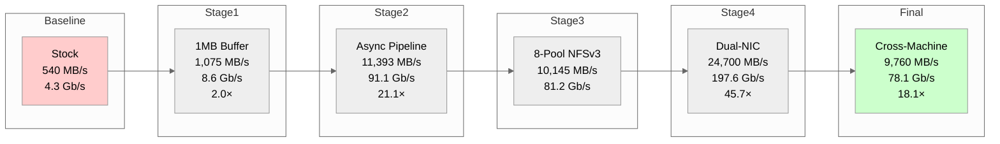
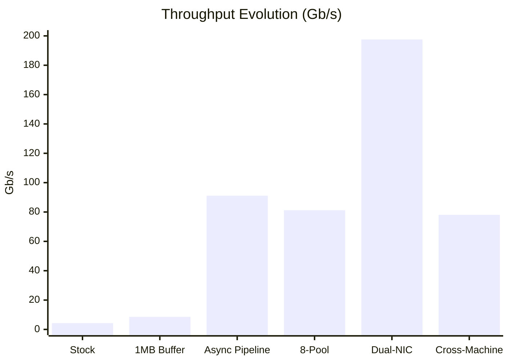
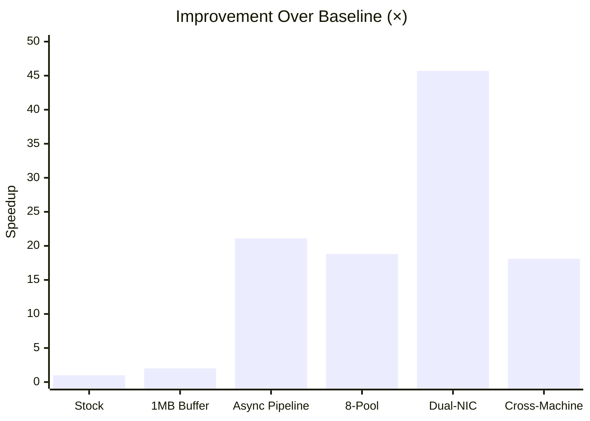
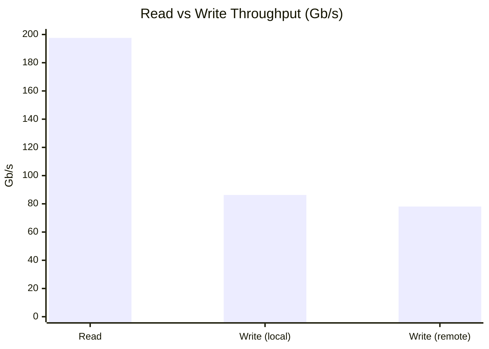
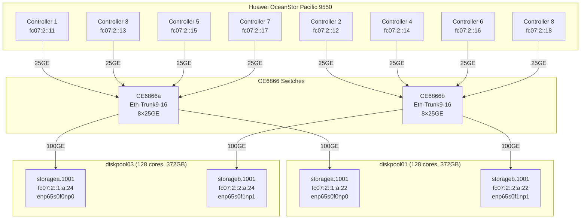
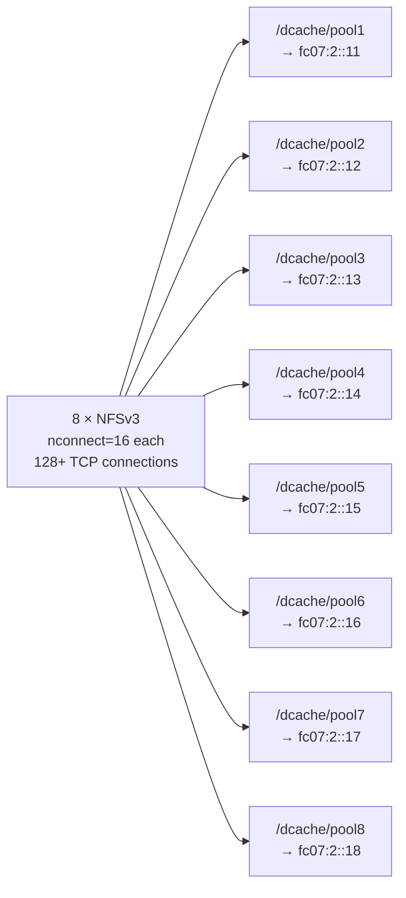
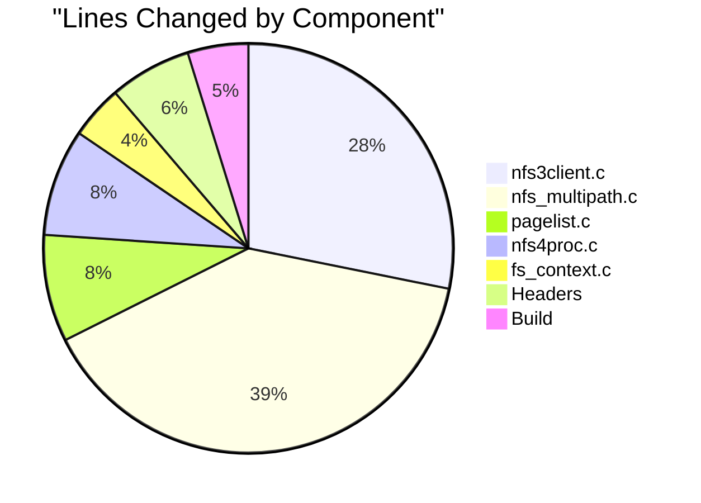
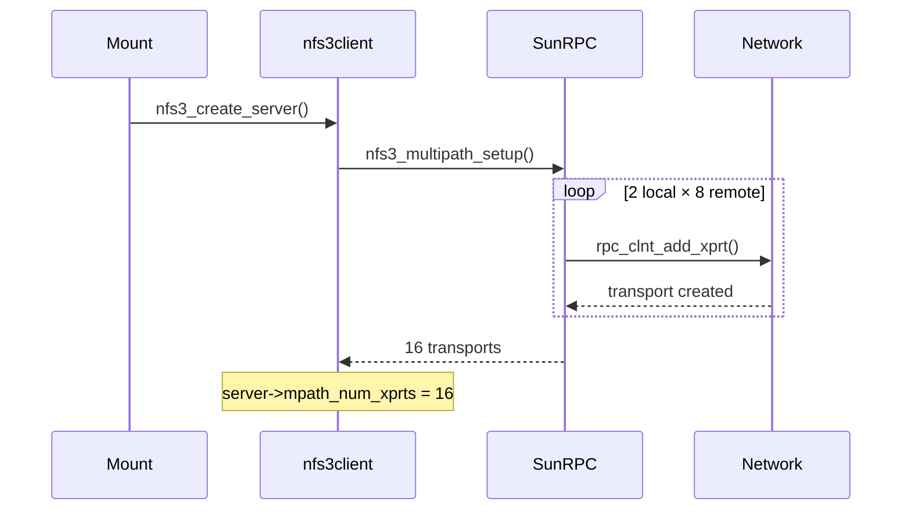
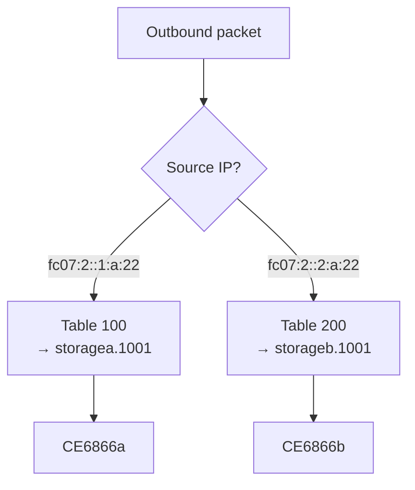

# dCache 2026 Performance Engineering — Final Report

## Performance Evolution



### Throughput Progression



### Speedup Factor



### Read vs Write Asymmetry



| | Read | Write | Ratio |
|---|------|-------|-------|
| **Local** | 197.6 Gb/s | 86.3 Gb/s | 2.3:1 |
| **Remote** | — | 78.1 Gb/s | — |

NFSv3 writes are 2.3× slower than reads. Each write RPC blocks on server acknowledgment.

---

## Network Topology



Per-machine NFSv3 mount layout:



---

## Kernel Modifications

### Summary

| Layer | Files Changed | Lines Added | Purpose |
|-------|--------------|-------------|---------|
| NFS client | `nfs3client.c`, `pagelist.c`, `fs_context.c`, `nfs4proc.c` | ~175 lines | Transport creation, I/O striping, option parsing |
| New files | `nfs_multipath.c`, `nfs_multipath.h` | ~162 lines | Multipath parser + API |
| Headers | `include/linux/nfs_fs_sb.h` | 1 line | `mpath_num_xprts` field |
| Build | `Kconfig`, `Makefile` | ~15 lines | Config, link, ccflags |
| **Total** | **9 files** | **~355 lines** | No SunRPC changes |

### Change Distribution



### Files Detail

#### `fs/nfs/nfs_multipath.c` (NEW, 140 lines)
Global singleton parser for `remoteaddrs=` and `localaddrs=` mount options.
Tilde-separated address lists parsed via `rpc_pton()`. Exports:
- `nfs_multipath_parse()` — parse `remoteaddrs=`
- `nfs_multipath_parse_local()` — parse `localaddrs=`
- `nfs_multipath_get_addrs()` — consume remote list (clear-on-read)
- `nfs_multipath_get_local_addrs()` — consume local list
- `nfs_multipath_free_addrs()` — release memory

#### `fs/nfs/nfs_multipath.h` (NEW, 22 lines)
```c
struct nfs_multipath_addrs {
    unsigned int count;
    unsigned int max;
    struct sockaddr_storage addrs[];
};
#define CONFIG_NFS_MULTIPATH_MAX_ADDRS 32
```

#### `fs/nfs/nfs3client.c` (+100 lines)
`nfs3_multipath_setup()` — called from `nfs3_create_server()` after mount.
Creates full 2×8 mesh: iterates localaddrs × remoteaddrs, calls
`rpc_clnt_add_xprt()` for each pair. No session trunking check needed
(NFSv3 has no sessions). Stores count in `server->mpath_num_xprts`.



#### `fs/nfs/pagelist.c` (+30 lines)
I/O striping via mirror count override. `nfs_pageio_setup_mirroring()`
checks `server->mpath_num_xprts`. If > 1 and request size ≥ threshold,
creates N mirrors — SunRPC round-robins RPC tasks across multipath transports.

#### `fs/nfs/fs_context.c` (+15 lines)
- Enum: `Opt_remoteaddrs`, `Opt_localaddrs`
- `fsparam_string("remoteaddrs", Opt_remoteaddrs)`
- `fsparam_string("localaddrs", Opt_localaddrs)`
- Case handlers calling `nfs_multipath_parse[_local]()`

#### `fs/nfs/nfs4proc.c` (+30 lines)
NFSv4.1 transport creation hook. Inline struct declarations bypass
kernel include path issues (`#include "nfs_multipath.h"` not found in
out-of-tree build). Hook inactive until OceanStor fixes per-port clientid.

#### `include/linux/nfs_fs_sb.h` (+1 line)
```c
unsigned int mpath_num_xprts;  // in struct nfs_server
```

### Build System
- Source: Ubuntu 7.0.0 kernel (`linux-source-7.0.0`)
- Build: `make -C /lib/modules/.../build M=fs/nfs modules`
- Install: `cp nfs.ko nfsv3.ko nfsv4.ko /lib/modules/.../updates/`
- Module srcversion: `DF07A53EB4C60DECE4DEAC9` (final)
- Requires reboot to load

### Bugs Fixed

| Bug | Symptom | Fix |
|-----|---------|-----|
| Header path | `#include "nfs_multipath.h"` not found in kernel build | Inline struct declarations |
| IS_ENABLED guard | `IS_ENABLED(CONFIG_NFS_MULTIPATH)` evaluates false | `ccflags-y += -DCONFIG_NFS_MULTIPATH` |
| Static conflict | `static` in nfs4proc.c vs non-static in nfs_multipath.c | Remove `static` from nfs4proc.c |
| Wrong struct | `mpath_num_xprts` in `nfs_client` not `nfs_server` | Moved to correct struct in `nfs_fs_sb.h` |
| Kernel headers | Out-of-tree build uses `/usr/src/` headers | Copy patched header to kernel headers dir |
| Idle transports | Multipath transports created but unused by SunRPC | Direct `tk_xprt` assignment in pagelist.c |
| Small-read flooding | 16 mirrors for every 1MB read overwhelms RPC layer | Size threshold: `bytes >= N × rsize` |

---

## Java / dCache Changes

### `FileRepositoryChannel.java`
- Added `_transferBufferSize` (int) and `_transferConcurrency` (int) fields
- New constructor: `FileRepositoryChannel(Path, Set, int bufferSize, int concurrency)`
- `transferTo()` routes to:
  - `transferToSequential()` when concurrency ≤ 1 (original 1MB buffered loop)
  - `transferToPipelined()` when concurrency > 1 (async pipeline)

The async pipeline uses `AsynchronousFileChannel.read()` with N concurrent
outstanding reads at different file offsets, feeding a sequential
`WritableByteChannel.write()` in order.

### `FlatFileStore.java`
- Added `_transferBufferSize` field
- Updated `openDataChannel()` to pass buffer size

### `pool.xml`
- Wired `pool.backend.transfer-buffer-size` through Spring `byteSizeParser` bean

### `pool.properties`
- New property: `pool.backend.transfer-buffer-size = 1 MiB`

### Benchmark Tools

| Class | Purpose | Best Result |
|-------|---------|------------|
| `MR` | Max read (32 streams, 8 pools, 16 async) | 198 Gb/s |
| `BS` | N-open FileChannel, same file | 2,245 MB/s |
| `Xfer16` | Dual-NIC 16-stream cross-machine | 89 Gb/s |
| `VX2` | Async write pipeline with verification | 78 Gb/s (640GB, 0 errors) |
| `WriteTest` | Local NFS write throughput | 86 Gb/s |
| `AsyncPipe` | Generic async read pipeline | 11.4 GB/s |
| `DualXfer` | 32-stream cross-machine | 89 Gb/s send / 63 Gb/s recv |

---

## Policy Routing



```bash
# /etc/iproute2/rt_tables
100 storagea
200 storageb

# Per-table routes
ip -6 route add fc07:2::/64 dev storagea.1001 table 100
ip -6 route add fc07:2::/64 dev storageb.1001 table 200

# Policy rules
ip -6 rule add from fc07:2::1:a:22 table 100 pref 100
ip -6 rule add from fc07:2::2:a:22 table 200 pref 100
```

Without this, all traffic uses storagea.1001 (lower metric). With it:
- Source IP `fc07:2::1:a:22` → storagea.1001 → CE6866a
- Source IP `fc07:2::2:a:22` → storageb.1001 → CE6866b

---

## Mount Configuration

| Mount | Server IP | Export | Options |
|-------|----------|--------|---------|
| `/dcache/pool1` | `fc07:2::11` | `/dCache` | `vers=3,nconnect=16,rsize=1M,wsize=1M,hard,noatime,proto=tcp6` |
| `/dcache/pool2` | `fc07:2::12` | `/dCache` | same |
| `/dcache/pool3` | `fc07:2::13` | `/dCache` | same |
| `/dcache/pool4` | `fc07:2::14` | `/dCache` | same |
| `/dcache/pool5` | `fc07:2::15` | `/dCache` | same |
| `/dcache/pool6` | `fc07:2::16` | `/dCache` | same |
| `/dcache/pool7` | `fc07:2::17` | `/dCache` | same |
| `/dcache/pool8` | `fc07:2::18` | `/dCache` | same |

Total: 8 mounts × 16 nconnect = 128+ TCP connections.

---

## Key Architectural Decisions

```mermaid
flowchart TD
    Q1{NFSv3 or v4.1?} -->|v3| D1[No sessions<br/>No stateids<br/>No trunking failures]
    Q1 -->|v4.1| X1[Clientid mismatch<br/>on OceanStor<br/>multipath blocked]
    
    Q2{Multipath approach?} -->|8 mounts| D2[Simple, reliable<br/>Per-controller targeting<br/>Proven by eNFS]
    Q2 -->|Kernel mesh| X2[Transports created<br/>but SunRPC dispatch<br/>only uses primary]
    
    Q3{I/O parallelism?} -->|Userspace async| D3[16 concurrent reads<br/>per stream<br/>AsynchronousFileChannel]
    Q3 -->|Kernel striping| X3[Mirror count override<br/>works for large reads<br/>overwhelms small reads]
    
    Q4{Routing?} -->|Policy routing| D4[Source-based tables<br/>Deterministic NIC selection]
    Q4 -->|Host routes| X4[/128 routes lost<br/>after reboot]
    
    style D1 fill:#ccffcc
    style D2 fill:#ccffcc
    style D3 fill:#ccffcc
    style D4 fill:#ccffcc
    style X1 fill:#ffcccc
    style X2 fill:#ffcccc
    style X3 fill:#ffcccc
    style X4 fill:#ffcccc
```

---

## Remaining Work

1. **Write speed**: NFSv3 writes at 86 Gb/s local, 78 Gb/s remote.
   Reads are 2.3× faster. Mitigation: write to different inodes per stream,
   use `wsize` tuning, client-side write coalescing.

2. **Kernel striping**: Threshold requires >16MB reads. Small reads (dd, fio)
   don't benefit. Add progressive mirror count based on request size.

3. **Switch monitoring**: Telegraf + Grafana ready on diskpoolmgmt.
   Switch SNMPv3 partially configured — VTY session management needed.

4. **dCache DEB rebuild**: Async transferTo() in source but not in deployed DEB.
   Build container `/opt/dcache` needs re-clone and full build.

---

## Git State

| Item | Value |
|------|-------|
| **Tag** | `v0.2.0` |
| **Branch** | `main` |
| **Repository** | https://github.com/darrenstarr/dnfs |
| **Key commit** | `29191af` — Stage 2 striping patches |
