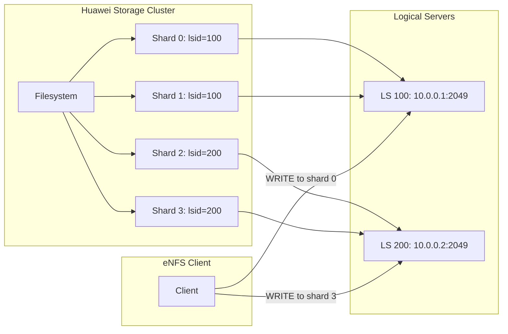
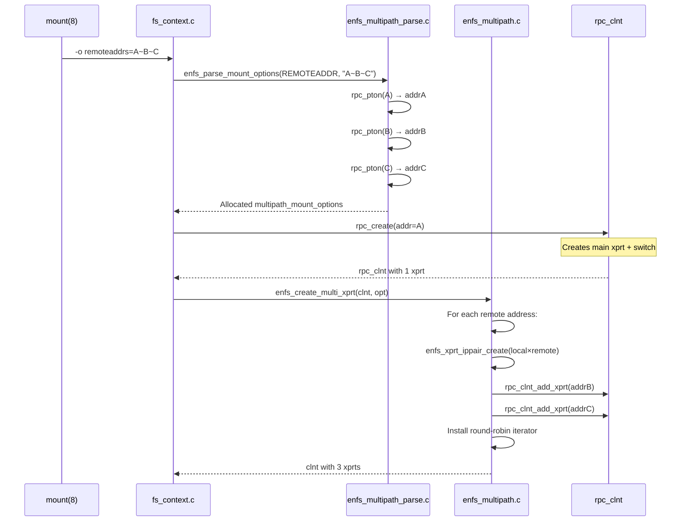
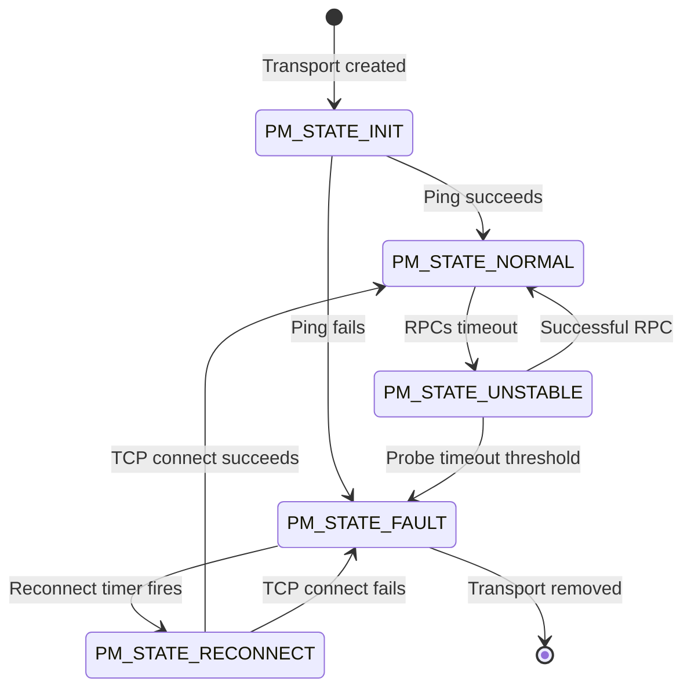
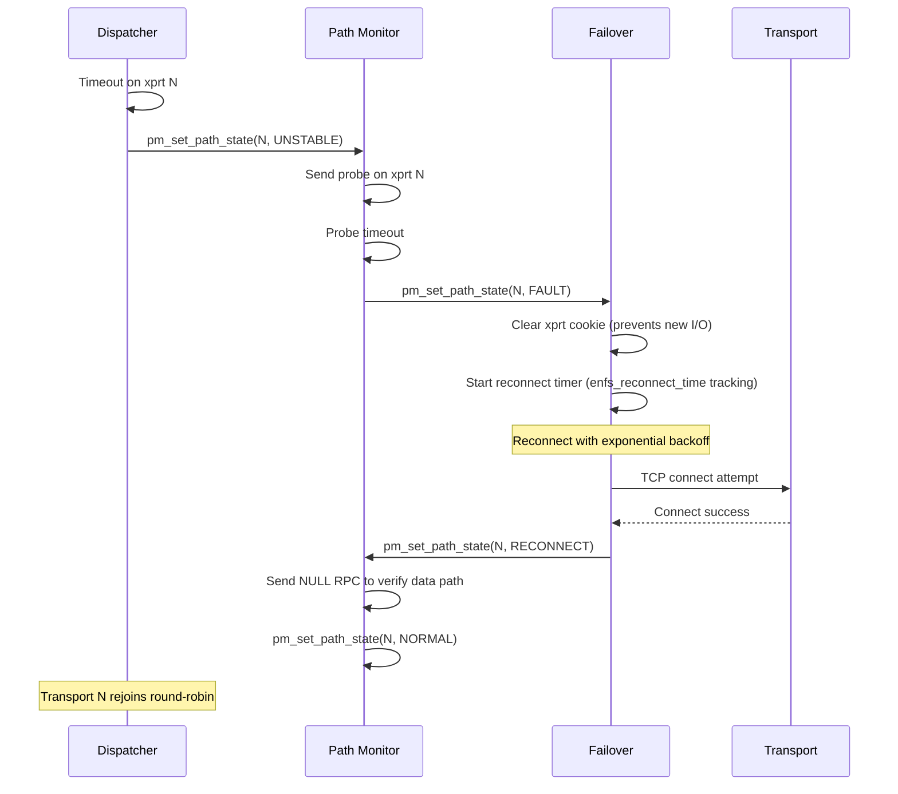
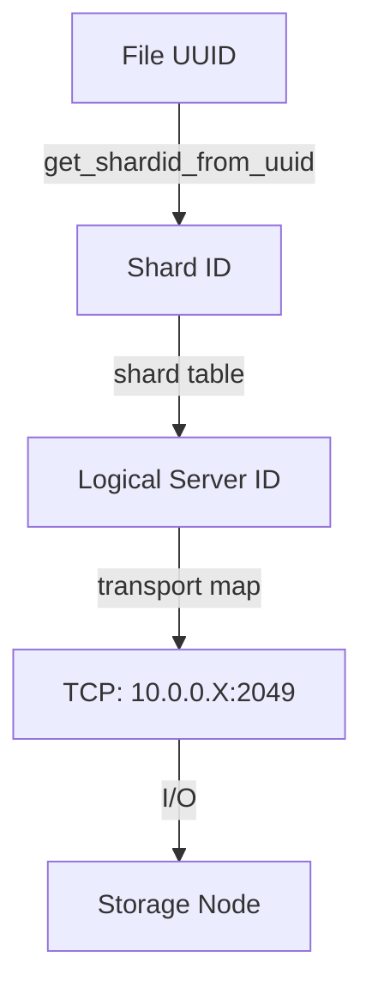

# Annex B: The Huawei eNFS Protocol — Implementation Analysis

> This annex describes the eNFS protocol as implemented by Huawei in the OpenEuler kernel (branch OLK-6.6). This is **not** a specification for our clean-room implementation — it is a reference to understand what eNFS does, why it works, and what we need to replicate in a mainline-acceptable form.

## B.1 What Is eNFS?

eNFS ("Enhanced NFS") is Huawei's extension to the Linux NFS client for multipath and distributed storage access. It was developed for the OpenEuler kernel and is the reference implementation that demonstrated ~70 Gb/s throughput over 2 × 100 GbE links.

Unlike NFSv4.1 session trunking (which requires server cooperation), eNFS is a **client-only** implementation that works by:

1. Creating multiple RPC transports (TCP connections) per mount
2. Mapping those transports to the `xprt_switch` infrastructure
3. Dispatching NFS operations across transports via a queue-length-aware round-robin algorithm
4. Monitoring path health through active pinging and recovering failed paths automatically

### Architecture Overview

```mermaid
flowchart TD
    subgraph eNFS Module Stack
        ENFS[enfs.ko] --> ADAPTER[enfs_adapter (in nfs.ko)]
        ADAPTER --> SUN[sunrpc_enfs_adapter (in sunrpc.ko)]
        SUN --> XPS[xprt_switch]
        XPS --> X1[xprt 1: TCP]
        XPS --> X2[xprt 2: TCP]
        XPS --> X3[xprt N: TCP]
    end
    subgraph eNFS Subsystems
        ENFS --> RR[enfs_roundrobin.c]
        ENFS --> PM[pm_ping.c / pm_state.c]
        ENFS --> FO[failover_path.c]
        ENFS --> EXT[exten_call.c]
        ENFS --> DNS[dns_process.c]
        ENFS --> PROC[enfs_proc.c]
        ENFS --> CFG[enfs_config.c]
    end
```

### Source File Map

| Source File | Purpose |
|-------------|---------|
| `enfs.h` | Core data structures: `enfs_xprt_context`, `nfs_ip_list`, limits |
| `enfs_multipath.c` | Transport creation, xprt_switch management, path attach, clnt lifecycle |
| `enfs_multipath_parse.c` | Mount option parsing (`remoteaddrs=`, `localaddrs=`, `enfs_info=`) |
| `enfs_roundrobin.c` | Queue-length-aware round-robin xprt iterator |
| `pm_ping.c` | Periodic ping thread, path health probing |
| `pm_state.c` | Path state machine (ONLINE, UNSTABLE, OFFLINE) |
| `failover_path.c` | Path failover decision logic |
| `failover_time.c` | Timestamp tracking for failure detection |
| `exten_call.c` | EXTEND NFSv3 operation (Huawei-specific RPC extension) |
| `enfs_lookup_cache.c` | Server capability cache (from EXTEND responses) |
| `enfs_proc.c` | `/proc/enfs/` interface |
| `enfs_config.c` | Runtime configuration via module parameters |
| `dns_process.c` | DNS-based address resolution |
| `enfs_rpc_proc.c` | rpc_procinfo tables for EXTEND operations |
| `shard_route.c` | Huawei shard-based routing |

## B.2 The EXTEND Operation (NFS3PROC_EXTEND)

The most distinctive part of eNFS is the **EXTEND operation** — a Huawei-specific extension to NFSv3. It uses procedure number 22 (`NFS3PROC_EXTEND = 22`), which is not defined in any standard NFSv3 specification.

### Protocol Definition

The EXTEND operation is a generic container for up to four sub-operations, each querying different server capabilities:

```xdr
/* EXTEND request */
struct enfs_extend3_args {
    uint32_t opcode;      // Which sub-operation
    uint32_t version;     // Protocol version (0 or 1)
    union {
        struct enfs_file_uuid Uuid;        // For FSINFO
        struct enfs_lif_args lifArgs;      // For LIF_VIEW
        struct enfs_dns_args dnsArgs;      // For DNS_QUERY
    } extend_args_u;
};

/* EXTEND response */
struct enfs_extend3_rsp {
    uint32_t opcode;      // Echoes the request opcode
    uint32_t version;
    union {
        struct enfs_shard_view fsInfo;          // Filesystem shard layout
        struct enfs_lif_port_info_mulp lifInfo; // LIF port information
        struct enfs_dns_query_ip_mulp dnsQueryIpInfo; // DNS resolution
        struct enfs_get_ls_version_rsp lsView;  // Logical server version
    } extend_res_u;
};
```

### Sub-Operation Opcodes

| Opcode | Name | Purpose |
|--------|------|---------|
| 0 | `NFS3_GET_FSINFO_OP` | Query filesystem shard layout (which storage servers hold which shards) |
| 1 | `NFS3_GET_LIF_VIEW_OP` | Query LIF (Logical Interface) port information for a given IP range |
| 2 | `NFS_ENFS_QUERY_DNS_OP` | Resolve a DNS name to storage server IP addresses |
| 3 | `NFS3_GET_LS_VERSION_OP` | Query logical server version/routing information |

### FSINFO — The Shard Layout

The FSINFO sub-operation is the core of Huawei's distributed storage model. It maps filesystem UUID to a **shard view**:

```c
struct enfs_shard_view {
    uint64_t clusterId;
    uint32_t storagePoolId;
    uint32_t fsId;
    uint32_t tenantId;
    uint32_t num;                              // Number of shards
    struct enfs_shard_view_single shardView[];  // Variable-length array
};

struct enfs_shard_view_single {
    uint64_t lsid;      // Logical Server ID (which server holds this shard)
    uint32_t cpuId;     // CPU affinity hint (which CPU to use for this shard)
};
```

The shard view tells the client which storage server (identified by `lsid`) is responsible for which portion of the filesystem. The client can use this information to route requests to the appropriate server directly, bypassing the metadata path.



### LIF VIEW — Network Topology Discovery

The LIF (Logical Interface) VIEW sub-operation queries which network interfaces are associated with which logical servers:

```c
struct enfs_lif_args {
    uint32_t tenantId;
    uint32_t ipNumber;     // Number of IP addresses to query
    char ipAddr[];         // Variable-length array of IPs
};

struct enfs_lif_port_info_single {
    uint32_t isfound;
    uint32_t workStatus;   // 0 = offline, 1 = online
    uint64_t lsId;         // Logical Server ID
    uint32_t tenantId;
    uint64_t homeSiteWwn;  // WWN of the owning storage node
    uint32_t cpuId;
};

struct enfs_lif_port_info_mulp {
    uint32_t lifNumber;    // Number of LIF entries returned
    struct enfs_lif_port_info_single lifport[];  // Variable-length array
};
```

This allows the client to discover which server IP addresses belong to which logical server, and whether those interfaces are currently online or offline. The `workStatus` field is used to determine whether a path is eligible for I/O.

### DNS QUERY — Address Resolution

The DNS sub-operation resolves a storage DNS name to a list of IP addresses with their associated server information:

```c
struct enfs_dns_args {
    uint32_t ipType;           // IP_TYPE_V4, IP_TYPE_V6, or IP_TYPE_BOTH
    uint32_t dnsNameCount;
    char dnsName[];            // Variable-length DNS name
};

struct enfs_dns_query_ip_info_single {
    char ipAddr[IP_ADDRESS_LEN_MAX];  // IPv4 or IPv6 address
    uint64_t lsId;                    // Logical Server ID
    uint32_t cpuId;
};

struct enfs_dns_query_ip_mulp {
    uint32_t ipNumber;
    struct enfs_dns_query_ip_info_single ipInfo[];  // Variable-length array
};
```

This is distinct from standard DNS resolution — it's a storage-aware DNS that returns not just IP addresses but also the topology context (lsId, cpuId) for each resolved address.

### LS VERSION — Server Topology Query

The LS version sub-operation returns the cluster's logical server layout:

```c
struct enfs_get_ls_version_single {
    uint64_t lsVersion;          // Version number for this logical server
    uint32_t lsId;               // Logical Server ID
};

struct enfs_get_ls_version_rsp {
    uint32_t num;
    uint64_t clusterId;
    struct enfs_get_ls_version_single lsInfo[];  // Variable-length array
};
```

## B.3 Filehandle UUID Model

Huawei's storage encodes a 38-byte UUID into NFS filehandles. The UUID contains all the information needed to locate a file across the distributed cluster:

```c
/* UUID layout within the NFS filehandle */
#define UUID_OFFSET      16    // UUID starts at byte 16 of the FH
#define UUID_DEVID_OFFSET  2   // bytes 2-9: device WWN
#define UUID_FSID_OFFSET   10   // bytes 10-13: filesystem ID
#define UUID_DTREEID_OFFSET 14  // bytes 14-17: dentry tree ID
#define UUID_SNAPID_OFFSET  18  // bytes 18-21: snapshot ID
#define UUID_PFID_OFFSET    22  // bytes 22-29: parent/partition FID
#define UUID_FID_OFFSET     30  // bytes 30-38: file ID
```

The UUID allows the client to determine which **shard** owns a file without contacting the server:

```c
static inline uint32_t get_shardid_from_uuid(struct enfs_file_uuid *file_uuid)
{
    uint64_t objectId = get_objectid_from_uuid(file_uuid);
    uint32_t fsId = GET_FSID_FROM_UUID(file_uuid);
    uint32_t fspId = ENFS_GET_FSP_FROM_FSID_FID(fsId, objectId);

    return fspId % MAX_SHARD_NUMBER_IN_CLUSTER_4FS;  // 65536 shards max
}
```

This is a **distributed hash** — the filehandle encodes the entire routing path. The client can compute which shard owns a file directly from the filehandle data, without any server query. This is the core enabler of direct data access in the Huawei architecture.

## B.4 Mount Option Parsing

eNFS extends the standard NFS mount options with several new parameters:

```bash
# Basic multipath: three server addresses
mount -t nfs -o vers=3,nolock,remoteaddrs=10.0.0.1~10.0.0.2~10.0.0.3 \
    10.0.0.1:/export /mnt

# With local address binding
mount -t nfs -o vers=3,nolock,remoteaddrs=A~B,localaddrs=X~Y \
    A:/export /mnt

# Legacy syntax (enfs_info wrapper)
mount -t nfs -o vers=3,nolock,enfs_info='remoteaddrs=A~B,localaddrs=X~Y' \
    A:/export /mnt

# DNS-based multipath
mount -t nfs -o vers=3,nolock,remoteaddrs=storage-cluster.example.com \
    storage-cluster.example.com:/export /mnt
```

### Option Processing Flow



### Address Range Parsing

eNFS supports IP address ranges in mount options (not just individual addresses):

```c
// Input: "10.0.0.1~10.0.0.3" means addresses 10.0.0.1, 10.0.0.2, 10.0.0.3
// The parser increments the IP for each range step:
static int enfs_parse_ip_range(struct net *net_ns, const char *cursor, ...)
{
    // Parse base address
    rpc_pton(net_ns, cursor, strlen(cursor), (struct sockaddr *)&addr, sizeof(addr));

    // If this is the end of a range, compute add_num
    // Add `add_num` consecutive addresses to the IP list
    for (i = 0; i < add_num; i++) {
        // Increment IP and add to list
    }
}
```

This allows configurations like `remoteaddrs=10.0.0.1~-10.0.0.4` to specify a range.

### Constraints

| Parameter | Limit | Defined In |
|-----------|-------|------------|
| Max remote IPs | 1024 | `MAX_SUPPORTED_REMOTE_IP_COUNT` |
| Default remote IPs | 32 | `DEFAULT_SUPPORTED_REMOTE_IP_COUNT` |
| Min remote IPs | 2 | `MIN_SUPPORTED_REMOTE_IP_COUNT` |
| Max local IPs | 8 | `MAX_SUPPORTED_LOCAL_IP_COUNT` |
| Max IP pairs per mount | 8 | `MAX_IP_PAIR_PER_MOUNT` |
| Max transports (global) | 16384 | `ENFS_MAX_LINK_COUNT` |
| Default max transports | 512 | `DEFAULT_ENFS_MAX_LINK_COUNT` |
| Max mounts | 256 | `ENFS_MAX_MOUNT_COUNT` |
| DNS name length | 512 | `MAX_DNS_NAME_LEN` |
| Max DNS entries | 2 | `MAX_DNS_SUPPORTED` |

## B.5 The Per-Transport Context

Each transport in an eNFS-managed `xprt_switch` carries an `enfs_xprt_context` attached via `xprt_get_reserve_context()`:

```c
struct enfs_xprt_context {
    int       version;                    // Protocol version
    struct sockaddr_storage srcaddr;      // Source address (for local binding)
    struct rpc_iostats *stats;            // Per-transport I/O statistics
    bool      main;                       // Is this the "main" xprt from rpc_create?
    atomic_t  path_state;                 // Current path state (ONLINE/DEGRADED/etc.)
    atomic_t  path_check_state;           // Check-state for ping probing
    atomic_long_t queuelen;               // Current queue depth (for load-aware dispatch)
    uint64_t  lsid;                       // Logical Server ID (from EXTEND response)
    uint64_t  wwn;                        // Storage node WWN
    uint32_t  cpuId;                      // CPU affinity hint
    u32       protocol;                   // TCP / UDP / RDMA
    int64_t   lastTime;                   // Last activity timestamp
    struct enfs_reconnect_time reconnect_time;  // Reconnect timing history
};
```

Key fields for dispatch decisions:

- **`queuelen`**: The current number of outstanding RPCs on this transport. Used by the round-robin dispatcher to select the least-loaded transport.
- **`path_state`**: The current health state (see §B.7). Determines whether the transport is eligible for dispatch.
- **`lsid`**: Which logical server this transport connects to. Used for shard-aware routing.
- **`main`**: Whether this is the original transport created by `rpc_create()`. The `enfs_get_native_link_io_status()` config option controls whether the main transport participates in round-robin or is reserved for control operations.

## B.6 Round-Robin Dispatch with Queue-Length Awareness

The dispatch policy (`enfs_roundrobin.c`) implements a **least-queue-length** selection algorithm that accounts for transport health and the "main transport" exclusion:

```c
static struct rpc_xprt *
enfs_lb_find_next_entry_roundrobin(struct rpc_xprt_switch *xps,
                                   const struct rpc_xprt *cur)
{
    list_for_each_entry_rcu(pos, &xps->xps_xprt_list, xprt_switch) {
        // Skip main xprt if nativeLink IO is disabled
        if (!nativeLinkStatus && enfs_is_main_xprt(pos))
            continue;

        // Skip inactive (disconnected/in-degraded) transports
        if (!enfs_xprt_is_active(pos)) {
            prev = pos;
            continue;
        }

        // Compare queue lengths
        ctx = xprt_get_reserve_context(pos);
        pos_xprt_queuelen = atomic_long_read(&ctx->queuelen);

        // Track the minimum-queue xprt seen so far
        if (min_queuelen_xprt == NULL ||
            pos_xprt_queuelen < min_xprt_queuelen) {
            min_queuelen_xprt = pos;
            min_xprt_queuelen = pos_xprt_queuelen;
        }

        // If we've passed the cursor position, check for best candidate
        if (cur == prev)
            found = true;
    }
}
```

The algorithm:

1. **Start** at the transport after the previously selected one (cursor-based, not absolute round-robin)
2. **Skip** the main transport if `enfs_get_native_link_io_status()` is disabled (reserves the main transport for control traffic)
3. **Skip** inactive transports (disconnected, degraded, offline)
4. **Track** the minimum queue length among all scanned transports
5. **Select** the first optimal transport after the cursor position with the minimum queue length

This is more sophisticated than a simple round-robin because it:
- Factors in transport health (skips degraded paths)
- Factors in load (prefers transports with fewer queued RPCs)
- Supports main-transport exclusion (optional)
- Is concurrent-reader safe (uses RCU list iteration + atomic counters)

## B.7 Path State Machine

Path health is managed through a state machine in `pm_state.c`:



| State | Meaning | Eligible for I/O? |
|-------|---------|-------------------|
| `PM_STATE_INIT` | Transport created, connection in progress | No |
| `PM_STATE_NORMAL` | Path healthy, active | Yes |
| `PM_STATE_UNSTABLE` | Degraded — intermittent failures | Yes (last resort) |
| `PM_STATE_FAULT` | Path dead | No |
| `PM_STATE_RECONNECT` | Attempting to reconnect | No |

### Path Monitoring Thread

eNFS runs a dedicated kernel thread (`pm_ping_timer_thread`) that periodically probes transport health:

```c
static int pm_ping_timer_thread(void *args)
{
    while (!kthread_should_stop()) {
        // Iterate all transports across all clients
        // For each transport in PM_STATE_NORMAL:
        //   If idle > threshold, send a GETATTR or NULL RPC
        // For each transport in PM_STATE_UNSTABLE or PM_STATE_FAULT:
        //   Send a probe RPC
        // Update state based on probe response
        msleep(SLEEP_INTERVAL * 1000);  // Configurable interval
    }
}
```

The ping thread uses a workqueue (`ping_execute_workq`) to send probe RPCs asynchronously. Each probe increments `check_xprt_count` and decrements it on completion, allowing the thread to track in-flight probes.

### State Transition Triggers

| Event | Action |
|-------|--------|
| Successful RPC completion | `pm_set_path_state(xprt, PM_STATE_NORMAL)` |
| N consecutive timeouts | `pm_set_path_state(xprt, PM_STATE_UNSTABLE)` |
| Probe success during UNSTABLE | `pm_set_path_state(xprt, PM_STATE_NORMAL)` |
| Probe timeout during UNSTABLE | `pm_set_path_state(xprt, PM_STATE_FAULT)` |
| Reconnect timer fires | `pm_set_path_state(xprt, PM_STATE_RECONNECT)` |
| TCP connect succeeds | `pm_set_path_state(xprt, PM_STATE_NORMAL)` |
| TCP connect fails | `pm_set_path_state(xprt, PM_STATE_FAULT)` |

## B.8 Failover Path Management

When a transport enters `PM_STATE_FAULT`, the failover subsystem (`failover_path.c`) manages the recovery process:



### Reconnect Timing

eNFS tracks reconnect timing history per transport:

```c
struct enfs_reconnect_time {
    s64 time[ENFS_RECONNECT_TIME_CNT + 1];  // 3 timestamps
    s8 head;
    s8 tail;
    unsigned int xprt_cookie;
};
```

The reconnect timer uses the cookie to correlate transport identities across reconnections (the underlying socket address may change during reconnection).

## B.9 Global Resource Limits

eNFS enforces global limits to prevent resource exhaustion:

```c
// Link count (total transports across all mounts)
static int link_count;

bool enfs_link_count_add(int num)
{
    // When adding: check against configurable max
    if (num > 0 && link_count >= enfs_get_config_link_count_total() - num)
        return false;

    link_count += num;
    return true;
}

// Mount count (total eNFS mounts)
static int mount_count;

bool enfs_mount_count_add(int num)
{
    if (mount_count >= ENFS_MAX_MOUNT_COUNT)
        return false;

    mount_count += num;
    return true;
}
```

These limits prevent a misconfigured mount (e.g., `remoteaddrs=` with 1000 addresses) from exhausting kernel memory.

## B.10 The `/proc/enfs/` Interface

eNFS exposes per-client state through `/proc/enfs/`:

```text
/proc/enfs/
├── <client-id>/
│   ├── path          ← List of all transports with state
│   ├── stats         ← I/O statistics per transport
│   └── config        ← Runtime configuration
```

The implementation is in `enfs_proc.c` and creates entries using `proc_create()` for each eNFS-managed NFS client.

## B.11 DNS-Based Multipath

eNFS supports DNS-based address resolution through `dns_process.c`. When a mount uses a hostname instead of explicit IP addresses:

```bash
mount -t nfs -o vers=3,nolock,remoteaddrs=storage-cluster.example.com \
    storage-cluster.example.com:/export /mnt
```

The DNS resolution workflow:

1. At mount time: the hostname is stored in `multipath_mount_options.pRemoteDnsInfo`
2. During transport creation: `enfs_multipath_create_thread` calls DNS resolution
3. Each resolved IP becomes a separate transport
4. A periodic DNS re-resolution (via the ping thread) detects address changes
5. New addresses are added as new transports; removed addresses are marked for cleanup

```c
struct enfs_route_dns_info {
    int dnsNameCount;
    struct enfs_dns_info_single routeRemoteDnsList[MAX_DNS_SUPPORTED];
};

struct enfs_dns_info_single {
    char dnsname[MAX_DNS_NAME_LEN];
};
```

The DNS resolution is a two-phase process:
1. **Standard DNS resolution** (via kernel's `dns_query()` or `kallsyms`-resolved functions)
2. **eNFS EXTEND DNS query** (via `NFS_ENFS_QUERY_DNS_OP` sub-operation)

The second phase is Huawei-specific — it queries the storage cluster's internal DNS service through the EXTEND protocol, which returns not just IP addresses but also `lsid` and `cpuId` metadata for each address.

## B.12 The Shard Routing System

For Huawei storage clusters, eNFS implements **shard-aware routing** (`shard_route.c`). The idea:

1. Each file is assigned to a shard based on its UUID (see §B.3)
2. Each shard is served by one or more logical servers (LS)
3. eNFS routes I/O to the LS responsible for the file's shard



This is conceptually similar to pNFS (the metadata server tells the client which data server to use), but Huawei implements it at the **client side** — the client computes the routing directly from the filehandle UUID, without needing a separate metadata server.

## B.13 Compatibility and Fallback

eNFS includes a compatibility test (`enfs_test.c`) that:

1. Sends an EXTEND NULL probe to the server
2. If the server responds with `NFS3ERR_NOTSUPP` (which stock NFSv3 does — EXTEND is not a standard operation), eNFS falls back to basic round-robin multipath without shard routing
3. If the server responds with a valid EXTEND reply, eNFS enables the full feature set (shard routing, DNS resolution, LIF-aware path selection)

This means eNFS works with any NFSv3 server, but the advanced features (shard routing, server capability discovery) only work with Huawei storage targets.

## B.14 Key Constants Summary

| Constant | Value | Meaning |
|----------|-------|---------|
| `MAX_IP_PAIR_PER_MOUNT` | 8 | Max transports per mount |
| `MAX_SUPPORTED_LOCAL_IP_COUNT` | 8 | Max local source addresses |
| `MAX_SUPPORTED_REMOTE_IP_COUNT` | 1024 | Max remote addresses |
| `DEFAULT_SUPPORTED_REMOTE_IP_COUNT` | 32 | Default limit |
| `MIN_SUPPORTED_REMOTE_IP_COUNT` | 2 | Minimum before multipath is meaningful |
| `MAX_DNS_NAME_LEN` | 512 | Max DNS name length |
| `MAX_DNS_SUPPORTED` | 2 | Max DNS entries |
| `ENFS_MAX_LINK_COUNT` | 16384 | Absolute max transport count |
| `DEFAULT_ENFS_MAX_LINK_COUNT` | 512 | Default global transport limit |
| `ENFS_MAX_MOUNT_COUNT` | 256 | Max concurrent eNFS mounts |
| `ENFS_UNSTABLE_STATE_TIMEOUT` | 1800s | Max time before declaring path dead |
| `MAX_SHARD_NUMBER_IN_CLUSTER_4FS` | 65536 | Max shards in Huawei cluster |
| `NFS3PROC_EXTEND` | 22 | EXTEND procedure number (non-standard) |
| `EXTEND_MAX_DNS_NAME_LEN` | 256 | Max DNS name in EXTEND queries |
| `FILE_UUID_BUFF_LEN` | 38 | UUID length embedded in filehandles |
