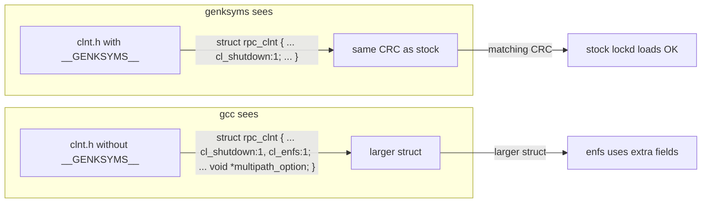
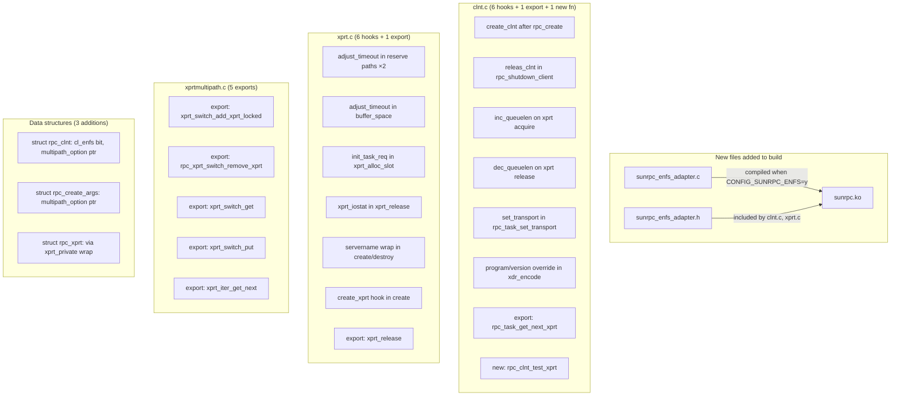

# Annex C: eNFS Deviations from Mainline SunRPC

> This annex documents every change that Huawei's eNFS makes to the core SunRPC layer (`net/sunrpc/`). These deviations are the key challenge for our clean-room implementation — we need the same functionality **without** modifying `sunrpc.ko`.

## C.1 The Architecture of Deviation

eNFS does not replace `sunrpc.ko`. Instead, it **splices into it** through a callback registration system and conditional `#ifdef` hooks at 20+ call sites across three source files:

```mermaid
flowchart TD
    subgraph enfs.ko
        OPS[rpc_multipath_ops]
        OPS -->|register at module load| ADAPTER[sunrpc_enfs_adapter]
    end
    subgraph sunrpc.ko (patched)
        ADAPTER -->|rcu_dereference| OPS_PTR[multipath_ops pointer]
        CLI[clnt.c hooks] -->|create_clnt| ADAPTER
        CLI -->|adjust_task_timeout| ADAPTER
        CLI -->|inc/dec_queuelen| ADAPTER
        CLI -->|set_transport| ADAPTER
        CLI -->|update_rpc_program| ADAPTER
        XPR[xprt.c hooks] -->|create_xprt| ADAPTER
        XPR -->|xprt_iostat| ADAPTER
        XPR -->|init_task_req| ADAPTER
        XPM[xprtmultipath.c] -->|export helpers| ENFS_D[enfs.ko uses directly]
    end
    subgraph Stock sunrpc.ko
        OEMPTY[No adapter, no hooks, no exports]
    end
```

The deviation falls into four categories:

1. **A new source file** (`sunrpc_enfs_adapter.c`) added to sunrpc.ko — this is the registration glue
2. **Inline hooks** inserted into existing functions in `clnt.c` and `xprt.c` — 13 insertion points total
3. **Export promotions** — 8 functions that were static or unexported are exported for enfs.ko to call
4. **Data structure additions** — fields added to `rpc_clnt`, `rpc_create_args`, and `rpc_xprt`

## C.2 New File: sunrpc_enfs_adapter.c

This file is compiled into `sunrpc.ko` when `CONFIG_SUNRPC_ENFS=y`. It provides:

### The rpc_multipath_ops Registry

```c
struct rpc_multipath_ops __rcu *multipath_ops;

struct rpc_multipath_ops {
    struct module *owner;

    // Client lifecycle
    void (*create_clnt)(struct rpc_create_args *, struct rpc_clnt *);
    void (*releas_clnt)(struct rpc_clnt *);

    // Transport lifecycle
    void (*create_xprt)(struct rpc_xprt *);
    void (*destroy_xprt)(struct rpc_xprt *);

    // Per-RPC hooks (called for every RPC)
    void (*xprt_iostat)(struct rpc_task *);
    void (*failover_handle)(struct rpc_task *);
    void (*adjust_task_timeout)(struct rpc_task *, void *);
    void (*init_task_req)(struct rpc_task *, struct rpc_rqst *);
    bool (*prepare_transmit)(struct rpc_task *);
    void (*set_transport)(struct rpc_task *, struct rpc_clnt *);
    void (*inc_queuelen)(struct rpc_xprt *);
    void (*dec_queuelen)(struct rpc_xprt *);

    // RPC header modification (for the EXTEND operation)
    void (*get_rpc_program)(struct rpc_task *, u32 *, u32 *);
    bool (*task_need_call_start_again)(struct rpc_task *);
};
```

This ops vector has **17 function pointers**. enfs.ko registers a single instance at module init time via `rpc_multipath_ops_register()`. The registration uses RCU for lock-free read access:

```c
int rpc_multipath_ops_register(struct rpc_multipath_ops *ops)
{
    struct rpc_multipath_ops *old;

    old = cmpxchg((struct rpc_multipath_ops **)&multipath_ops, NULL, ops);
    if (!old || old == ops)
        return 0;
    return -EPERM;  // Only one registration allowed
}
```

The "one registration only" constraint means **at most one enfs-like module can be loaded at a time.** This is a design limitation — if two modules wanted to hook the RPC layer, they'd conflict.

### The xprt_get_reserve_context Extension

eNFS needs per-transport private data. It attaches this through a `reserve_context` pointer:

```c
struct xprt_client_private {
    void *reserve_context;    // Points to enfs_xprt_context
    char servername[];        // Extended server name (may carry enfs metadata)
};

void *xprt_get_reserve_context(struct rpc_xprt *xprt)
{
    struct xprt_client_private *priv = rcu_dereference(xprt->xprt_private);
    return priv ? priv->reserve_context : NULL;
}
```

This abuses the existing `xprt_private` field on `struct rpc_xprt` — stock XPRT uses it for something different (transport-specific private data). eNFS wraps it with another level of indirection to store both the servername and the enfs context pointer.

## C.3 Hooks in clnt.c (6 Sites)

### Site 1: After rpc_create (clnt creation)

```c
// In rpc_create(), after clnt construction but before return:
#if IS_ENABLED(CONFIG_SUNRPC_ENFS)
    rpc_multipath_ops_create_clnt(args, clnt);
#endif
```

This is where enfs.ko gets notified of a new `rpc_clnt`. It attaches the multipath option (parsed from mount options) to the client.

### Site 2: In rpc_shutdown_client (clnt destruction)

```c
#if IS_ENABLED(CONFIG_SUNRPC_ENFS)
    rpc_multipath_ops_releas_clnt(clnt);
#endif
```

Called during client shutdown to clean up multipath state.

### Site 3 & 4: Queue Length Tracking (inc and dec)

```c
// In rpc_task_release_xprt (when xprt is acquired):
#if IS_ENABLED(CONFIG_SUNRPC_ENFS)
    rpc_multipath_ops_inc_queuelen(xprt);
#endif

// In rpc_task_release_xprt (when xprt is released):
#if IS_ENABLED(CONFIG_SUNRPC_ENFS)
    rpc_multipath_ops_dec_queuelen(xprt);
#endif
```

These keep `enfs_xprt_context->queuelen` in sync, which the round-robin dispatcher uses for load-aware selection.

### Site 5: Transport Selection Hook

```c
// In rpc_task_set_transport (called when a task picks a transport):
#if IS_ENABLED(CONFIG_SUNRPC_ENFS)
    if (task->tk_msg.rpc_proc)
        rpc_multipath_ops_set_transport(task, clnt);
#endif
```

Allows enfs to override the transport selection for a task.

### Site 6: RPC Header Program/Version Override

```c
// In xdr_encode_request (when encoding the RPC header):
#if IS_ENABLED(CONFIG_SUNRPC_ENFS)
    RPC_MULTIPAHT_UPDATE_RPC_PROC(task, p, clnt);
#else
    *p++ = cpu_to_be32(clnt->cl_prog);
    *p++ = cpu_to_be32(clnt->cl_vers);
#endif
```

This allows enfs to change the program and version numbers on a per-task basis. This is how the EXTEND operation (NFS3PROC_EXTEND = 22) is sent — enfs modifies the RPC header to request a non-standard NFSv3 procedure.

### Export Addition: rpc_task_get_next_xprt

```c
// Was: static struct rpc_xprt *rpc_task_get_next_xprt(...)
// Now: exported for enfs.ko:
EXPORT_SYMBOL_GPL(rpc_task_get_next_xprt);
```

enfs's failover code calls this directly to find the next available transport.

### New Function: rpc_clnt_test_xprt

```c
// Re-implemented from OpenEuler (deleted from mainline):
int rpc_clnt_test_xprt(struct rpc_clnt *clnt, struct rpc_xprt *xprt,
                       const struct rpc_call_ops *ops, void *data, int flags)
{
    struct rpc_task *task;
    task = rpc_call_null_helper(clnt, xprt, NULL,
                RPC_TASK_SOFT | RPC_TASK_SOFTCONN | flags, ops, data);
    if (IS_ERR(task))
        return PTR_ERR(task);
    rpc_put_task(task);
    return 1;
}
EXPORT_SYMBOL_GPL(rpc_clnt_test_xprt);
```

This is used by `pm_ping.c` to send probe RPCs to specific transports. Mainline Linux replaced it with `rpc_clnt_setup_test_and_add_xprt()`, but enfs's ping code still uses the old API.

### Switch: rpc_xprt_switch_set_roundrobin Replacement

```c
// In rpc_clnt_xprt_switch_add_xprt:
#if IS_ENABLED(CONFIG_SUNRPC_ENFS)
    rpc_multipath_switch_set_roundrobin(clnt, xps);  // enfs wrapper
#else
    rpc_xprt_switch_set_roundrobin(xps);              // stock
#endif
```

The enfs wrapper checks whether the client has multipath enabled. If not, it calls the stock function. If yes, it lets enfs handle the iterator setup.

## C.4 Hooks in xprt.c (6 Sites)

### Site 1 & 2: Timeout Adjustment (xprt reservation)

```c
// In xprt_reserve_xprt_cong and xprt_reserve_xprt, out_sleep path:
#if IS_ENABLED(CONFIG_SUNRPC_ENFS)
    rpc_multipath_ops_adjust_task_timeout(task, NULL);
#endif
```

Allows enfs to modify the per-task timeout based on the selected transport. This is how enfs implements different timeout policies for different paths.

### Site 3: Buffer Space Wait

```c
// In xprt_wait_for_buffer_space:
#if IS_ENABLED(CONFIG_SUNRPC_ENFS)
    rpc_multipath_ops_adjust_task_timeout(xprt->snd_task, NULL);
#endif
```

Same timeout adjustment, but for the buffer-space wait path.

### Site 4: Request Initialization

```c
// In xprt_alloc_slot, after xprt_init_majortimeo:
#if IS_ENABLED(CONFIG_SUNRPC_ENFS)
    rpc_multipath_ops_init_task_req(task, req);
#endif
```

Allows enfs to stamp per-request metadata immediately after slot allocation.

### Site 5: Transport Statistics

```c
// In xprt_release:
#if IS_ENABLED(CONFIG_SUNRPC_ENFS)
    rpc_multipath_ops_xprt_iostat(task);
#endif
```

Called when a transport is released. enfs updates its per-transport I/O counters here.

### Site 6: Server Name Handling + Transport Context

```c
// In xprt_create_transport (server name allocation):
#if IS_ENABLED(CONFIG_SUNRPC_ENFS)
    xprt->servername = rpc_multipath_set_servername(args->servername, GFP_KERNEL);
#else
    xprt->servername = kstrdup(args->servername, GFP_KERNEL);
#endif

// After server name allocation:
#if IS_ENABLED(CONFIG_SUNRPC_ENFS)
    if (!rpc_multipath_ops_create_xprt(xprt)) {
        xprt_destroy(xprt);
        return ERR_PTR(-ENOMEM);
    }
#endif
```

The server name allocation is wrapped so enfs can allocate extra space for `xprt_client_private` metadata. The `create_xprt` hook initializes per-transport enfs state.

```c
// In xprt_destroy (server name free):
#if IS_ENABLED(CONFIG_SUNRPC_ENFS)
    rpc_multipath_free_servername(xprt);
#else
    kfree(xprt->servername);
#endif
```

### Export Addition: xprt_release

```c
// Was: non-static but un-exported
// Now:
EXPORT_SYMBOL_GPL(xprt_release);
```

enfs's failover path calls `xprt_release()` directly to clean up transport state during failover.

## C.5 Hooks in xprtmultipath.c (5 Exports)

All five are straight export promotions — the functions exist in stock Linux but are not callable from loadable modules:

```c
// Was static, now exported:
void xprt_switch_add_xprt_locked(struct rpc_xprt_switch *xps, struct rpc_xprt *xprt);

// Were non-static but unexported, now exported:
int rpc_xprt_switch_remove_xprt(struct rpc_xprt_switch *xps, struct rpc_xprt *xprt);
struct rpc_xprt_switch *xprt_switch_get(struct rpc_xprt_switch *xps);
void xprt_switch_put(struct rpc_xprt_switch *xps);
struct rpc_xprt *xprt_iter_get_next(struct rpc_xprt_switch *xps);
```

These allow enfs.ko to directly manipulate the transport switch — adding and removing transports, iterating the switch, and managing refcounts — without going through the higher-level rpc_clnt API.

## C.6 Data Structure Additions

### struct rpc_clnt (in clnt.h)

Two additions, both hidden from genksyms to preserve CRC compatibility:

```c
struct rpc_clnt {
    // ...existing fields...
    // Bit-field: enfs adds cl_enfs flag
#if defined(__GENKSYMS__) || !IS_ENABLED(CONFIG_SUNRPC_ENFS)
    unsigned long cl_shutdown : 1;
#else
    unsigned long cl_shutdown : 1, cl_enfs : 1;
#endif

    // ...more existing fields, then at the END:
#if !defined(__GENKSYMS__) && IS_ENABLED(CONFIG_SUNRPC_ENFS)
    void *multipath_option;  // Per-client multipath state (enfs only)
#endif
};
```

### struct rpc_create_args (in clnt.h)

```c
struct rpc_create_args {
    // ...existing fields, then at the END:
#if !defined(__GENKSYMS__) && IS_ENABLED(CONFIG_SUNRPC_ENFS)
    void *multipath_option;  // Parsed mount option passed to rpc_create
#endif
};
```

### The __GENKSYMS__ Trick

The `__GENKSYMS__` guard is the key insight that makes enfs's binary-only approach work:

1. **genksyms** (the tool that computes symbol CRCs) preprocesses the header with `__GENKSYMS__` defined
2. When `__GENKSYMS__` is defined, the new fields are hidden — genksyms sees the ORIGINAL struct layout
3. genksyms produces the SAME CRCs as the stock kernel
4. Stock modules (lockd.ko, nfs_acl.ko, nfsd.ko) load against patched sunrpc.ko without "disagrees about version" errors
5. At runtime, the patched sunrpc.ko and enfs.ko use the extra fields through a struct layout that genksyms never saw



The bitfield case (`cl_shutdown : 1, cl_enfs : 1`) works because both the stock and patched versions use the same underlying unsigned long for the bitfield — `cl_enfs` simply uses a bit that was previously padding. The trailing pointer field (`multipath_option`) works because existing code accesses fields by offset from the front, and the new field is at the end.

## C.7 Kconfig and Makefile Changes

### Kconfig (net/sunrpc/Kconfig)

```kconfig
config SUNRPC_ENFS
    bool "sunrpc support ENFS"
    depends on SUNRPC
    depends on X86 || X86_64 || ARM64
    default n
```

Arch-restricted to x86, x86_64, and ARM64. enfs's `config ENFS` uses `select SUNRPC_ENFS` to auto-enable it.

### Makefile (net/sunrpc/Makefile)

```makefile
sunrpc-$(CONFIG_SUNRPC_ENFS) += sunrpc_enfs_adapter.o
```

One additional object file when the config is enabled.

## C.8 Summary of All Deviations



| Category | Count | Files |
|----------|-------|-------|
| New source files | 1 (.c) + 1 (.h) | `sunrpc_enfs_adapter.{c,h}` |
| Hook sites in clnt.c | 6 | `rpc_create`, `rpc_shutdown_client`, `rpc_task_release_xprt` (×2), `rpc_task_set_transport`, `xdr_encode_request` |
| Hook sites in xprt.c | 6 | `xprt_reserve_xprt_cong`, `xprt_reserve_xprt`, `xprt_wait_for_buffer_space`, `xprt_alloc_slot`, `xprt_release`, `xprt_create_transport` |
| Export promotions | 5+2+1 = 8 | `xprtmultipath.c` (5), `xprt.c` (1+1), `clnt.c` (1) |
| New functions in sunrpc | 2 | `rpc_clnt_test_xprt`, `rpc_init_task_retry_counters` |
| Data structure changes | 3 structs | `rpc_clnt`, `rpc_create_args`, `rpc_xprt` |
| Kconfig/Makefile changes | 2 | `Kconfig`, `Makefile` |

## C.9 Implications for Our Clean-Room Implementation

The eNFS approach has a fundamental architectural problem: **it requires patching three core kernel files** (`clnt.c`, `xprt.c`, `xprtmultipath.c`) and **adding fields to three core data structures**. This means it can never be a standalone module — it requires a custom kernel build.

For our clean-room implementation, we have two strategies:

**Strategy A (Minimal sunrpc changes)**: Add a generic "RPC hook plugin" mechanism to sunrpc that supports the 17-function ops vector, plus the 3 data structure additions. This is what eNFS did, but we'd submit the hooks upstream first.

**Strategy B (No sunrpc changes)**: Implement all multipath logic within the NFS client layer. Instead of intercepting `xprt_sendmsg` at the RPC level, manage multiple `rpc_clnt` instances at the NFS level and dispatch operations across them. This avoids touching sunrpc entirely but duplicates transport management (each `rpc_clnt` has its own transport switch).

Strategy A is what eNFS does — it's invasive but clean. Strategy B is simpler to upstream but less efficient (NFS-layer dispatch has less visibility into transport state).

The ideal approach for upstream submission is **Strategy A as a generic hook framework** — not an enfs-specific mechanism with 17 function pointers, but a slim, well-defined extension point that any multipath implementation could use.
