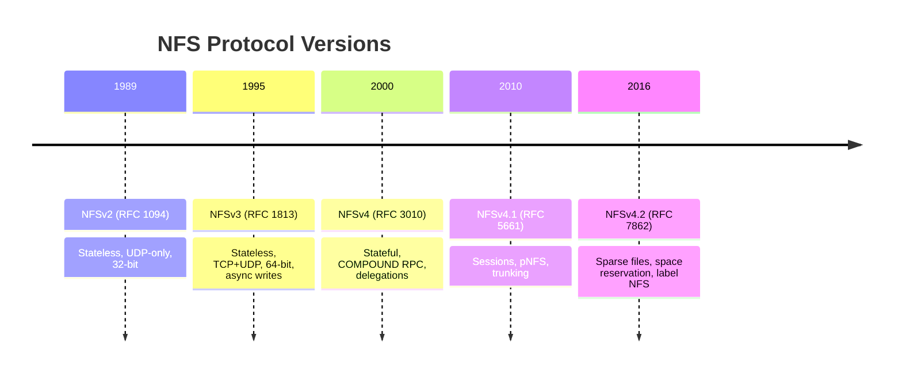
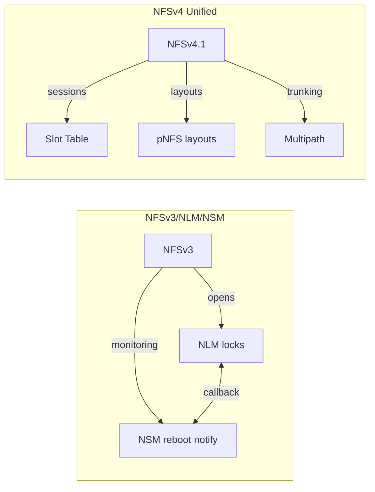
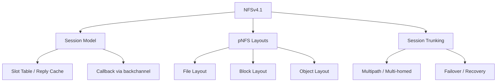
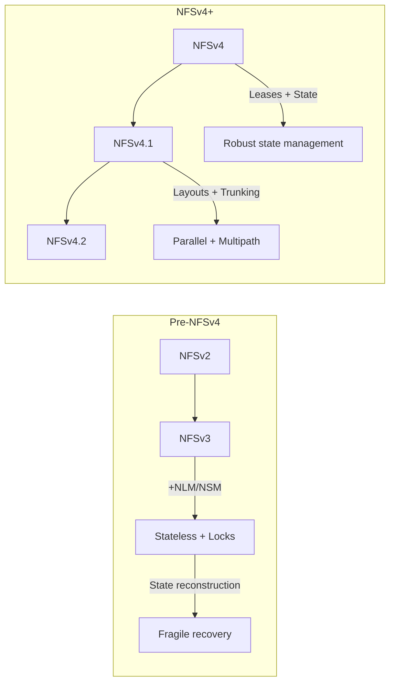

# Chapter 1: NFS Protocol Evolution

## The Three Generations

The Network File System has gone through three distinct architectural generations across five minor versions.

### NFSv2 — The Foundation

- Stateless: the server holds no open/lock state between operations
- Idempotent operations where possible (writes, creates)
- Non-idempotent operations (remove, rename) could produce silent errors
- UDP transport only; packet loss meant whole RPC retransmission
- 32-bit file sizes and offsets — maximum file size 4 GiB
- Single READ/WRITE operation per RPC — no compounding

### NFSv3 — Stateless Maturity

NFSv3 addressed v2's most severe limitations while preserving the stateless server model:

- **64-bit filesizes and offsets** — needed for real-world storage
- **TCP transport** — eliminated the "UDP fragmentation" problem and gave the protocol a reliable byte stream
- **WRITE + COMMIT** — asynchronous writes with a separate COMMIT operation to flush to stable storage
- **READDIRPLUS** — read directory entries along with file attributes and handles in a single RPC
- **Access control checks** via ACCESS operation (no more server-side mode guessing)
- **FSINFO, PATHCONF** — query server capabilities and path behaviour

The stateless model meant:

- Server reboot = no state lost (no locks, no opens)
- Client crash = no orphaned state on server
- Lock recovery impossible without a separate lock manager (NLM, which was a disaster)

#### The NLM Problem

NFSv3 relied on the separate **Network Lock Manager** (NLM, RFC 1813 Appendix) protocol for byte-range locks and the **Network Status Monitor** (NSM) for reboot notification. This introduced:

- A second RPC program with its own portmapper registration
- NSM callback mechanism required clients to run a monitoring daemon
- Lock state was _reconstructed_ after server reboot via NSM notifications — unreliable in practice
- No coordination between NFS I/O and NLM locking (write delegations impossible)

### NFSv4 — The Stateful Revolution

NFSv4 was a complete redesign that merged the NFS, NLM, and NSM protocols into a single RPC program (100003, version 4). Key innovations:

- **Stateful**: opens, locks, and delegations are stateful, managed through a lease-based model
- **COMPOUND RPC**: multiple operations in a single request/reply (e.g., LOOKUP + OPEN + READ)
- **Open/Lock integration**: OPEN and LOCK are first-class operations
- **Client ID**: persistent identity for the client across server reboots
- **Delegations**: server grants read or write delegation to reduce protocol chatter
- **RPCSEC_GSS**: mandatory security negotiation
- **Single port (2049)**: no portmapper needed for NFSv4 operations
- **INLINE I/O**: small reads and writes can be embedded in the COMPOUND RPC, avoiding separate data RPCs

### NFSv4.1 — Sessions, pNFS, and Trunking

NFSv4.1 added three major facilities:

| Feature | Description |
|---------|-------------|
| **Session model** | Client-server session with slot table, ordered slot processing, reply cache |
| **Backchannel** | Server can send RPCs to client through the same connection (callbacks) |
| **pNFS layouts** | Separates metadata (control path) from data (data path) for parallel access |
| **Session trunking** | Multiple connections between same client-server pair, bound to one session |
| **Referrals** | Server can redirect client to another server for a filesystem |
| **Directory delegations** | Notify client of directory changes |

### NFSv4.2 — Minor Feature Extensions

NFSv4.2 (RFC 7862) added targeted features:

| Operation | Purpose |
|-----------|---------|
| ALLOCATE/DEALLOCATE | Sparse file space management (hole punching) |
| CLONE | Copy offload within a server |
| COPY | Server-side copy between files |
| SEEK | Find next data or hole in sparse files |
| LABELED NFS | Security label support (SELinux context on files) |
| IO_ADVISE | Hint server about access patterns |

## Summary

This book focuses on NFSv4 and NFSv4.1 — the stateful, trunkable protocol that forms the foundation for multipath NFS access.
