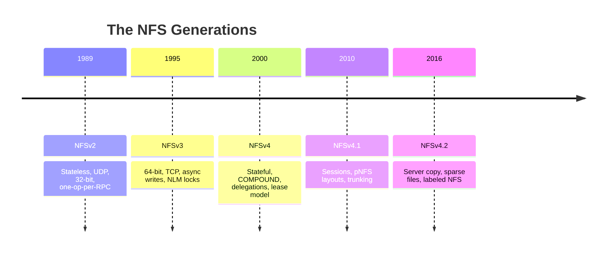

# Chapter 1: NFS Protocol Evolution — The Thirty-Thousand-Foot View

The Network File System wasn't designed all at once. It grew — sometimes gracefully, sometimes through painful field experience — across four decades and five protocol versions. Understanding this evolution is essential because each version's design decisions constrain what we can do today. The session trunking feature in NFSv4.1, for example, is a direct response to problems that NFSv3 deployments hit in the early 2000s. If you don't know those problems, the v4.1 solution looks like unnecessary complexity.

Let me walk you through the generations.

## The First Generation: NFSv2 (1989)

### The Problem Sun Microsystems Set Out to Solve

The early 1980s had plenty of networked filesystems — Novell NetWare, Apollo Domain, Sun's own Network Disk Protocol — but they were all **vendor-specific** and **hardware-coupled**. If you wanted to share files between a Sun workstation and a DEC VAX, you bought a tape. There was no standard way to share files across architectures.

Sun's insight was that the protocol should be **independent of operating system, CPU architecture, and transport**. They achieved this through a remarkably simple architecture:

**The server is stateless.** It receives a file operation request, executes it, sends the response, and forgets the entire transaction. It doesn't remember which files you have open, which byte ranges you've locked, or even whether you're still connected. Everything the client needs to resume after a failure is stored on the **client side**.

This design choice was revolutionary because it solved the hardest problem in distributed filesystem design: crash recovery. When an NFSv2 server crashes and reboots, it has zero state to restore. There are no open files to close, no locks to release, no pending operations to replay. The server simply boots, starts the NFS daemon, and begins serving requests. Any client that was connected before the crash just retries its operations until the server comes back.

### What NFSv2 Couldn't Do

The stateless model came at a steep price:

**No file locking.** Because the server doesn't know which files are open, it can't enforce locks. Applications that needed mutual exclusion — databases, mail servers, source control systems — couldn't use NFSv2 as their primary storage.

**No consistency guarantees.** If two clients write to the same file simultaneously, the last writer wins. There's no mechanism for the server to coordinate access, because the server doesn't track who has what open.

**32-bit everything.** File sizes and offsets were 32 bits, limiting files to 4 GiB. In 1989 that seemed generous. By 1993 it was a crisis.

**UDP-only.** The protocol ran exclusively over UDP datagrams. This meant individual RPCs had to fit in a single UDP packet (typically 8 KB with Ethernet MTU), limiting read and write sizes. Packet loss meant the client had to retransmit the entire RPC — no TCP-like selective acknowledgement.

**One operation per RPC.** Each LOOKUP, each READ, each WRITE was its own RPC with its own network round trip. Opening a file required: LOOKUP (root), LOOKUP (directory), LOOKUP (file), GETATTR, READ — five round trips before you got a single byte of data.

## The Second Generation: NFSv3 (1995)

### What Seven Years of Production Use Taught the Industry

By 1995, NFSv2 was everywhere. It was the default filesharing protocol for Unix workstations. But its limitations were causing real pain.

**64-bit files and offsets** were the most urgent fix. Storage systems had crossed the 4 GiB barrier, and databases needed to address large files. NFSv3 made all file sizes and offsets 64 bits wide.

**TCP support** eliminated the UDP fragmentation problem. With TCP, individual RPCs could be megabytes in size. The reliable byte stream also meant the client no longer had to guess whether a missing response meant a lost packet or a slow server — TCP handled retransmission at the transport layer, below RPC's concern.

**The WRITE + COMMIT model** was the most architecturally significant change. In NFSv2, every WRITE had to write data to stable storage before responding — otherwise a server crash could lose acknowledged writes. This was deadly for performance, especially with magnetic disks that had multi-millisecond seek times.

NFSv3 split writes into two phases:

1. **WRITE**: Data arrives at the server and is cached in memory. The server acknowledges immediately.
2. **COMMIT**: The client sends a separate request asking the server to flush cached writes to stable storage.

This meant the client could stream writes at network speed and only pay the disk latency cost once per RPC batch, not once per write. For large file transfers, this was the difference between 10 MB/s and 100 MB/s.

### The NLM Disaster

NFSv3's designers knew they needed file locking. The problem was architectural: how do you add state (locks) to a stateless protocol?

Their answer was to add locks as a **separate protocol** — the Network Lock Manager (NLM) — alongside a reboot notification protocol called the Network Status Monitor (NSM). This was a disaster for reasons that are instructive:

**NLM locks don't survive server reboots.** When the server restarts, it has no record of which locks were held. The NSM protocol was supposed to notify clients of server reboots so they could reclaim locks. In practice, NSM notifications were unreliable, and clients frequently lost locks silently.

**NLM introduces a second RPC program.** The NFS server runs on port 2049. The NLM server runs on a randomly assigned port registered with the portmapper. This means firewalls need to track NLM ports dynamically, clients need to discover the NLM port, and any network intermediary between client and server must permit this secondary connection.

**There's no coordination between NFS I/O and NLM locking.** The NFS server processes READ and WRITE operations without consulting the NLM server. This means a write delegation — where the server grants a client exclusive write access — can't work, because the NFS layer doesn't know what the NLM layer has locked.

The NLM/NSM experience taught the IETF a painful lesson: **you can't bolt state management onto a stateless protocol as an afterthought**. This lesson directly shaped NFSv4's design.

## The Third Generation: NFSv4 (2000)

### A Clean-Sheet Redesign

NFSv4 wasn't NFSv3 with improvements. It was a **fundamentally different architecture** that happened to share the name "NFS."

The core insight: **the server must manage state, and that state must have a bounded lifetime.** NFSv4 introduced:

**A single merged protocol.** NFS, NLM, and NSM were combined into one RPC program (100003, version 4). No more portmapper lookups, no more separate lock manager connections, no more NSM callbacks. Everything goes over port 2049.

**A lease-based state model.** Every piece of state — open files, byte-range locks, delegations — has a timebound lease. The client must periodically renew the lease by sending any operation. If the lease expires, the server discards all state for that client. This bounds the damage of a client crash: the server isn't left with orphaned state forever.

**Client ID for persistent identity.** Each client identifies itself with a unique ID that persists across network reconnections. When the client reconnects after a network interruption, the server recognizes the client ID and can re-associate it with existing state — up to the lease expiration.

**Delegations.** The most powerful new feature: the server can temporarily transfer ownership of a file to a client. A write delegation means "you can cache this file's data locally and modify it without asking permission." The server keeps the right to recall the delegation if another client needs the file. This dramatically reduces protocol chatter for the common case (a file used by one client at a time).

**COMPOUND RPC.** Multiple operations in a single request. Opening a file in NFSv4 is a single network round trip (PUTROOTFH + LOOKUP + OPEN) instead of five. The operations within a COMPOUND execute sequentially, and if any operation fails, the remaining operations are skipped — exactly like exception handling in a programming language.

### The Cost of State

NFSv4's stateful design solved the problems of NFSv3, but it introduced a new class of failure modes:

**Server reboot recovery is complex.** When an NFSv4 server reboots, it enters a "grace period" during which clients must reclaim their state (re-open files, re-acquire locks). This takes time — typically 60-120 seconds — during which new operations are rejected with `NFS4ERR_GRACE`.

**Client crash recovery requires lease expiry.** If a client crashes without closing its files, the server won't know until the lease expires. The files remain open and locked for up to 120 seconds. This is a deliberate tradeoff — it's better to hold locks too long than to release them prematurely and cause data corruption.

**Callback complexity.** Some NFSv4 features require the server to contact the client asynchronously (e.g., recalling a delegation). In NFSv4.0, this requires the client to run a TCP listener on a separate port, which is a firewall and NAT nightmare.

## NFSv4.1 (2010) — The Session Layer

### Why Another Version

NFSv4.0 had been deployed for a decade, and three problems had emerged:

1. **Duplicate reply detection was best-effort.** NFSv4.0 servers maintained a "duplicate request cache" (DRC) per connection. If the client re-connected on a new TCP connection (which happens after any network interruption), the new connection had an empty DRC. The server could execute the same non-idempotent operation (like RENAME) twice.

2. **Callbacks were fragile.** The NFSv4.0 callback model required the client to be reachable on a TCP port. This didn't work across NAT boundaries, firewalls, or multi-homed clients.

3. **There was no standard multipath mechanism.** Deployments with multiple NICs or multiple paths to storage had no standard way to use them through a single mount.

NFSv4.1 solved all three with a single architectural change: **the session.**

### What a Session Actually Is

A session is a contract between client and server that says: "we agree to use this slot table for ordered, at-most-once execution of our requests."

Each session has:

**A slot table** — an array of N slots (typically 8-64). Every request occupies a slot. Every slot has a sequence number that monotonically increases. The server processes requests within a slot **in strict order**. If the client sends request #3 into slot 2, then request #4 into slot 2, the server will not process #4 until it has completed #3.

**A reply cache per slot** — because the server processes slots in order, and because it knows the sequence number of the last request it executed in each slot, it can detect duplicates with certainty. If the client retransmits request #4 into slot 2, the server says "I already executed #4, here's the cached reply."

**A backchannel** — a server-to-client RPC path that uses the same TCP connection as the client-to-server path. No more separate callback listener. The backchannel is reliable because it's on an established TCP connection.

### pNFS: Separating Control and Data

NFSv4.1's second major feature was Parallel NFS. The idea is beautifully simple:

Most of the overhead in an NFS request is in the **control path**: checking permissions, resolving filehandles, managing state. The **data path** — reading and writing bytes — is comparatively simple. If we could get the control path out of the way once and then send data directly to the storage devices, we'd eliminate the single-server bottleneck.

This is what pNFS does:

1. The client asks the metadata server for a **layout** — a description of where a file's data lives.
2. The layout says "bytes 0-1GB are on storage device A, bytes 1-2GB are on device B."
3. The client reads and writes directly to devices A and B, bypassing the metadata server entirely.

This is analogous to how a filesystem driver reads from a block device: the driver knows the layout (the filesystem structure) and issues I/O directly to the storage. pNFS makes the NFS client into something like a filesystem driver for a distributed block store.

### Session Trunking

The third major feature — and the one most relevant to our project — is **session trunking**. The idea: if a session can have one TCP connection, why not many?

NFSv4.1 allows a client to bind multiple TCP connections to the same session. The connections can use different source addresses (different client NICs), different destination addresses (different server IPs), or both. All connections share the same slot table, the same session ID, the same authentication context.

The protocol for trunking is simple: the client calls `BIND_CONN_TO_SESSION` on a new connection, and if the server agrees (it validates that the client identity matches), the connection becomes part of the session. After that, any slot operation can go over any connection.

This is the foundation for multipath NFS in the standard protocol. But as we'll see in Chapter 5, session trunking has serious limitations — limitations that motivated our project.

## NFSv4.2 (2016) — The Polish Release

NFSv4.2 was a minor version that added targeted features rather than architectural changes:

**Server-side copy** (COPY operation) lets the server copy data between files without moving bytes across the network. This is transformative for NAS-to-NAS migration.

**Sparse file support** (ALLOCATE, DEALLOCATE, SEEK) lets applications manage hole-punching and space allocation through NFS, matching local filesystem capabilities.

**Labeled NFS** extends security labels (SELinux contexts) across NFS mounts, essential for environments with mandatory access control.

None of these features change the fundamental architecture. They're valuable additions but they don't alter the story we're telling.

## Where We Stand

The through-line across all five versions is the tension between **simplicity** and **capability**. NFSv2 was simple but incapable. NFSv3 was more capable but flawed in its approach to state. NFSv4 was complete but complex. NFSv4.1 added the session layer — more complexity, but with it the foundation for true multipath access.

The question our project answers is: **can we build a multipath NFS client that works with any server, not just servers that implement session trunking?** Understanding the evolution of the protocol is essential to answering that question. The session model gives us the concepts (slot ordering, duplicate detection, connection binding). The Linux kernel gives us the infrastructure (`xprt_switch`, `xps_iter_ops`). The gap between them is where we build.
