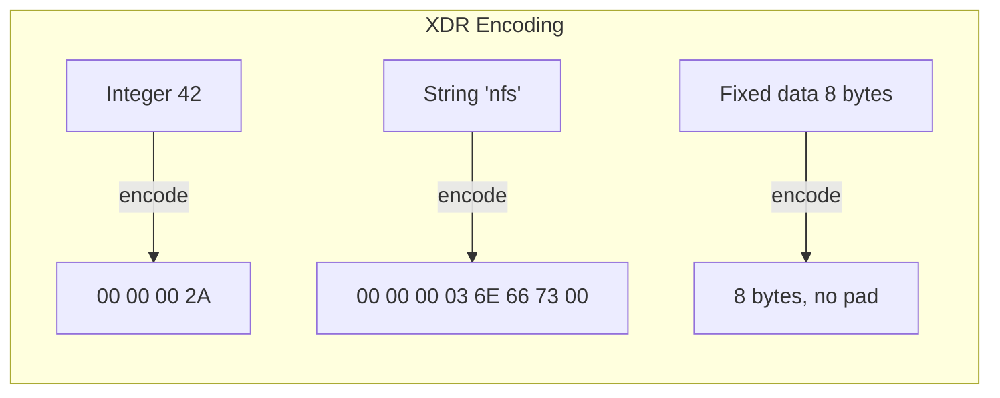
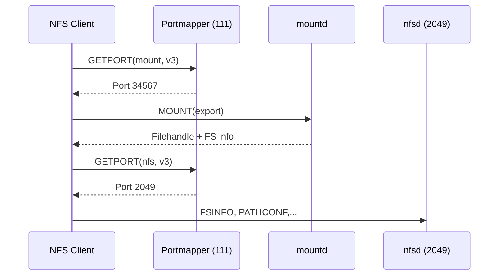
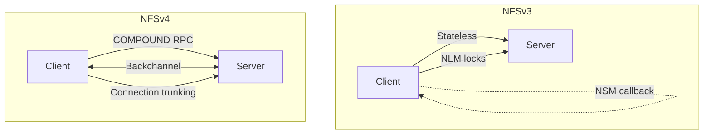
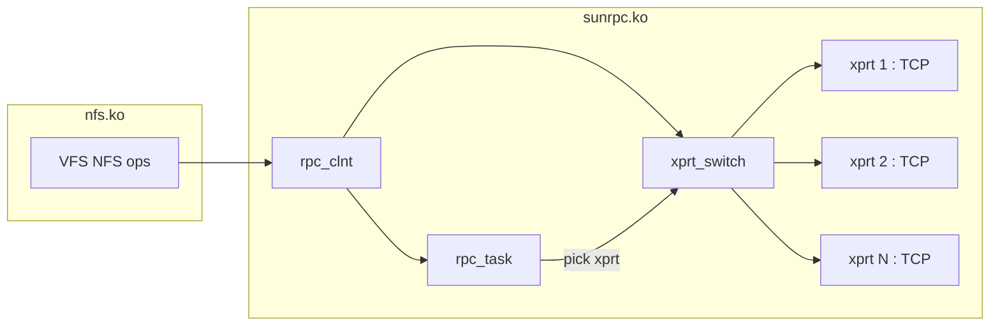

# Chapter 2: Sun RPC Recap

> This chapter is a reference for readers already familiar with ONC RPC. It highlights the structures and behaviours most relevant to the NFS client implementation in Linux.

## 2.1 RPC Message Structure

Every RPC message follows this framing:

```xdr
struct rpc_msg {
    unsigned int  xid;          // transaction ID
    enum msg_type mtype;        // CALL (0) or REPLY (1)
    union body {
        call_body  cbody;       // if CALL
        reply_body rbody;       // if REPLY
    };
};
```

### CALL body

```xdr
struct call_body {
    unsigned int  rpcvers;      // must be 2
    unsigned int  prog;         // program number
    unsigned int  vers;         // version number
    unsigned int  proc;         // procedure number
    opaque_auth   cred;         // authentication credential
    opaque_auth   verf;         // authentication verifier
};
```

### REPLY body

```xdr
union reply_body switch (enum reply_stat stat) {
    case RPC_MSG_ACCEPTED:
        accepted_reply areply;
    case RPC_MSG_DENIED:
        rejected_reply rreply;
};
```

## 2.2 XDR — eXternal Data Representation

XDR is the serialization layer. Key properties:

- **Big-endian byte order** (network byte order) — no byte-order negotiation
- **4-byte alignment** — every data element starts at a 4-byte boundary
- **Variable-length primitive** — length-prefixed (4 bytes) followed by data, padded to 4 bytes



## 2.3 Authentication Flavours

| Flavour | Number | Usage |
|---------|--------|-------|
| AUTH_NONE | 0 | No authentication |
| AUTH_SYS | 1 | Unix UID/GID (legacy, NFSv3 default) |
| AUTH_SHORT | 2 | Shorthand for AUTH_SYS (obsolete) |
| RPCSEC_GSS | 6 | Kerberos 5, SPKM, LIPKEY (mandatory for NFSv4) |

In NFSv4, `AUTH_SYS` is deprecated. Clients and servers MUST support RPCSEC_GSS negotiation. In practice, many deployments still use `AUTH_SYS` (`sec=sys`) for simplicity.

## 2.4 Transport and Binding

### Portmapper / rpcbind

Before NFSv4, clients needed to discover service ports:



NFSv4 eliminates this: all operations happen on port 2049. The server exports are discovered via GETATTR(fs_locations) or the /proc/fs/nfsd/ interface.

### Connection Model



## 2.5 Idempotency and Duplicate Detection

- **NFSv3**: The client retransmits on timeout. Non-idempotent operations (REMOVE, RENAME, CREATE) can execute multiple times. Servers maintain a **duplicate request cache (DRC)** per connection.
- **NFSv4**: The COMPOUND RPC may contain both idempotent and non-idempotent operations. The server uses a **slot-based reply cache** (see Chapter 4).
- **NFSv4.1**: The session slot table provides deterministic duplicate detection and ordered operation processing.

## 2.6 The Linux SunRPC Implementation

The Linux kernel's SunRPC layer (`net/sunrpc/`) provides:

| Component | File(s) | Role |
|-----------|---------|------|
| `rpc_clnt` | `clnt.c` | RPC client handle, manages transports |
| `rpc_task` | `sched.c` | Single RPC execution context, state machine |
| `rpc_xprt` | `xprt.c` | Transport abstraction (TCP, UDP, RDMA) |
| `xprtmultipath` | `xprtmultipath.c` | Transport switch — the multipath foundation |
| `auth` | `auth.c`, `auth_null.c`, `auth_unix.c`, `auth_tls.c` | Credential management and RPC-level auth |



The `xprt_switch` (`xprtmultipath.c`) is the key data structure for multipath — it holds an ordered list of transports and an iterator (`xps_iter_ops`) that selects the next transport for each RPC. This is the hook point for custom dispatch policies (round-robin, weighted, etc.).

### Transport Switch Iterator

```c
struct xprt_switch_iter_ops {
    struct rpc_xprt *(*xps_iter_init)(struct rpc_xprt_switch *);
    struct rpc_xprt *(*xps_iter_next)(struct rpc_xprt_switch *);
};
```

The NFSv4.1 session trunking implementation uses this interface. Our dnfs project will extend it for client-configured multipath (see Chapter 8).

## 2.7 Summary of Key Differences

| Aspect | NFSv3 | NFSv4 | NFSv4.1 |
|--------|-------|-------|---------|
| RPC version | 2 | 2 | 2 |
| Program | 100003 (NFS) + 100021 (NLM) | 100003 (NFS) | 100003 (NFS) |
| Port | 2049 + random (mountd, NLM) | 2049 | 2049 |
| Transport | TCP/UDP | TCP | TCP (RDMA optional) |
| Auth | AUTH_SYS typical | RPCSEC_GSS required | RPCSEC_GSS required |
| Duplicate detection | DRC per connection | Slot table per client | Slot table per session |
| Callback | Separate connection | Inline via backchannel | Backchannel (reliable) |
| Multipath | None | None | Session trunking |
