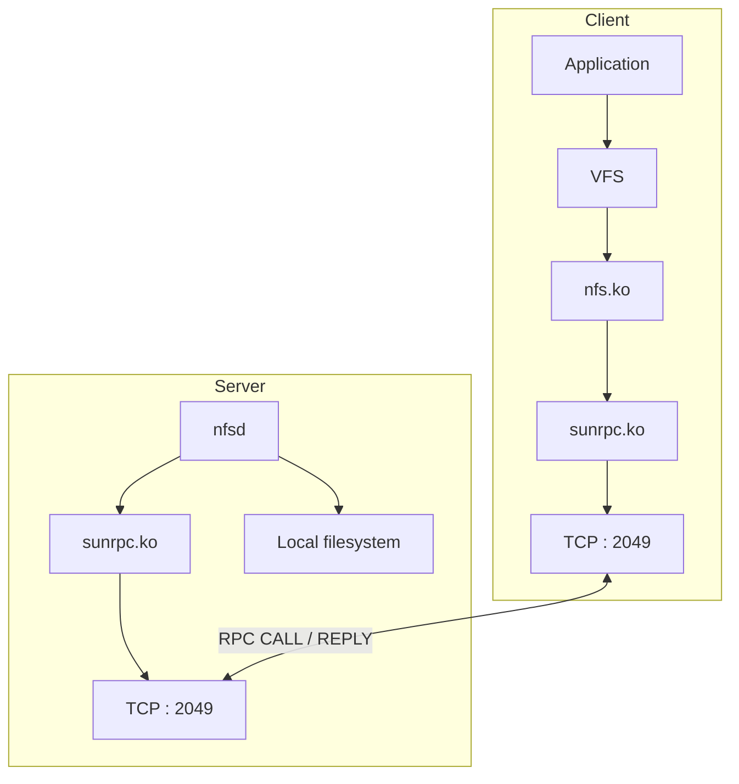
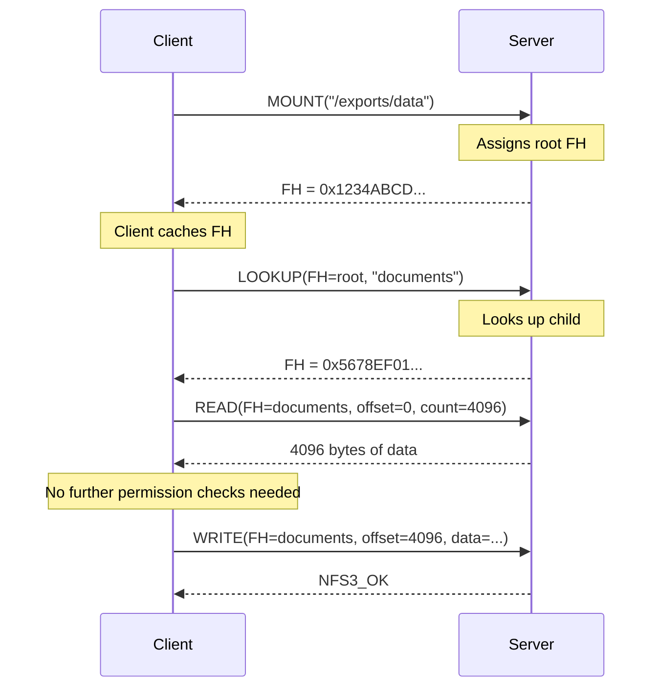
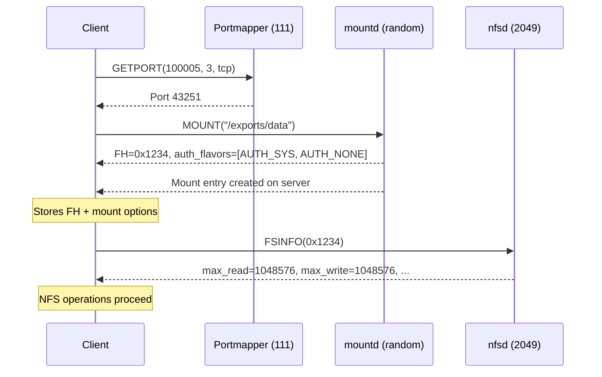
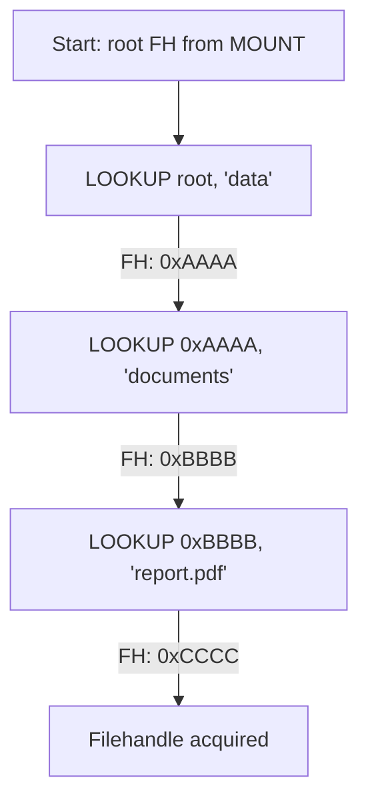
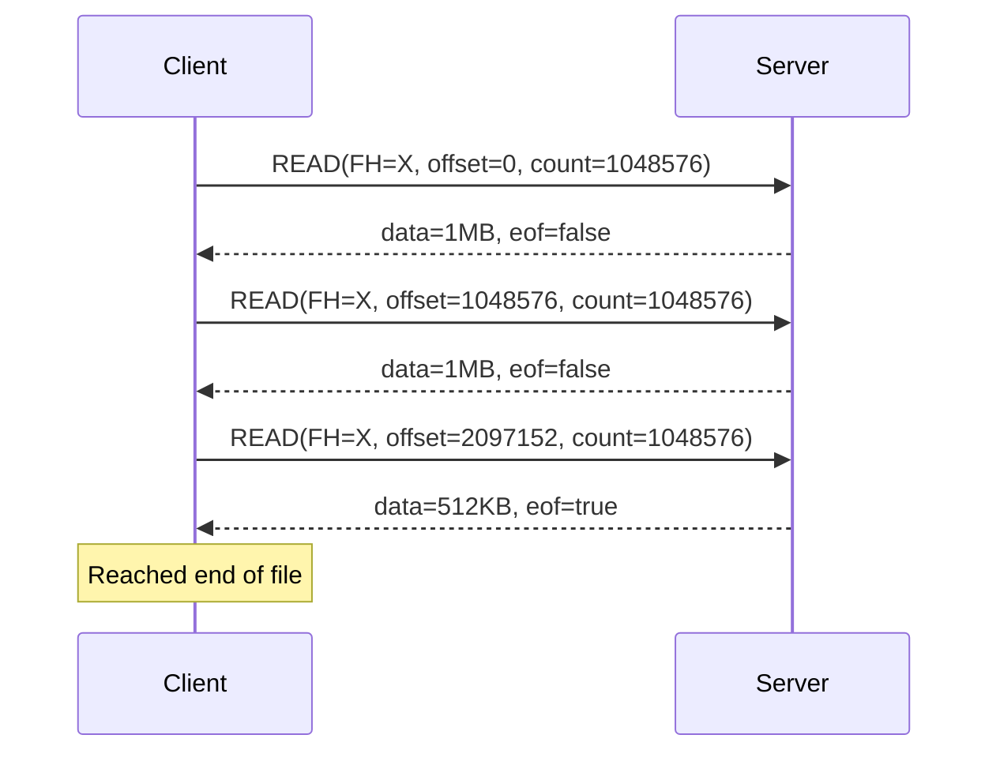
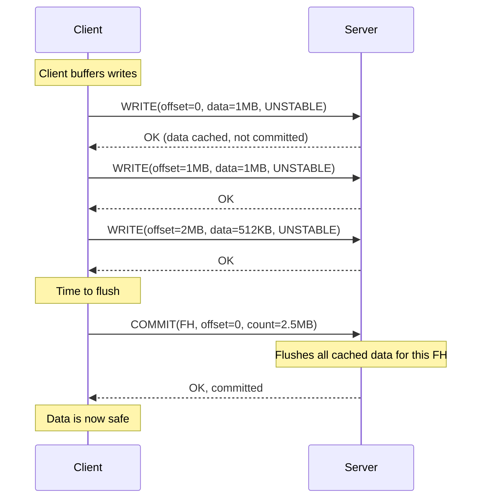
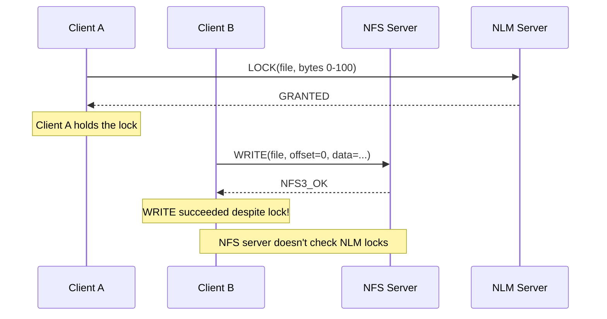
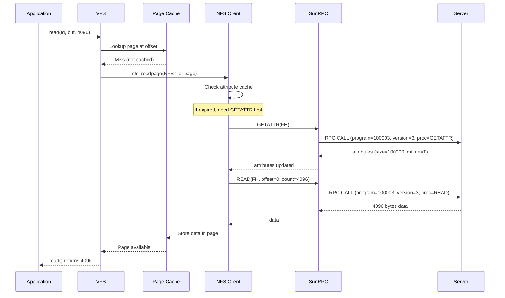
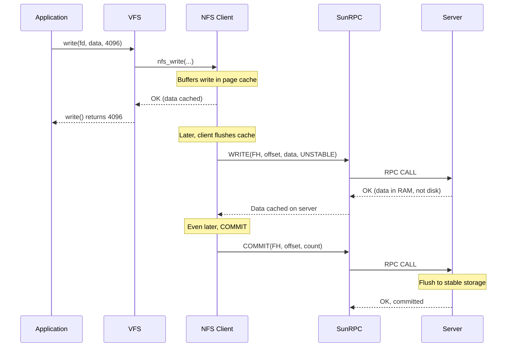
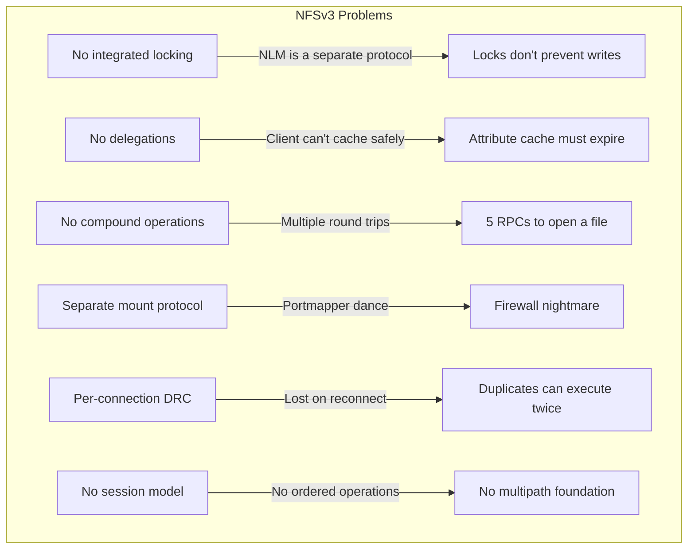

# Chapter 3: NFSv3 — How NFS Actually Works

If you want to understand NFSv4, you need to understand NFSv3 first — not because v3 is a prerequisite in the "you must read this first" sense, but because **every design decision in NFSv4 is a direct response to a specific problem in NFSv3.** You can't understand why NFSv4 has stateids and leases unless you understand why NFSv3's stateless model made locking unreliable. You can't understand why COMPOUND RPC exists unless you understand the "five-round-trips-to-open-a-file" problem.

This chapter teaches the NFSv3 protocol as a foundation. By the end, you'll understand exactly how NFS works on the wire, what each operation does, and — most importantly — where the architectural problems are that NFSv4 had to solve.

## 3.1 The NFSv3 Model in One Picture



NFSv3 is a **stateless, request-response protocol** over RPC. The client sends a request (READ, WRITE, LOOKUP, etc.). The server executes it and sends a response. The server does not remember anything between requests. It doesn't know which files you have open, which byte ranges you've locked, or even whether you're still connected.

Everything the client needs to resume after a failure is stored on the **client side** — filehandles in memory, attributes in the page cache, locks tracked by the separate lock manager (NLM). If the client crashes, it all disappears. If the server crashes, the client retries until the server comes back.

This simplicity is both NFSv3's greatest strength and its most fundamental limitation. Let's see how it works.

## 3.2 Filehandles — The Identity Token

Every operation in NFSv3 identifies a file or directory by a **filehandle** — an opaque byte string that the server assigns and the client stores.

```c
struct nfs_fh3 {
    unsigned int  length;    // 0-64 bytes (typically 32-64)
    char          data[64];  // Opaque bytes meaningful only to the server
};
```

A filehandle is like a **pointer** in C — it's an opaque value that refers to an object, but you can't look inside it. The server creates filehandles when the client mounts an export or looks up a path. The client stores them and presents them with every subsequent operation.

Internally, the server usually encodes:

```
filehandle = {
    filesystem_id,    // Which export/filesystem
    inode_number,     // Which inode
    generation,       // Anti-stale counter
    fsid              // Filesystem identifier for NFS referrals
}
```

The generation counter is critical. When a file is deleted and a new file is created with the same inode number, the generation changes. The server can detect that a client is presenting a stale filehandle and return `NFS3ERR_STALE` instead of silently operating on the wrong file.

### How Filehandles Are Obtained

There are exactly three ways a client gets a filehandle:

1. **MOUNT operation** (from the mountd protocol): Returns the root filehandle of an export
2. **LOOKUP operation**: Given a directory filehandle + filename, returns the filehandle of the child
3. **READDIRPLUS operation**: Returns filehandles for all entries in a directory in a single RPC

Once the client has a filehandle, it can use it directly without asking the server for permission. This is the core of the stateless model — the filehandle IS the authorization. If you have a valid filehandle, you can operate on the file.



The entire authorization check happens once, at MOUNT or LOOKUP time. After that, the filehandle IS the ticket. The server trusts that if you have a valid filehandle, you should be allowed to use it.

### The Stale Filehandle Problem

Filehandles can become **stale** — the underlying file was deleted or renamed, and the filehandle no longer refers to anything valid. The server returns `NFS3ERR_STALE`:

```c
// Client tries to read from a file that was deleted by another client
READ(FH=0x1234, offset=0, count=4096)
// Server response: NFS3ERR_STALE

// The client must re-LOOKUP the file from its parent directory
LOOKUP(FH=parent, "filename")
// If the file is gone: NFS3ERR_NOENT
// If the file was recreated: new FH, use it
```

Stale filehandles are a fact of life in NFSv3. The client must handle them gracefully by re-resolving the path from the parent directory. This is one reason NFSv3 clients are careful to keep directory filehandles around — they need them for re-resolution.

## 3.3 The NFSv3 RPC Program

NFSv3 is registered as RPC program 100003, version 3. It defines 19 procedures:

| Proc | Name | Idempotent? | Purpose |
|------|------|------------|---------|
| 0 | NULL | Yes | No-op, used for connectivity checks |
| 1 | GETATTR | Yes | Get file attributes (size, mtime, type, permissions) |
| 2 | SETATTR | No | Set file attributes |
| 3 | LOOKUP | Yes | Resolve filename to filehandle |
| 4 | ACCESS | Yes | Check access permissions |
| 5 | READLINK | Yes | Read symbolic link target |
| 6 | READ | Yes | Read bytes from a file |
| 7 | WRITE | No | Write bytes to a file |
| 8 | CREATE | No | Create a file |
| 9 | MKDIR | No | Create a directory |
| 10 | SYMLINK | No | Create a symbolic link |
| 11 | MKNOD | No | Create a device node |
| 12 | REMOVE | No | Delete a file |
| 13 | RMDIR | No | Delete a directory |
| 14 | RENAME | No | Rename a file or directory |
| 15 | LINK | No | Create a hard link |
| 16 | READDIR | Yes | Read directory entries (names and cookies) |
| 17 | READDIRPLUS | Yes | Read directory entries + filehandles + attributes |
| 18 | FSSTAT | Yes | Get filesystem statistics (free space, total inodes) |
| 19 | FSINFO | Yes | Get filesystem capabilities (max read/write size, etc.) |
| 20 | PATHCONF | Yes | Get POSIX pathconf information |
| 21 | COMMIT | Yes | Flush cached writes to stable storage |

### Idempotent vs. Non-Idempotent

This distinction is crucial for understanding how NFSv3 handles retransmissions:

**Idempotent operations** produce the same result no matter how many times they execute. READ(offset=0, count=4096) returns the same data every time. GETATTR returns the same attributes (until the file changes). LOOKUP("readme.txt") returns the same filehandle.

**Non-idempotent operations** change server state in a way that makes repeated execution dangerous. WRITE(data="hello") writes "hello" once; if executed twice, it writes "hellohello". REMOVE("file") deletes the file on first execution; on second execution, the file is already gone.

When the client retransmits a request (because the reply was lost), the server uses a **duplicate request cache (DRC)** to detect duplicates. But the DRC is per-TCP-connection, and reconnecting after a network interruption loses the cache. Non-idempotent operations can execute twice.

NFSv4 solves this with the session slot table (Chapter 4 of this book). NFSv3 just lives with the risk.

## 3.4 The Mount Protocol

Before a client can perform NFS operations, it must **mount** an export. Mounting is handled by a separate RPC program: **mountd** (program 100005).



The MOUNT response contains:

```c
struct mountres3_ok {
    struct nfs_fh3    fh;               // Root filehandle
    int               auth_flavors<>;   // Supported auth flavours
};
```

The filehandle returned by MOUNT is the root of the export. The client saves it and uses it as the starting point for all subsequent path lookups.

### The Export List

The server maintains a list of exports in `/etc/exports`. Each export specifies:

```
/exports/data     client1(rw,sync,no_subtree_check) client2(ro)
```

When the client calls MOUNT, the server checks:
1. Is the requested path in the export list?
2. Is the requesting client allowed to mount it?
3. What options apply (read-only, root squash, etc.)?

If the check passes, the server creates a virtual root filehandle for that export. If not, the MOUNT fails with `NFS3ERR_ACCES` or `NFS3ERR_NOENT`.

## 3.5 The NULL Procedure (Connectivity Check)

Procedure 0, NULL, is the simplest operation in NFSv3. It takes no arguments, returns no results, and does nothing. Its sole purpose is to check whether the server is alive and reachable:

```
CALL:  program=100003, version=3, procedure=0, arguments=(empty)
REPLY: (empty)
```

If the server responds to a NULL RPC, the client knows the RPC layer is working. The transport is connected, the RPC infrastructure is functional, and the server hasn't crashed.

NFS clients send NULL RPCs periodically to detect server failures before an actual operation times out. This is called the **dead server detection** mechanism.

## 3.6 The Core Operations: How Files Are Read and Written

### GETATTR — Getting File Attributes

Before reading or writing, the client often needs to know the file's attributes: size, modification time, permissions, type.

```c
// Arguments: current filehandle
// Results:
struct GETATTR3resok {
    struct fattr3   attributes;   // File type, size, mode, mtime, etc.
};
```

The `fattr3` structure contains:

```c
struct fattr3 {
    ftype3        type;      // NF3REG (file), NF3DIR (dir), NF3LNK (symlink), etc.
    uint32_t      mode;      // Unix permission bits (rwxr-xr-x)
    uint32_t      nlink;     // Number of hard links
    uint64_t      size;      // File size in bytes
    uint64_t      used;      // Disk space used (bytes)
    uint64_t      fsid;      // Filesystem identifier
    nfs_fh3       fileid;    // Unique file identifier (inode number)
    nfstime3      atime;     // Access time
    nfstime3      mtime;     // Modify time
    nfstime3      ctime;     // Change time (metadata modification)
};
```

GETATTR is the most frequently called NFS operation. Every time you run `ls -l`, every time you `stat` a file, every time the VFS needs to validate its attribute cache — GETATTR is sent.

### LOOKUP — Finding Files

LOOKUP resolves a filename within a directory:

```c
// Arguments: directory filehandle, filename
// Results: target filehandle + target attributes
struct LOOKUP3resok {
    struct nfs_fh3   fh;          // Filehandle of the resolved file
    struct fattr3    attr;        // Attributes of the resolved file
    struct fattr3    dir_attr;    // Attributes of the parent directory
};
```

LOOKUP is the core of path resolution. When the client needs to open `/data/documents/report.pdf`, it performs a series of LOOKUPs:



Each LOOKUP returns the filehandle of the next component. By the end, the client has the filehandle of the target file and can begin reading or writing.

### READ — Reading Data

The READ operation is the heart of NFS data access:

```c
// Arguments:
struct READ3args {
    struct nfs_fh3   fh;         // Filehandle
    uint64_t         offset;     // Byte offset (64-bit)
    uint32_t         count;      // Bytes to read (max 1 MB typically)
};

// Results:
struct READ3resok {
    struct fattr3    attributes; // File attributes after the read
    uint32_t         count;      // Actual bytes read
    bool             eof;        // True if offset+count >= file size
    opaque           data<>;     // The data itself
};
```

The client specifies a filehandle, an offset, and a count. The server reads the data and returns it. The `eof` flag tells the client whether it hit the end of the file, which is how the client knows when to stop reading.



The maximum READ size is negotiated during FSINFO. Modern NFSv3 deployments use 1 MB reads, which gives the best balance of throughput (big reads fill the pipe) and latency (small reads don't monopolize the server).

### WRITE — Writing Data

WRITE is the most complex operation in NFSv3 because of the **async write + commit** model:

```c
// Arguments:
struct WRITE3args {
    struct nfs_fh3   fh;         // Filehandle
    uint64_t         offset;     // Byte offset
    uint32_t         count;      // Bytes to write
    enum stable_how  stable;     // FILE_SYNC, DATA_SYNC, UNSTABLE
    opaque           data<>;     // The data
};

// Results:
struct WRITE3resok {
    struct fattr3    attributes;
    uint32_t         count;      // Bytes written (may be < requested)
    enum stable_how  committed;  // What the server actually committed
    verifier3        writeverf;  // Write verifier (changes on server reboot)
};
```

The `stable_how` parameter is where the complexity is:

| Value | Server Must Commit | Client Can Assume |
|-------|-------------------|-------------------|
| `FILE_SYNC` | Data to stable storage before replying | Data is safe (slow) |
| `DATA_SYNC` | Data to stable storage, metadata may be cached | Data is safe (faster) |
| `UNSTABLE` | Nothing — data may be in RAM only | Data is NOT safe until COMMIT |

### The Write Lifecycle

NFSv3 clients almost never use `FILE_SYNC` writes because they're slow — each write must flush to disk before the server responds. Instead, they use `UNSTABLE` writes and periodically call COMMIT:



The COMMIT operation tells the server to flush all pending UNSTABLE writes for a file to stable storage. The client issues COMMIT when:

- An application calls `fsync()` or `close()`
- The client's write buffer fills up
- A timer fires (typically every 5-30 seconds)

### The Write Verifier

Every COMMIT response includes a **write verifier** — a 64-bit value that changes when the server reboots. If the client sees a different verifier than it saw during the WRITE calls, it knows the server crashed and the pending UNSTABLE writes were lost. The client must retransmit all data since the last successful COMMIT.

```c
// Client writes data
WRITE(offset=0, data="hello", UNSTABLE)
// Server: verifier = 0xAAAA
// Server CRASHES and REBOOTS
WRITE(offset=0, data="hello", UNSTABLE)  // retransmit
// Server: verifier = 0xBBBB (changed after reboot)
// Client detects verifier change, knows it must rewrite
```

This is the mechanism that makes UNSTABLE writes safe despite server crashes. The verifier is the guarantee that data isn't lost.

## 3.7 READDIR and READDIRPLUS — Reading Directories

READDIR returns the entries in a directory:

```c
// Arguments: directory FH, cookie (opaque), count
// Results: entries (name + cookie), eof flag

// Each entry:
struct entry3 {
    uint64_t        fileid;    // Inode number
    filename3       name;      // Entry name
    cookie3         cookie;    // Opaque cursor for next READDIR
    struct entry3   *next;     // Next entry (linked list)
};
```

The **cookie** is an opaque value that the client passes on subsequent READDIR calls to continue reading from where it left off. It's like a cursor in a database — the client doesn't interpret it, just passes it back to the server.

READDIRPLUS is the same as READDIR, but also returns **filehandles and attributes** for each entry:

```
READDIRPLUS(FH=dir, cookie=0, count=4096)
→ Entry "a.txt": filehandle=0x1111, size=1024, mtime=T1
→ Entry "b.txt": filehandle=0x2222, size=2048, mtime=T2
→ Entry "c.txt": filehandle=0x3333, size=512, mtime=T3
```

This saves the client from having to call GETATTR on each entry individually. For a directory with 10,000 files, READDIRPLUS replaces 10,000 GETATTR calls with a single RPC.

## 3.8 The ACCESS Operation — Permission Checking

NFSv3 doesn't trust client-side permission bits. The client asks:

```c
ACCESS(FH=file, want=READ|WRITE|EXEC)
→ Server response: can_READ=1, can_WRITE=0, can_EXEC=1
```

This lets the server enforce its own permission model. Even if the client has root access locally, the server can deny operations based on the server's `/etc/exports` options (root_squash, ro, etc.).

## 3.9 NLM Locking — The Bolt-On Disaster

NFSv3 has no native locking. Locking is handled by a **completely separate RPC program** — the Network Lock Manager (NLM, program 100021).

```mermaid
flowchart LR
    subgraph NFSv3 "Lockless"
        NFS[NFS: 100003, port 2049] -->|READ/WRITE without lock check| FS[Server Filesystem]
    end
    subgraph NLM "Separate protocol"
        NLM[100021, random port] -->|LOCK/UNLOCK/TEST| LM[Lock Manager]
        NSM[100024, random port] -->|MONITOR/NOTIFY| LM
    end
    subgraph Problem
        NFS -.->|No coordination| NLM
    end
```

The NLM protocol has its own procedures:

| Proc | Name | Purpose |
|------|------|---------|
| 1 | LOCK | Acquire a byte-range lock |
| 2 | UNLOCK | Release a byte-range lock |
| 3 | TEST | Test if a lock would succeed |
| 4 | GRANTED | Server grants a blocked lock |
| 5 | CANCEL | Cancel a blocked lock request |
| 6 | GRANTED_MSG | Async lock granted notification |
| 7 | LOCKED_RES | Obsolete |
| 8 | UNLOCKED_RES | Obsolete |

### Why NLM Fails

The NLM has a fundamental architectural problem: **the NFS and NLM servers don't coordinate.**



The NFS server processes READ and WRITE without consulting the NLM server. The lock exists in the NLM server's state table, but the NFS server never checks it. This means:

- **Locking doesn't prevent concurrent writes.** Two clients can hold conflicting locks and write to the same bytes. The last writer wins, and data is corrupted.
- **Lock recovery on server reboot is unreliable.** After a server crash, the NLM server has no record of locks. Clients must reclaim locks using the NSM protocol, which can fail silently.
- **Locks are a second-class citizen.** They don't integrate with file operations, delegations, or any consistency mechanism.

NFSv4 fixed this by merging NLM into the NFS protocol itself. In NFSv4, OPEN and LOCK are operations within the same COMPOUND RPC, and every READ/WRITE carries a stateid that proves the client holds the necessary lock.

## 3.10 Attribute Caching — How Clients Avoid the Server

If every `ls -l` required a GETATTR call to the server, NFS would be unusably slow over WAN links. NFSv3 clients solve this with **attribute caching**:

```mermaid
flowchart TD
    APP[stat() or ls] --> CACHE{Attribute in cache?}
    CACHE -->|Yes, fresh| RETURN[Return cached data]
    CACHE -->|Expired| GETATTR[GETATTR to server]
    GETATTR --> UPDATE[Update cache]
    UPDATE --> RETURN
```

The client caches file attributes (size, mtime, permissions) for a configurable period:

- **acregmin / acregmax** (file attributes): typically 3-60 seconds
- **acdirmin / acdirmax** (directory attributes): typically 30-60 seconds

Within the cache period, `stat()` returns cached data without any network access. After the cache expires, the next `stat()` triggers a GETATTR.

This caching is why NFS feels responsive for directory listings but can return stale data — a file's size might be cached for 30 seconds even if another client just modified it.

### The Attribute Cache Problem

The NFSv3 attribute cache has no invalidation mechanism. If client A modifies a file and client B has that file's attributes cached, client B won't see the new size until the cache expires. This is a direct consequence of the stateless server — the server doesn't know which clients have which attributes cached, so it can't notify them when something changes.

NFSv4 addresses this with **delegations and callbacks** (covered in Chapter 5 of this book).

## 3.11 What a Read Looks Like End-to-End

Here's the complete journey of a `read()` call through NFSv3:



Two RPCs (one for GETATTR, one for READ). Two network round trips. On a local network with 0.1 ms latency, that's 0.2 ms of pure latency plus the server's read time. On a WAN with 50 ms latency, it's 100 ms.

This is why NFSv4's COMPOUND RPC is such a big deal — it merges the GETATTR and READ into a single RPC, halving the latency.

## 3.12 What a Write Looks Like End-to-End



The write path has three stages:
1. **Application writes to page cache** — instant, no network
2. **WRITE to server** — data moves to server RAM, acknowledged immediately
3. **COMMIT to server** — data moves to server disk, acknowledged when safe

This three-stage model gives excellent performance for write-heavy workloads. The application sees fast write completions (stage 1 is sub-microsecond, stage 2 is sub-millisecond on a LAN). The data durability is guaranteed by stage 3.

## 3.13 What's Wrong with NFSv3

The stateless model is simple and robust, but it has fundamental limitations that motivated the NFSv4 redesign:



### Problem 1: Locking Is Separate from I/O

The NFS server doesn't check locks before allowing writes. This means locking is effectively advisory — a cooperating client respects locks, but there's no enforcement. Databases that rely on locks for consistency cannot use NFSv3 safely.

**NFSv4 solution**: OPEN creates a stateid. Every READ and WRITE carries the stateid. The server validates the stateid against the lock state. If you don't hold the lock, your I/O fails.

### Problem 2: No Delegation Mechanism

NFSv3 clients can cache data, but they can never be sure the cache is valid. Another client might have modified the file. The attribute cache timeout is a guess, not a guarantee.

**NFSv4 solution**: Delegations give the client temporary ownership of a file. With a write delegation, the client KNOWS no other client is modifying the file. It can cache aggressively and only communicate with the server when done.

### Problem 3: Every Operation Is a Round Trip

Opening a file in NFSv3 requires:
1. MOUNT (or have the root FH)
2. LOOKUP "dir1"
3. LOOKUP "dir2"
4. LOOKUP "file"
5. GETATTR (optional but common)
6. READ (to get the first bytes)

That's 4-6 RPCs to do what a local filesystem does in one system call. On high-latency links, this is devastating.

**NFSv4 solution**: COMPOUND RPC combines multiple operations into a single request. The same file open takes one RPC.

### Problem 4: Portmapper Dependency

The NFS server is on port 2049, but mountd and NLM are on random ports. Clients must discover them via the portmapper (rpcbind, port 111). This adds startup latency, complicates firewall configuration, and introduces an additional point of failure.

**NFSv4 solution**: Everything goes over port 2049. No portmapper needed.

### Problem 5: The DRC Is Per-Connection

The duplicate request cache is tied to the TCP connection. If the connection is lost and re-established, the DRC is empty. Non-idempotent operations (WRITE, REMOVE, RENAME) can execute twice.

**NFSv4.1 solution**: The session slot table provides deterministic duplicate detection independent of which TCP connection carries the request.

### Problem 6: No Multipath Foundation

NFSv3 has no concept of multiple paths to the server. Each mount creates one TCP connection. There's no mechanism for session trunking, client-side multipath, or connection failover.

**NFSv4.1 solution**: Session trunking. And for our project, client-side multipath through the transport switch.

## 3.14 Summary

NFSv3 is a stateless, request-response protocol where:

- **Filehandles** are the identity tokens — if you have a valid FH, you can operate on the file
- **READ/WRITE** are the core operations, with COMMIT for durable writes
- **LOOKUP** resolves paths to filehandles
- **GETATTR** retrieves attributes (with client-side caching for performance)
- **NLM** provides locking as a separate, non-integrated protocol
- **The stateless model** makes server crash recovery trivial but prevents delegations, safe caching, and integrated locking

Every problem in NFSv3's design was addressed in NFSv4. The next chapter shows how.
