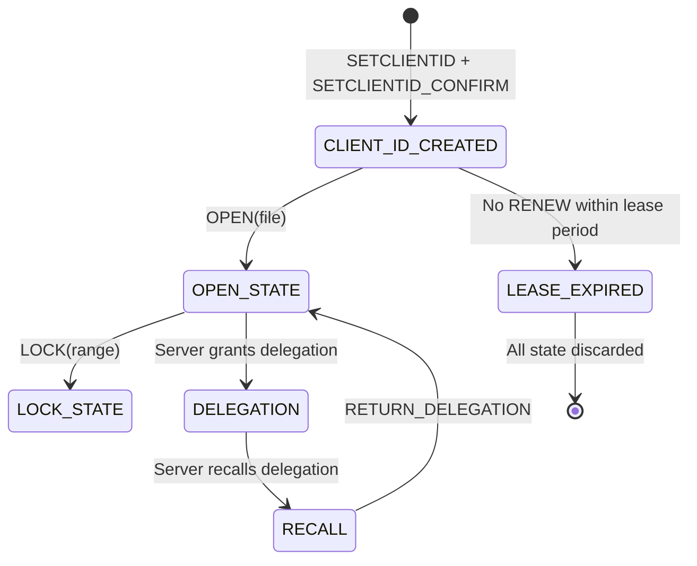
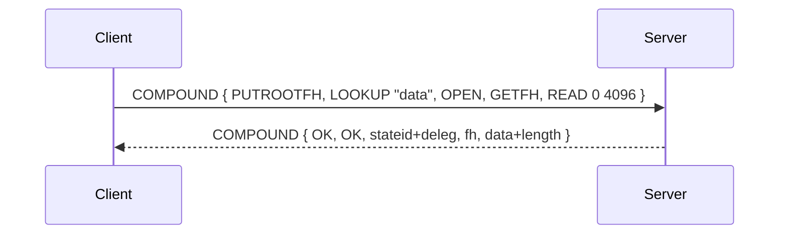
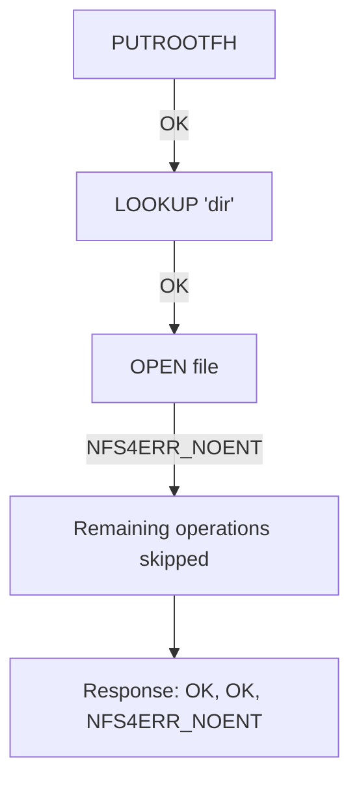
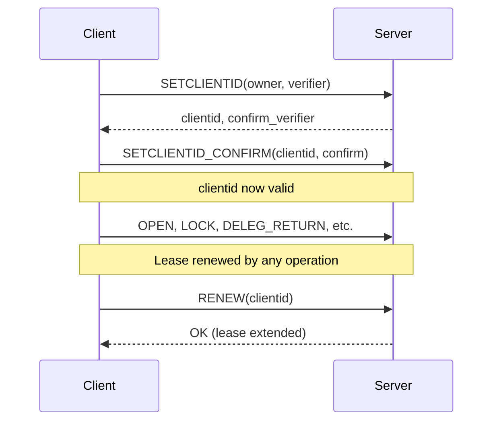
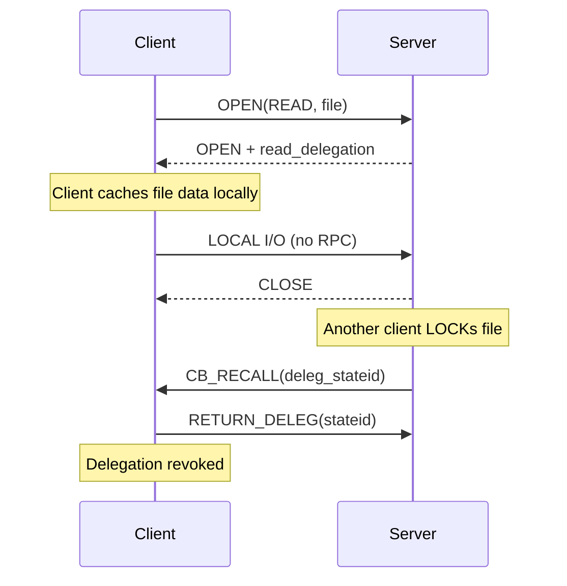
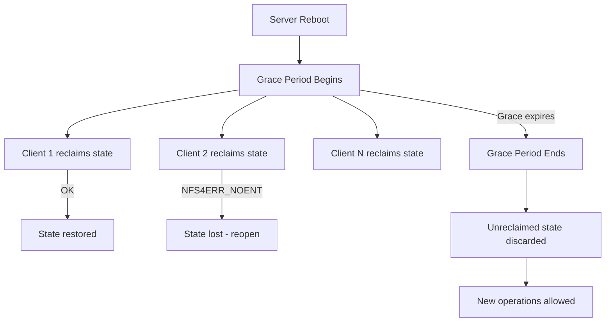
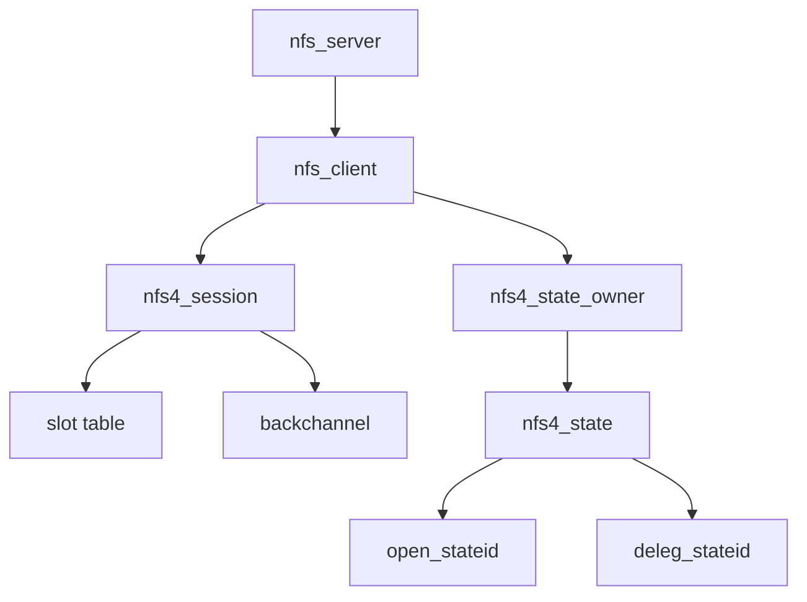

# Chapter 3: NFSv4 Architecture

## 3.1 The Stateful Model

NFSv4 replaced the stateless NFSv3 server with a **stateful lease-based model**. The server maintains:

- **Client ID**: A unique, persistent identifier for each client (created via SETCLIENTID)
- **Open state**: Every open file is tracked (OPEN → open_stateid)
- **Lock state**: Byte-range and file locks (LOCK → lock_stateid)
- **Delegations**: Temporary ownership transfer (deleg_stateid)
- **Lease**: All state has a timebound lease; client must renew (RENEW or any operation)



### Lease Management

The lease period (typically 30–120 seconds) governs all state lifetime:

- Client must send an RPC within the lease period to renew
- Any operation with a valid client ID renews the lease
- If the lease expires, the server discards ALL state (opens, locks, delegations)
- After server reboot, the client detects the grace period via `NFS4ERR_GRACE`

## 3.2 COMPOUND RPC

The fundamental unit of NFSv4 communication is the **COMPOUND operation** — a sequence of operations in a single request/reply:

```xdr
struct COMPOUND4args {
    utf8str_cs  tag;           // arbitrary string (debugging)
    uint32_t    minorversion;  // 0 for v4, 1 for v4.1
    nfs_opnum4  argarray<>;    // sequence of operations
};

struct COMPOUND4res {
    nfsstat4    status;
    utf8str_cs  tag;
    nfs_resop4  resarray<>;    // responses in same order
};
```

### Example: File Read



This replaces five separate RPCs in NFSv3 (MOUNT, LOOKUP, OPEN, GETFH, READ) with one.

### Operation Ordering Rules

- Operations execute sequentially
- If an operation fails, all subsequent operations are skipped
- The reply array contains responses for all attempted operations up to the failure, then a single error entry



## 3.3 Filehandles and Namespace

NFSv4 introduces a **pseudo-filesystem** that presents all exports as a single tree:

- The server constructs a virtual namespace rooted at the pseudo-root
- `PUTROOTFH` sets the current filehandle to the pseudo-root
- `GETFH` returns the current filehandle
- `SETFH` sets a filehandle directly (for reconnection recovery)

```mermaid
flowchart TD
    PR[Pseudo-root /] --> E1[/export/data]
    PR --> E2[/export/home]
    PR --> E3[/export/scratch]
    E1 --> F1[file1]
    E1 --> D1[subdir]
    D1 --> F2[file2]
```

## 3.4 State Management Operations

### Client ID Lifecycle



### Open and Lock State

Each OPEN creates an **open_stateid**. Each LOCK creates a **lock_stateid**. Stateids are:

- **Open stateid**: Identifies an open file instance
- **Lock stateid**: Identifies a byte-range lock
- **Delegation stateid**: Identifies a delegation (write delegation allows local caching)

```c
struct nfs_open_state {
    struct nfs_client  *clp;          // owning client
    struct nfs4_state  *state;         // v4 state tracking
    unsigned int       open_count;     // OPEN reference count
    stateid_t          open_stateid;   // current open stateid
};
```

### Delegations

A delegation is a server-to-client grant of **ownership** over a file:

| Type | Client can | Server can't | Revocation |
|------|-----------|-------------|------------|
| **READ delegation** | Cache file data locally | Change file data without notification | RECALL + RETURN_DELEG |
| **WRITE delegation** | Cache data + modify locally | Modify file at all | RECALL + RETURN_DELEG |



## 3.5 Recovery Models

### Client Recovery (Lease Expiry)

If the client fails to renew its lease:

1. Server continues until lease period expires
2. After expiry, server discards all state for that client ID
3. Client reconnects with SETCLIENTID
4. If state was lost, client re-opens files and re-acquires locks

### Server Recovery (Reboot)

After server reboot:

1. Server starts in a **grace period** (typically 2 × lease period)
2. During grace, only operations from clients that confirm previous state are allowed
3. Clients detect the reboot via `NFS4ERR_GRACE` on non-idempotent operations
4. Client re-issues OPEN_CONFIRM, LOCK_OWNER operations to reclaim state
5. After grace period, unreclaimed state is discarded



## 3.6 The Linux NFSv4 Client: Key Data Structures



| Structure | Location | Purpose |
|-----------|----------|---------|
| `nfs_client` | `fs/nfs/client.c` | Per-server NFS client state |
| `nfs4_session` | `fs/nfs/nfs4session.c` | Session slot table (v4.1+) |
| `nfs4_state_owner` | `fs/nfs/nfs4state.c` | Owner bound to a client ID |
| `nfs4_state` | `fs/nfs/nfs4state.c` | Open state for a specific file |
