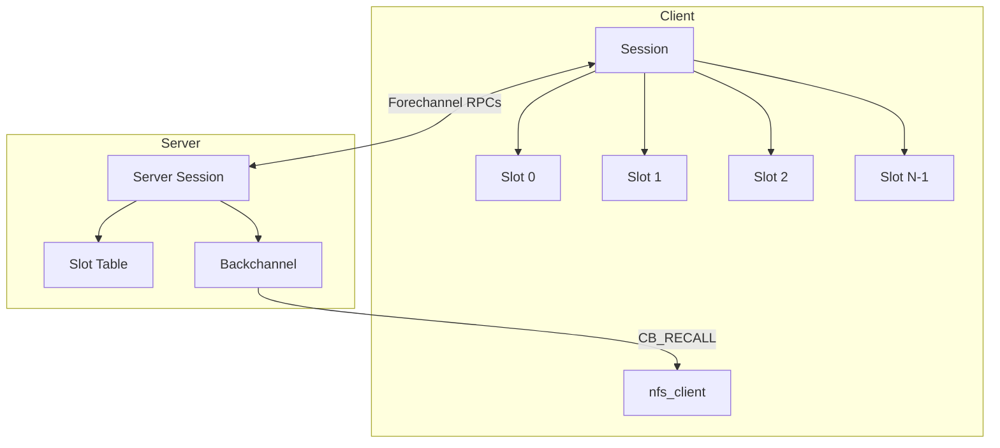
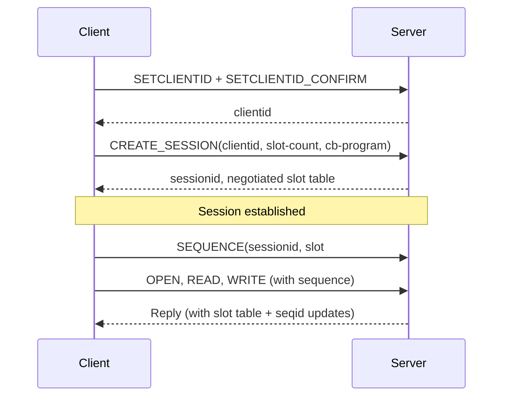
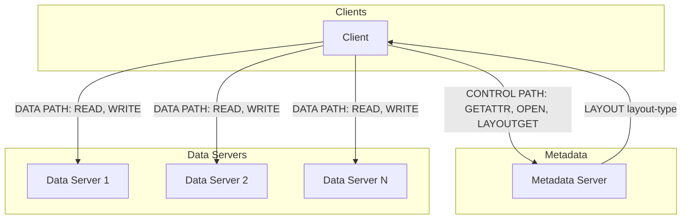
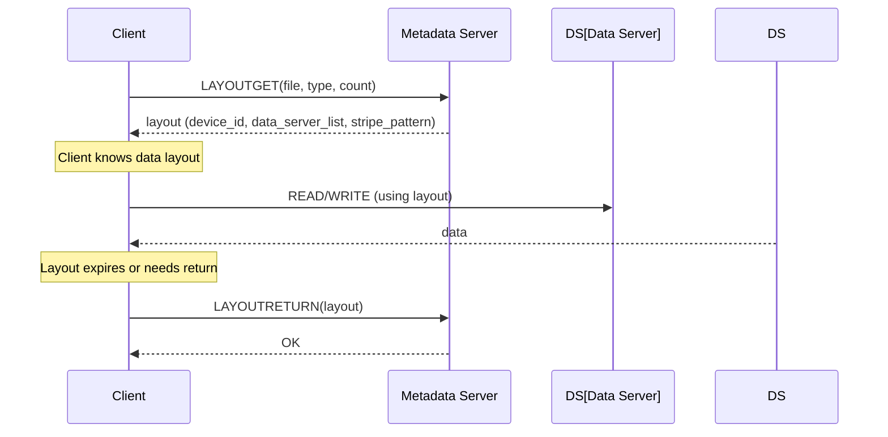
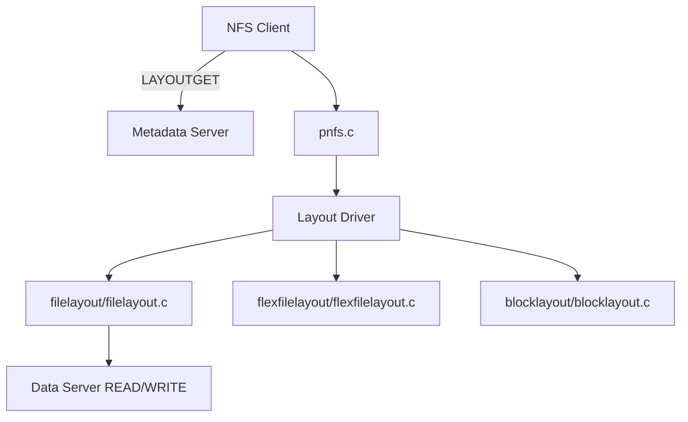
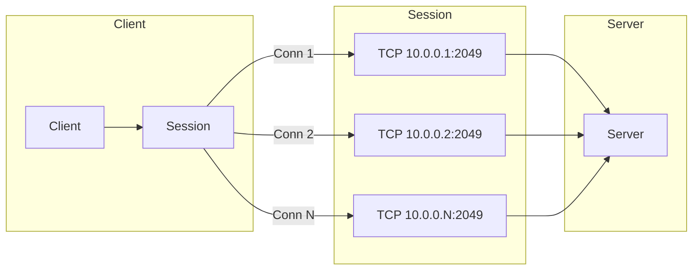
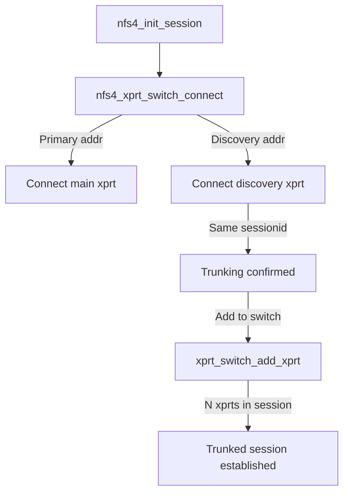

# Chapter 4: NFSv4.1 — Sessions, pNFS, and Trunking

NFSv4.1 (RFC 5661) introduced three architectural extensions that fundamentally changed the protocol's scalability and reliability:

| Feature | Problem Solved |
|---------|---------------|
| **Session model** | No deterministic duplicate reply cache for COMPOUND, no ordered operations |
| **pNFS layouts** | Single-server bottleneck for data throughput |
| **Session trunking** | No standard way to use multiple connections for reliability/throughput |

## 4.1 The Session Model

NFSv4.1 replaces the client-id/lease model with a **session-based** state model. Every client-server pairing creates one or more sessions, each with:

- A **slot table** (ordered array of operation slots)
- A **backchannel** (server-to-client RPCs over the same connection)
- A **reply cache** per slot (deterministic duplicate detection)



### CREATE_SESSION

After SETCLIENTID, the client creates a session:



### Slot Table Ordering

The slot table guarantees:

1. **Ordered processing** within a slot — operations in one slot are processed in order
2. **At-most-once semantics** — slot table doubles as an exact duplicate cache
3. **Slot-based flow control** — client can't exceed negotiated slot count

```c
struct nfs4_slot_table {
    struct nfs4_slot *slots;        // array of slots
    int               max_slots;    // negotiated maximum
    unsigned long     used_slots;   // bitmap of in-use slots
    unsigned long     highest_used_slotid;
    spinlock_t        slot_tbl_lock;
};
```

Each slot tracks:

```c
struct nfs4_slot {
    struct nfs4_slot_table *table;
    unsigned int            slot_nr;
    unsigned int            seq_nr;        // sequence number (monotonic)
    u32                     slot_nr;       // 0..max_slots-1
    // cached reply
    struct nfs4_cached_res *cached_reply;
};
```

### Backchannel

NFSv4.1 adds reliable server-to-client RPCs:

- The server uses the **backchannel** (same TCP connection) for operations like CB_RECALL
- No separate listener port needed
- Backchannel RPCs share the session's slot table
- The CB_SEQUENCE operation provides the same ordering guarantees

## 4.2 pNFS — Parallel NFS

pNFS separates the **metadata path** (control) from the **data path** (I/O):



### Layout Types

| Layout | Standard | Use Case |
|--------|----------|----------|
| **FILE** (flex_files) | RFC 5661 §13 | File-level striping across DS hosts |
| **BLOCK** | RFC 5661 §14 | Block-based (iSCSI, FC) data access |
| **OBJECT** | RFC 5661 §15 | Object storage devices (OSD) |
| **FLEX_FILES** | RFC 8435 | NFSv3 DS backends, mirrored layouts |

### LAYOUT Operations



### Layout Structure

```c
struct pnfs_layout_range {
    u64     offset;         // byte offset
    u64     length;         // byte length
    u32     iomode;         // READ, READ_WRITE
};

struct nfs4_layout {
    struct pnfs_layout_range  range;
    struct nfs4_deviceid_node *deviceid;
    layouttype4               type;
    void                     *layout_private;
};
```

### The Linux pNFS Client Implementation

The Linux client implements pNFS through **layout drivers**:



Key files in `fs/nfs/`:

| File | Purpose |
|------|---------|
| `pnfs.c` | Core pNFS infrastructure (layout management, device discovery) |
| `pnfs.h` | Layout driver interface |
| `pnfs_dev.c` | Device ID to data server mapping |
| `pnfs_nfs.c` | NFS-specific pNFS helpers |
| `filelayout/filelayout.c` | File layout driver |
| `flexfilelayout/flexfilelayout.c` | Flexible files layout driver |
| `blocklayout/blocklayout.c` | Block/volume layout driver |

## 4.3 Session Trunking

Session trunking allows a single NFSv4.1 session to use **multiple TCP connections** between the same client and server:



### Trunking Discovery

A client discovers trunkable connections through one of two methods:

1. **Explicit trunking**: Client tries to bind additional connections to an existing session by calling `CREATE_SESSION` with the same session ID
2. **Implicit trunking**: Server advertises trunkable addresses via `GETATTR(fs_locations)` or the `SECINFO_NO_NAME` operation

### Linux Implementation

The Linux NFSv4.1 client supports session trunking through the `nfs4_xprt_switch_connect()` path in `nfs4client.c`. When multiple source addresses or destination addresses are available, the client attempts to bind additional connections to the session.



## 4.4 Summary

| Feature | NFSv4.0 | NFSv4.1 |
|---------|---------|---------|
| State model | Lease + client ID | Session + slot table |
| Duplicate cache | Per-connection DRC | Per-slot deterministic cache |
| Callbacks | TCP listener on client | Backchannel on same connection |
| Parallel I/O | None | pNFS layouts |
| Multipath | None | Session trunking |
| Failover | Timeout + reconnect | Trunked connection fallback |

The session trunking mechanism is the foundation for client-side multipath NFS. Chapter 5 explores this in detail and discusses its limitations.
