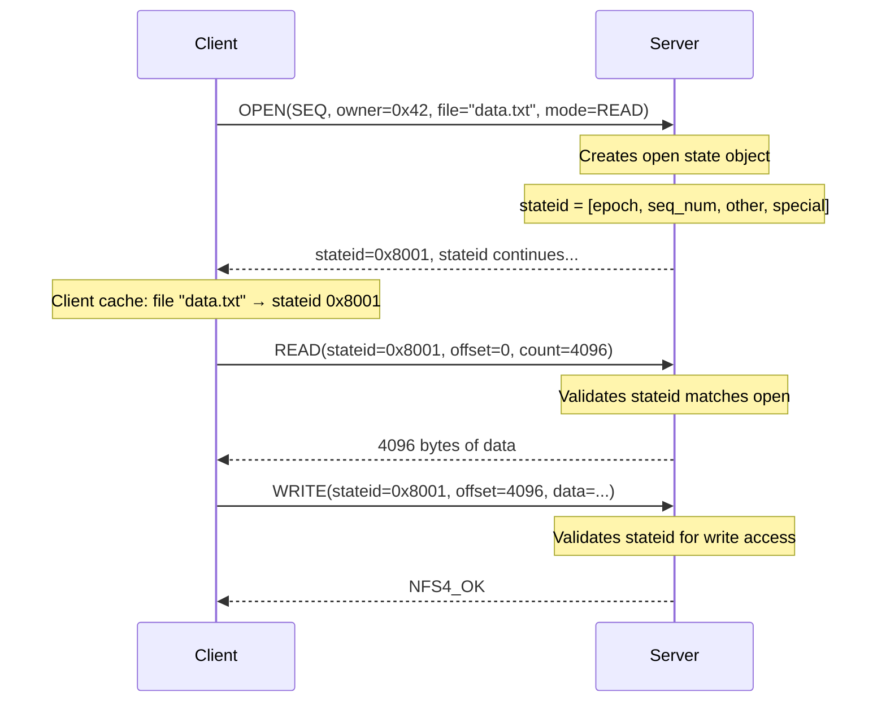
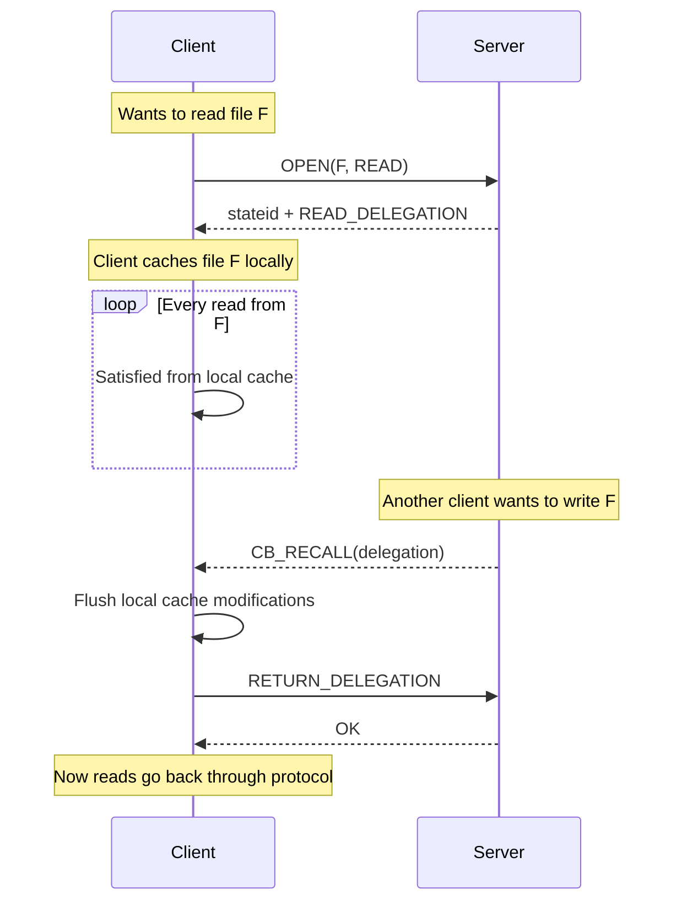

# Chapter 4: NFSv4 — The Stateful Revolution

If you've worked with filesystems your whole career, you might think the word "stateful" is unremarkable. Of course filesystems are stateful — they keep track of open files, current directory positions, and pending writes. What other kind of filesystem is there?

But NFSv2 and v3 were stateful only in the client. The server intentionally retained **zero** knowledge about its clients. Every request was self-contained: "here's a filehandle, here's an offset, give me 32 KB of data." The server didn't know whether the client had the file open, whether anyone else was writing to it, or whether the client was even still connected.

This stateless design was a deliberate engineering choice — and it was the right choice in 1989. But by 2000, the limitations were untenable. Let me explain why the designers abandoned statelessness and what they built instead.

## The Problem with Being Stateless

Imagine two clients editing the same file over NFSv3:

1. Client A opens the file and reads blocks 0-1000 into its local cache.
2. Client B opens the file and writes block 500. The server acknowledges the write.
3. Client A modifies block 500 in its cache (still the old version) and writes it back.
4. Client B's write is now silently overwritten — no warning, no error, no notification to either client.

There's no corruption at the storage level — the file still has valid data. But the data is wrong. Client B's changes are lost, and neither client knows it.

In a local filesystem, the kernel prevents this through locking. Two processes can't simultaneously write to the same region of a file without coordinating through the lock manager. In NFSv3, there was no lock manager integrated with the I/O path. The separate NLM protocol could lock byte ranges, but READ and WRITE didn't check locks. They couldn't — the NFS server didn't know which files were locked.

NFSv4's stateful design solved this by making READ and WRITE participants in the locking protocol. Every READ, WRITE, SETATTR, and LOCK carries a **stateid** that proves the client has the necessary permissions. The server validates the stateid before performing the operation. If client B has a conflicting open or lock, client A's operation fails with the appropriate error.

## The Lease: Bounding State Lifetime

The most important design decision in NFSv4 is the **lease**. Every piece of state — every open file, every byte-range lock, every delegation — is governed by a lease that expires after a fixed period (typically 30 to 120 seconds).

The lease is the mechanism that prevents state from accumulating forever. If a client crashes without closing its files, the server doesn't need to clean up immediately. It just waits for the lease to expire. When the lease expires, the server atomically discards **all** state associated with that client. No partial cleanup, no orphaned locks, no files that remain "open" indefinitely.

The lease period is a tradeoff:

- **Short lease (30 seconds)**: Fast recovery from client crashes. The server releases locks quickly. But the client must send renewals frequently, consuming bandwidth and CPU.

- **Long lease (120 seconds)**: Less renewal traffic. More tolerance for brief network interruptions. But if the client crashes, its files remain locked for two minutes.

Most deployments use the default (90 seconds). Some environments with high-latency links extend it to 120 seconds. The client chooses the lease time when it establishes its client ID; the server may impose a maximum.

### How Lease Renewal Works

The client must send any RPC within the lease period to renew all its state. The simplest way is the RENEW operation, which exists solely for this purpose. But any operation that carries a valid client ID — OPEN, LOCK, READ, WRITE — also renews the lease.

This means a busy client never needs explicit RENEW calls. Its regular I/O operations keep the lease alive. The RENEW operation only matters for idle mounts that hold state — for example, a file locked overnight by a database transaction.

If the client fails to renew before the lease expires, the server enters a **lease expiry** sequence:

1. The server marks the client's state as expired
2. The server discards all open file state, lock state, and delegation state for that client
3. If the client reconnects later, it must start fresh — new client ID, new opens, new locks

This is harsh, but it's deterministic. There's no ambiguity about whether state exists. The lease either is valid or is not. Programs can reason about this behavior.

## The Client ID: Who Are You?

Before a client can do anything useful — open files, acquire locks, establish a session — it must identify itself to the server. This happens through the SETCLIENTID operation.

The client sends:

- **An owner string**: A globally unique identifier (typically the hostname + boot epoch). This is how the server distinguishes one client from another.
- **A verifier**: A random number that changes each time the client reboots. This is how the server distinguishes "the same client reconnecting" from "an impostor trying to steal the client ID."

The server responds with a **client ID** — an opaque 64-bit number that identifies this client for the duration of its lease. The client must confirm the client ID with a separate SETCLIENTID_CONFIRM operation.

This two-phase exchange (SETCLIENTID + SETCLIENTID_CONFIRM) is a pattern that appears throughout NFSv4. It prevents a class of attacks where an attacker intercepts one message and replays it. The confirm operation proves that the client received the server's response — not just that it sent the original request.

## Open State and Stateids

When a client opens a file, the server creates an open state object and returns a **stateid** — a 16-byte token that represents the open. From this point forward, all operations on that file (READ, WRITE, SETATTR) must include the stateid.



The stateid contains:

- **A generation number**: Incremented each time the state changes. If the client presents a stale generation number, the server returns `NFS4ERR_OLD_STATEID`.
- **A sequence number**: Monotonically increasing within the state. Allows the server to detect out-of-order or duplicate operations.
- **Other fields**: Protocol-specific data (type, flags, etc.) encoded in the remaining bytes.

Stateids are a clever mechanism. They're compact (16 bytes fits easily in every operation), they're self-contained (the server doesn't need to look up state by filehandle + client), and they're versioned (the generation number prevents replay attacks).

## Delegations: Ownership Without the Ownership Headaches

The most powerful feature of NFSv4's state model is the **delegation**. A delegation is a temporary grant of ownership over a file.

When the server grants a read delegation on file F to client C, it's saying: "I promise not to modify file F while you hold this delegation. You can cache its contents locally and serve reads from cache without asking me."

When the server grants a write delegation, it says: "I promise not to let anyone else modify file F. You can cache writes locally and only notify me when you're done."



Delegations are a radical departure from NFSv3's philosophy. In NFSv3, every operation went to the server. The server was the sole authority on file contents. Delegations invert this: the client becomes the temporary authority, and the server reclaims authority when needed.

The mechanism that makes this safe is the **recall**. If the server needs to modify a file that has a delegation outstanding, it sends a callback (CB_RECALL) to the client. The client must flush any pending modifications and return the delegation. If the client doesn't respond — say, because it crashed — the server waits for the lease to expire, then forcefully revokes the delegation.

This is safe because the lease bounds how long a client can hold authority without the server's consent. A crashed client can't block access to a file for more than the lease period.

## COMPOUND RPC: Batching Operations

In NFSv2 and v3, every operation was a separate RPC. Opening a file that was three directories deep required four RPCs:

1. LOOKUP "/" → get root filehandle
2. LOOKUP "dir1" → get dir1's filehandle  
3. LOOKUP "dir2" → get dir2's filehandle
4. LOOKUP "file" → get file's attributes

Each RPC added a network round trip. With TCP, that's at least 4× the network latency — typically 4-20 milliseconds on a local network, 100+ milliseconds on a WAN.

NFSv4 bakes the operations together:

```
COMPOUND {
    PUTROOTFH      # set current FH to root
    LOOKUP "dir1"  # follow "dir1" from root
    LOOKUP "dir2"  # follow "dir2" from dir1
    LOOKUP "file"  # follow "file" from dir2
    GETFH          # get the resulting FH
    GETATTR        # get attributes
}
```

One RPC, one round trip, six operations.

The COMPOUND model is crucial for multipath because it means **one operation can do more work per transport round trip**. With NFSv3, spreading operations across transports doesn't help much — each operation is already a single round trip. With NFSv4, a COMPOUND containing multiple operations can benefit from transport-level parallelism.

### Failure Semantics

Operations within a COMPOUND execute sequentially. If the third operation in a six-operation compound fails, operations 4, 5, and 6 are skipped. The reply contains results for operations 1, 2, and 3 (failed), with the result for operation 3 carrying the error code.

This is exactly like exception handling in a programming language:

```c
try {
    PUTROOTFH();
    LOOKUP("nonexistent-directory");  // throws NFS4ERR_NOENT
    LOOKUP("file");                   // never executed
} catch (NFS4ERR_NOENT) {
    // Handle the error
}
```

The COMPOUND model is one of NFSv4's most elegant features. It reduces latency, simplifies state management (the current filehandle carries between operations), and provides clear error semantics.

## Recovery: What Happens When Things Break

### Client Recovery

When an NFSv4 client disconnects from the server (network failure, client reboot), the server doesn't immediately clean up state. Instead:

1. The server waits for the lease period.
2. If no operations arrive within the lease period, the server discards all state for that client ID (opens, locks, delegations).
3. If the client reconnects within the lease period and requests its state (via RECLAIM operations), the server restores the state.

The key insight is that the client drives recovery. The client knows what state it had before the failure. When it reconnects, it tells the server: "I used to have file F open and byte range L locked. Please confirm or re-create that state."

This is different from NFSv3's NLM approach, where the NSM (Network Status Monitor) tried to detect server reboots and proactively notify clients. The NFSv4 approach is simpler and more reliable: the client decides when and how to recover.

### Server Recovery

When an NFSv4 server reboots, it enters a **grace period** (typically 2 × the lease period). During the grace period:

- Only operations that **reclaim** previous state are allowed (OPEN with reclaim flag, LOCK with reclaim flag)
- New operations are rejected with `NFS4ERR_GRACE`
- Clients detect the reboot when their operations fail with `NFS4ERR_GRACE` or `NFS4ERR_STALE_CLIENTID`

The client's recovery process is:

1. Detect the failure (operations time out or return stale errors)
2. Create a new client ID (SETCLIENTID + SETCLIENTID_CONFIRM)
3. For each file that was open before the crash: OPEN with reclaim flag
4. For each byte range that was locked: LOCK with reclaim flag
5. Indicate recovery complete: RECLAIM_COMPLETE

This process takes time — typically 60-120 seconds. During this period, the client can't service new I/O requests. This is why NFSv4 failover feels slower than NFSv3 failover: the stateful recovery takes longer than the stateless reconnection.

For our multipath work, the recovery period is a critical design constraint. If a path fails, we can't wait 60 seconds for the session to recover. We need to detect the failure quickly (within a few timeouts) and switch to a healthy path without going through the full recovery sequence.

## From State Model to Sessions

NFSv4's stateful model solved the fundamental problems of NFSv3. With leases, stateids, and delegations, the protocol provided strong consistency guarantees that NFSv3 couldn't match.

But the stateful model introduced new challenges:

- **Callback reliability**: Delegation recall depends on client reachability
- **Duplicate detection**: The per-connection duplicate request cache was fragile
- **Multipath**: The state model had no concept of multiple paths

NFSv4.1 addressed all three with the session model, which we'll explore in Chapter 5.
