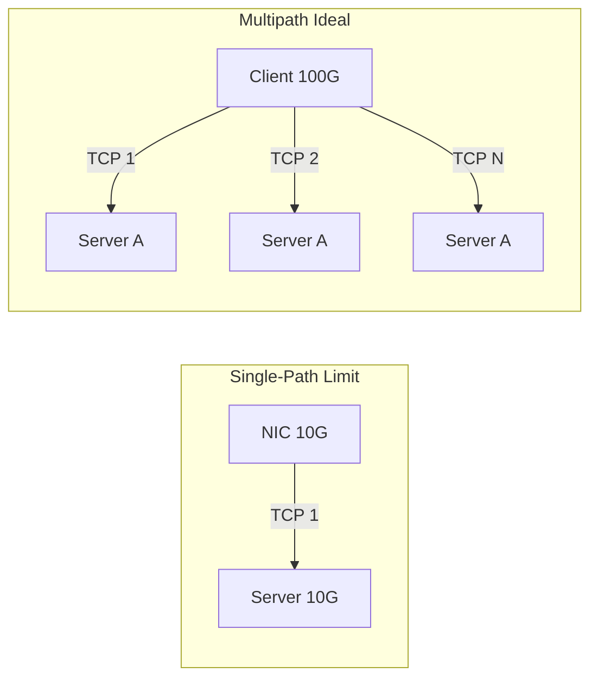
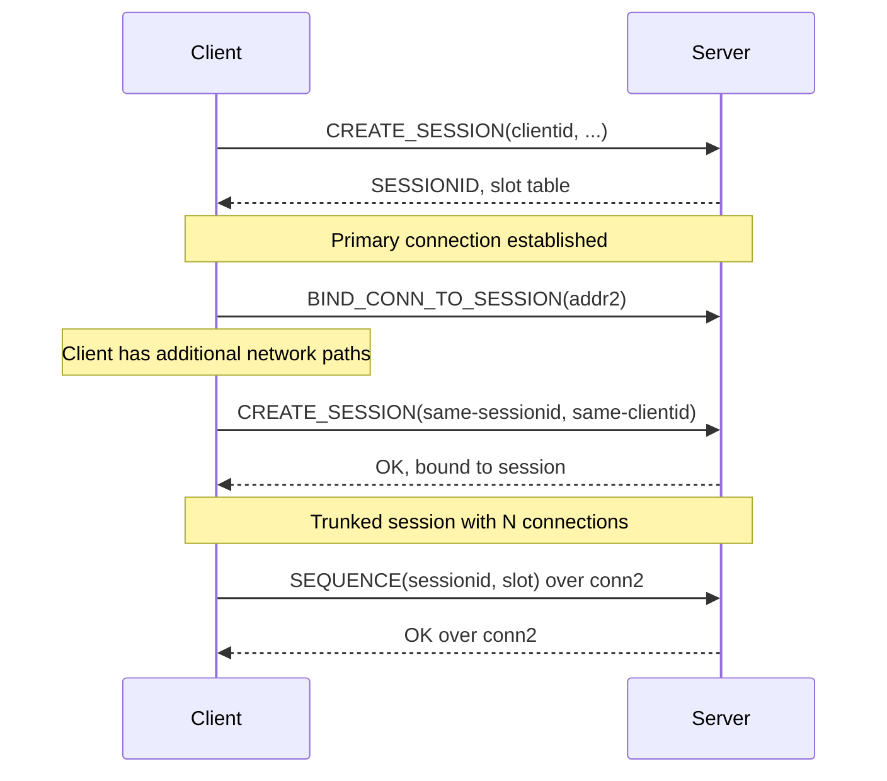
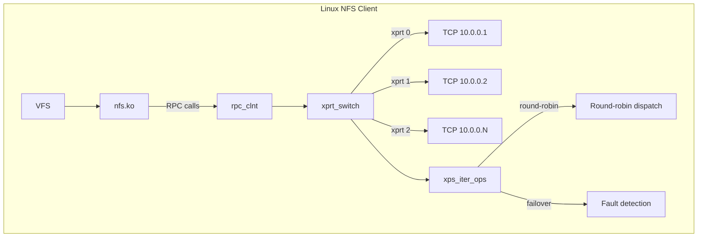
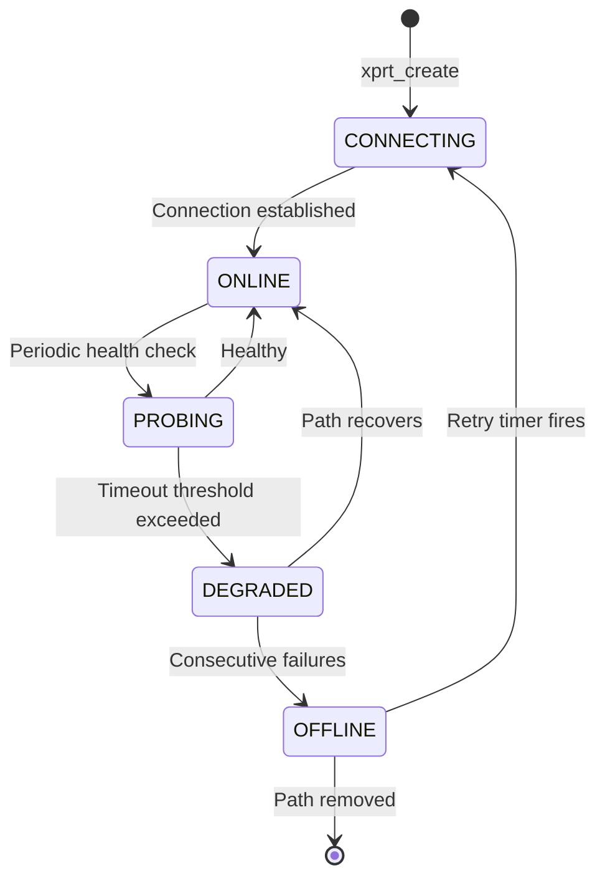
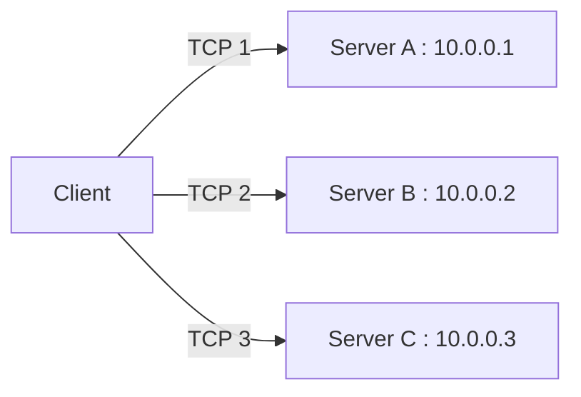
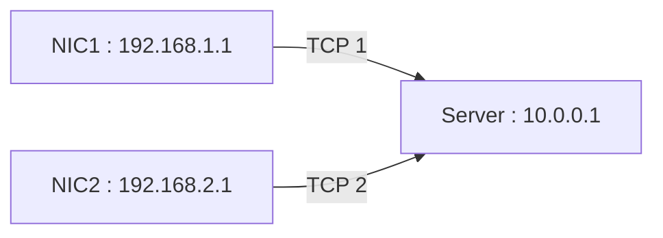
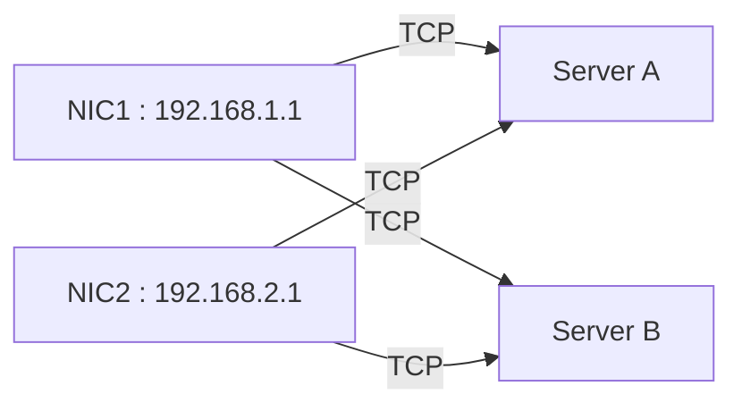

# Chapter 5: Multipath NFS and Client-Side Trunking

## 5.1 Why Multipath Matters

Storage performance at scale faces three hard bottlenecks:

1. **Single TCP stream throughput** — bounded by BDP (bandwidth × delay product), congestion window size, and single-CPU softirq processing
2. **NIC queue depth** — a single hardware queue can saturate before the NIC line rate
3. **Path failure** — a single cable, transceiver, or switch port brings the mount down



Multipath NFS addresses all three:
- **Aggregate throughput** scales with number of paths (up to NIC or fabric saturation)
- **Multiple NIC queues** distribute load across CPU cores
- **N-path redundancy** provides transparent failover

## 5.2 Session Trunking in NFSv4.1 (The Standard Way)

NFSv4.1 session trunking is the IETF-sanctioned approach to multipath:



### Requirements

For session trunking to work:

- **Same client ID** — connections must present the same identity
- **Same session ID** — connections bind to the same session
- **Same server principal** — RPCSEC_GSS must authenticate to the same identity
- **Server support** — the server must implement `BIND_CONN_TO_SESSION` and trunking detection

### Limitations

Session trunking has significant deployment constraints:

| Limitation | Impact |
|-----------|--------|
| Server must support NFSv4.1 trunking | Most enterprise arrays don't advertise trunk capability |
| Only works intra-server (same server, different addresses) | Can't spread across multiple storage heads |
| Requires RPCSEC_GSS in practice | AUTH_SYS trunking is poorly tested |
| Connection binding is optional in spec | Many servers reject BIND_CONN_TO_SESSION |
| No client-initiated path selection | Round-robin at RPC level; no per-mount policy |
| Limited address discovery | No standard way to enumerate trunkable server addresses |

## 5.3 Client-Initiated Multipath (The dnfs Approach)

Session trunking requires server cooperation. For storage systems that don't support trunking — or for multipath across truly independent servers — we need a **client-only** approach.

### Architecture



The key insight: the `xprt_switch` already supports multiple transports. NFSv4.1 session trunking binds them to a session. Our approach builds multiple transports and dispatches across them **without** requiring server-side session trunking support.

### Benefits Over Session Trunking

| Aspect | Session Trunking (v4.1) | Client Multipath (dnfs) |
|--------|------------------------|------------------------|
| Server support | Required | None (stock NFS server works) |
| Multiple servers | No (same server) | Yes (different storage heads) |
| NFSv3 compatible | No | Yes |
| Path selection | Server-directed | Client-configured |
| Failover policy | Connection drop | Configurable (round-robin, weighted) |
| Protocol visibility | Opaque (inside session) | `/proc/enfs/` |

## 5.4 Path Management

### Path Discovery

In the client-only multipath model, paths are configured through mount options:

```bash
mount -t nfs -o vers=3,remoteaddrs=10.0.0.1~10.0.0.2~10.0.0.3 \
  10.0.0.1:/export /mnt
```

Or via `/etc/fstab`:

```
10.0.0.1:/export /mnt nfs remoteaddrs=10.0.0.1~10.0.0.2,localaddrs=192.168.1.1~192.168.2.1 0 0
```

### Path Health Monitoring

Each transport in the switch is monitored independently:



## 5.5 Dispatch Policies

### Round-Robin (Default)

Each RPC picks the next live transport:

```python
def next_xprt(switch):
    start = last_idx + 1
    for i in range(len(switch)):
        idx = (start + i) % len(switch)
        if switch[idx].state == ONLINE:
            last_idx = idx
            return switch[idx]
    return None  # all dead
```

### Weighted

Transports with higher capacity get more RPCs:

```python
def next_xprt_weighted(switch):
    total = sum(t.weight for t in switch if t.state == ONLINE)
    r = randint(0, total)
    for t in switch:
        if t.state == ONLINE:
            r -= t.weight
            if r <= 0:
                return t
    return None
```

### Failover-Only

Use only the primary path unless it fails:

```python
def next_xprt_failover(switch):
    primary = switch[0]
    if primary.state == ONLINE:
        return primary
    for t in switch[1:]:
        if t.state == ONLINE:
            return t
    return None
```

## 5.6 Address Configurations

### Multi-Server, Single NIC



### Single Server, Multi-NIC Client



### Multi-Server, Multi-NIC (Cartesian Product)



When `localaddrs=A~B` and `remoteaddrs=X~Y`, the transport set is `{A:X, A:Y, B:X, B:Y}`, less any invalid pairs.

## 5.7 Summary

Session trunking (NFSv4.1) is the standards-based approach to multipath NFS, but its deployment depends on server support that few storage arrays provide. Client-initiated multipath — the approach taken by dnfs — works with any NFS server by managing multiple transports at the `xprt_switch` level and dispatching RPCs across them.

| Criterion | v4.1 Trunking | dnfs Client Multipath |
|-----------|---------------|----------------------|
| Server changes | Required | None |
| NFS versions | v4.1 only | v3, v4, v4.1 |
| Transport density | Same server | Any servers with same export |
| Address discovery | Server-advertised | Client-configured |
| Path policy | Implicit (connection-level) | Explicit (per-RPC dispatch) |
| Failover | Connection drop | Programmable (smoothed) |
