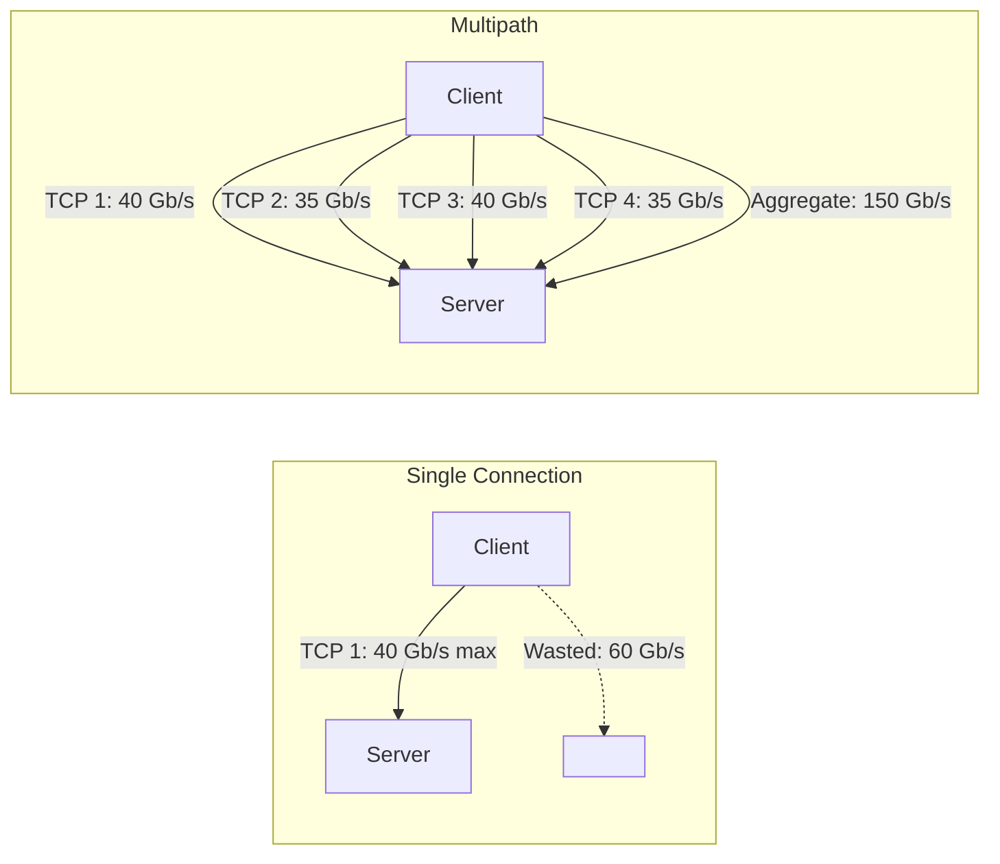
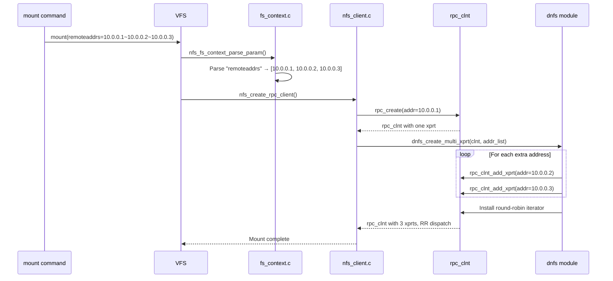
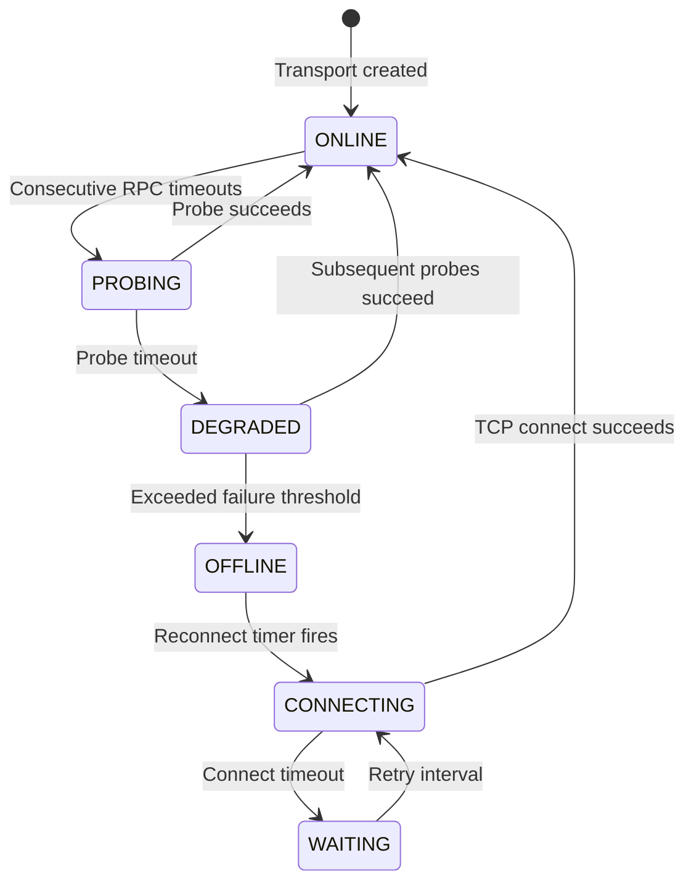
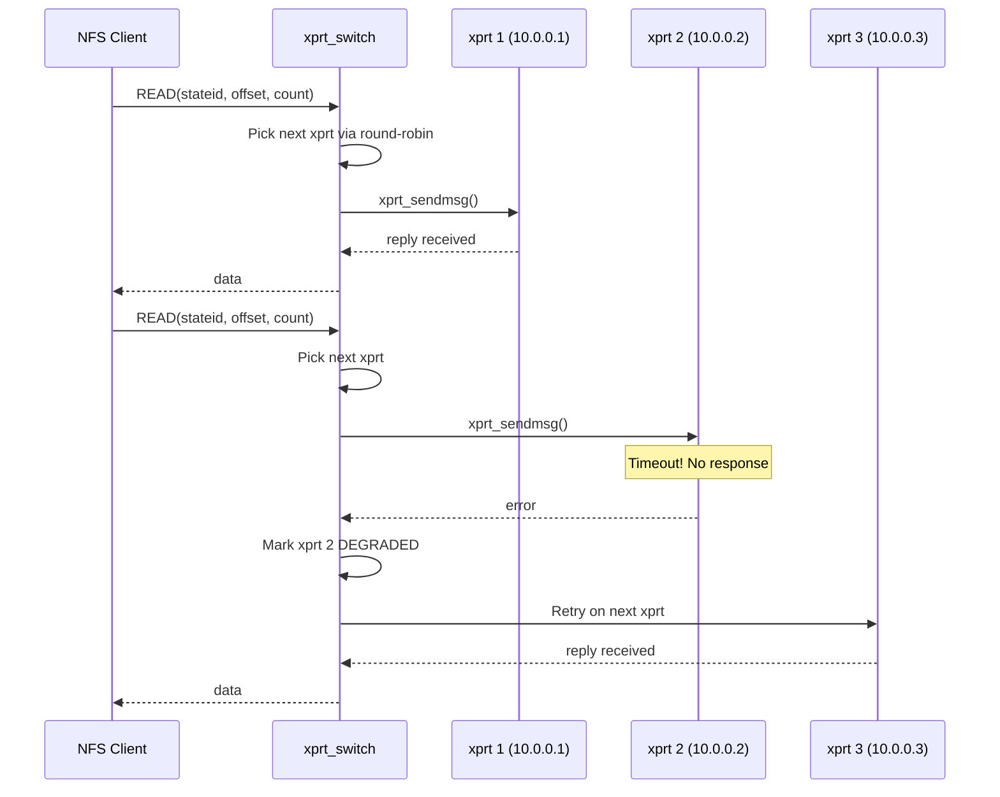
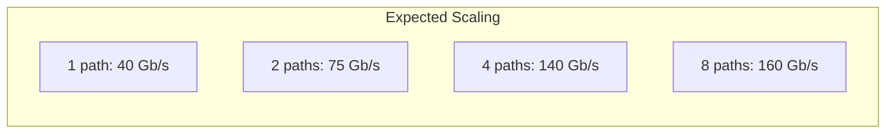

# Chapter 5: Multipath NFS — Why One Connection Is Never Enough

## The Throughput Problem

Imagine you have a client and server connected by two 100-gigabit Ethernet links. The links are bonded at the switch level (802.3ad LACP). According to the marketing materials, you should get 200 Gb/s of throughput.

In practice, you might get 100 Gb/s. Maybe 110 Gb/s if you're lucky. You'll never get 200 Gb/s, and the reason tells you everything about why multipath matters.

### The Single-Connection Bottleneck

A single TCP connection between two hosts is constrained by:

**The congestion window.** TCP's congestion avoidance algorithm limits how much data can be in flight at any moment. The window grows until packet loss is detected, then shrinks. On a high-bandwidth link with any packet loss at all (and 100 GbE at line rate will have some), the window never reaches the full bandwidth-delay product.

**Single-CPU softirq processing.** All the packets for a single TCP connection are processed by one CPU's softirq handler. A single core can saturate at 10-40 Gb/s of TCP processing, depending on packet size. Beyond that, the CPU becomes the bottleneck, not the network.

**NIC queue depth.** A single hardware queue on a NIC can only hold so many packets. Once the queue is full, packets are dropped, TCP backs off, and throughput collapses.

The result: **one TCP connection cannot saturate one 100 GbE link.** With jumbo frames and careful tuning, you might reach 40-60 Gb/s on a single connection. But the remaining bandwidth is wasted.

### How Multipath Solves It

Multiple connections distribute the load across multiple CPU cores, multiple NIC queues, and multiple congestion windows:



With N TCP connections:
- N congestion windows (each one grows independently)
- N CPUs processing softirqs 
- N NIC queues
- N independent retransmission timers

The efficiency improvement is dramatic. With 4-8 connections, you can saturate a 100 GbE link. With 16 connections, you can approach the theoretical maximum of a bonded pair of 100 GbE links.

## Beyond Throughput: Fault Tolerance

Multipath isn't just about speed. It's about **survival**.

Consider a traditional NFS mount with a single path:
- A cable gets pulled during maintenance → I/O stall
- A transceiver fails → I/O stall
- A switchport goes down → I/O stall
- A server NIC fails → I/O stall

Each stall lasts as long as the NFS timeout and retransmission interval — typically 60-120 seconds. For an application that needs to write data continuously, this is a disaster. Databases abort transactions. Log streams back up. Monitoring systems alert.

With multipath, a path failure is just a reduction in capacity:
- 4 paths → 1 fails → 75% throughput remaining, no stall
- 8 paths → 2 fail → 75% throughput remaining, no stall
- All paths fail → finally, a stall (but this requires a client-wide network failure)

The goal is to make path failure **visible only as a capacity reduction, not as an I/O error**.

## The Multipath Solution Space

Different storage vendors and protocol versions have taken different approaches to multipath:

```mermaid
flowchart TD
    MP[Multipath NFS Approaches] --> L2[Link Aggregation (LACP)]
    MP --> SCTP[SCTP Multihoming]
    MP --> IMPL[Application-Level Multipath]
    MP --> SS[Server Session Trunking]
    MP --> CC[Client-Initiated Multipath]
    L2 -->|Layer 2, single switch| LB[Link bundle, single IP]
    SCTP -->|Not widely deployed| NB[Never gained traction]
    SS -->|NFSv4.1 standard| LB2[Requires server support]
    CC -->|Our approach| LB3[Works with any server]
    IMPL -->|Vendor-specific| LB4[eNFS, proprietary]
```

Let me evaluate each approach.

### Link Aggregation (LACP)

802.3ad link aggregation combines multiple physical links into a single logical link. It operates at layer 2: the switch distributes packets across the physical links based on a hash of source/destination MAC+IP+port.

**Pros**: Transparent to applications. No protocol changes. Widely deployed.

**Cons**: Single switch (can't aggregate across switches). Single IP address (can't use different server IPs). Hash collision can cause uneven distribution. Doesn't help with multi-server access.

### Server Session Trunking (NFSv4.1)

The IETF-standard approach described in Chapter 4. Multiple TCP connections, same session, same client ID.

**Pros**: Standards-based. Tightly integrated with NFSv4.1 session model. Connection-level failover.

**Cons**: Requires server support. NFSv4.1 only. Same server only. Underimplemented in practice.

### Client-Initiated Multipath (Our Approach)

The client creates multiple transports and distributes operations across them, without server coordination.

**Pros**: Works with any NFS server (v3, v4, v4.1). No server changes. Works across different servers serving the same export. Full control over dispatch policy.

**Cons**: Not standard (yet). No server awareness of multipath state. NFSv4.1 session benefits (ordered execution, deterministic DRC) don't apply across transports.

## Client-Initiated Multipath: The Detailed Architecture

### Core Principle

The `rpc_clnt` — the kernel's RPC client structure — already supports multiple transports through the `xprt_switch`. The switch maintains a list of transports and an iterator that selects which transport serves the next RPC.

By default, the switch has one transport and the iterator always returns it. Our approach: **populate the switch with multiple transports and replace the iterator**.

```mermaid
flowchart TD
    subgraph Normal NFS (single path)
        NFS[nfs.ko] --> RPC[rpc_clnt]
        RPC --> SW[xprt_switch]
        SW --> IT[default iterator]
        IT --> X1[xprt 1]
    end
    subgraph Multipath NFS (dnfs)
        NFS2[nfs.ko] --> RPC2[rpc_clnt]
        RPC2 --> SW2[xprt_switch]
        SW2 --> IT2[round-robin iterator]
        IT2 --> X2a[xprt 1: 10.0.0.1]
        IT2 --> X2b[xprt 2: 10.0.0.2]
        IT2 --> X2c[xprt 3: 10.0.0.3]
    end
```

### Mount Option Flow

The user specifies multipath addresses at mount time:

```bash
mount -t nfs -o vers=3,remoteaddrs=10.0.0.1~10.0.0.2~10.0.0.3 \
    10.0.0.1:/export /mnt
```

Here's what happens inside the kernel:

**Step 1: Option parsing.** The kernel's filesystem context handler (`fs_context.c`) sees the `remoteaddrs=` option. It splits the tilde-separated list into individual addresses and stores them in a private data structure attached to the mount context.

**Step 2: RPC client creation.** The NFS client creates an `rpc_clnt` as usual — one transport, one address, everything normal. So far, no multipath.

**Step 3: Transport instantiation.** Our code runs after the main `rpc_clnt` is created. It iterates the address list from step 1 and creates a new `rpc_xprt` for each address. Each new transport is added to the `xprt_switch`.

**Step 4: Iterator installation.** The default iterator (which returns the first and only transport) is replaced with a round-robin iterator. From this moment, every RPC dispatched through this `rpc_clnt` picks the next transport in round-robin order.



### What About Different NFS Versions?

**NFSv3**: The simplest case. No session, no state model to coordinate. The NFSv3 client sends operations (READ, WRITE, GETATTR, etc.) and receives responses. Each operation is stateless — it doesn't depend on previous operations. Round-robin dispatch works naturally.

**NFSv4.0**: More complex. OPEN and LOCK operations create server-side state. The state is associated with the client ID, not the transport. So any transport can carry any operation — the server validates operations against the client ID, not the connection.

The risk: operations within a COMPOUND must execute in order. If compound 1 (containing OPEN) goes over transport A and compound 2 (containing READ with the new stateid) goes over transport B, there's a risk that compound 2 arrives before compound 1 — the server sees an unknown stateid and returns an error.

In practice, this is rare: TCP's ordering guarantees within a connection mean that ordering is preserved within a transport. We just need to ensure that operations that depend on each other stay on the same transport. This is the **RPC affinity** problem, and we solve it by letting the NFS layer hint at transport affinity.

**NFSv4.1**: The session model provides the strongest guarantees. The slot table provides ordered execution within each slot. As long as dependent operations use the same slot (which the Linux client already does), ordering is preserved regardless of which transport carries them.

### Dispatch Policies

The round-robin iterator is the simplest policy. But different workloads benefit from different policies:

**Round-robin** — Spreads load evenly across all transports. Best for throughput-bound workloads (large file transfers, streaming).

**Weighted round-robin** — Some transports get more RPCs than others. Useful when transports have different bandwidths (e.g., 100 GbE and 25 GbE connections to the same server).

**Failover-only** — Use one transport. Switch to a backup only if the primary fails. Best for latency-sensitive workloads where spreading across transports increases jitter.

**Adaptive** — Monitor transport health (latency, throughput, error rate) and adjust dispatch dynamically. The most complex policy, but potentially the most efficient.

Our implementation starts with round-robin (the simplest) and adds weighted and failover modes in subsequent stages.

### Path Health Monitoring

A transport isn't useful if it's not connected. We need to monitor transport health and detect failures before they cause application-level errors.

The health monitoring system works at two levels:

**Passive monitoring**: Every RPC gives us information about transport health. Timeouts indicate potential failures. Successful operations confirm that a path is working. The system tracks success/failure ratios per transport.

**Active probing**: If a transport has been idle for a while (or has experienced recent failures), we send a lightweight probe — a GETATTR of the root filehandle, or an ECHO-like ping — to verify connectivity.



The state transitions are governed by configurable parameters:

| Parameter | Default | What It Controls |
|-----------|---------|-----------------|
| Timeout (timeo) | 60 seconds | How long before an RPC is considered failed |
| Retransmissions (retrans) | 2 | How many consecutive failures before a path is marked degraded |
| Probe interval | 15 seconds | How often to probe a degraded path |
| Reconnect interval | 60 seconds | How long to wait before retrying a failed path |
| Recovery threshold | 3 | How many successful operations to restore a path to ONLINE |

These parameters match the NFS protocol's own timeout model. A path is degraded after 2×60 = 120 seconds of failures. It's marked offline after additional probe failures. This gives the network time to recover from transient issues without prematurely removing paths.

### The Transport Switch in Practice

Here's how the `xprt_switch` dispatch looks in practice for a mount with three paths:



Note that when a transport times out, the operation is **retried on the next transport**. This is transparent to the NFS client — it just sees a slightly delayed response. The application sees no error, no stall, no interruption.

This is the core value proposition of multipath NFS: **a path failure is a performance event, not an availability event.**

## Performance Expectations

### Throughput Scaling

With N transports, we expect throughput to scale roughly linearly — up to the point where the client or server becomes the bottleneck:



The scaling is sub-linear because:
- **Protocol overhead**: Each RPC has an XDR header, COMPOUND framing, authentication data
- **TCP overhead**: Each connection has its own ACK traffic
- **Scheduling overhead**: The kernel must manage more connections
- **Server limits**: The server has finite CPU and memory

Our target: **140 Gb/s over two 100 GbE links** — approximately 70% efficiency. This aligns with real-world benchmarks from the OpenEuler eNFS implementation, which achieved ~70 Gb/s on a similar configuration.

### Latency Impact

Multipath adds no inherent latency to individual operations. The round-robin dispatch is a trivial pointer increment — nanoseconds, not microseconds.

However, there's a **worst-case latency** consideration: if a transport becomes unresponsive, operations queued on that transport will experience the timeout delay (60 seconds by default) before being retried on a different transport. This worst-case latency is bounded by the timeout setting, not by the number of paths.

For latency-sensitive workloads (NFSv4.1 with delegations), the failover-only policy (one active path, one hot standby) may be preferable to round-robin (all paths active). The tradeoff is throughput versus latency predictability.

## Summary

Client-initiated multipath works because:

1. The Linux kernel's RPC layer already has the infrastructure (`xprt_switch`, iterators)
2. The NFS protocol (particularly v3) is stateless enough that operations are naturally independent
3. Path failures can be detected and recovered transparently
4. Throughput scales with the number of active paths, limited only by server and client capacity

The next chapter looks at the Linux kernel NFS client in detail — the code paths we'll modify and the existing infrastructure we'll leverage.
