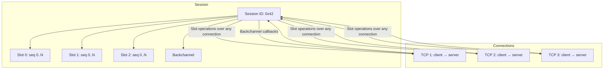
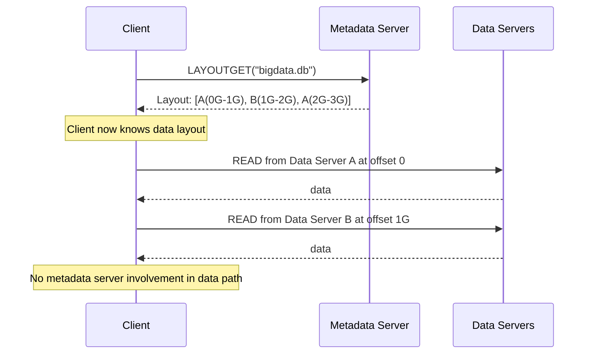
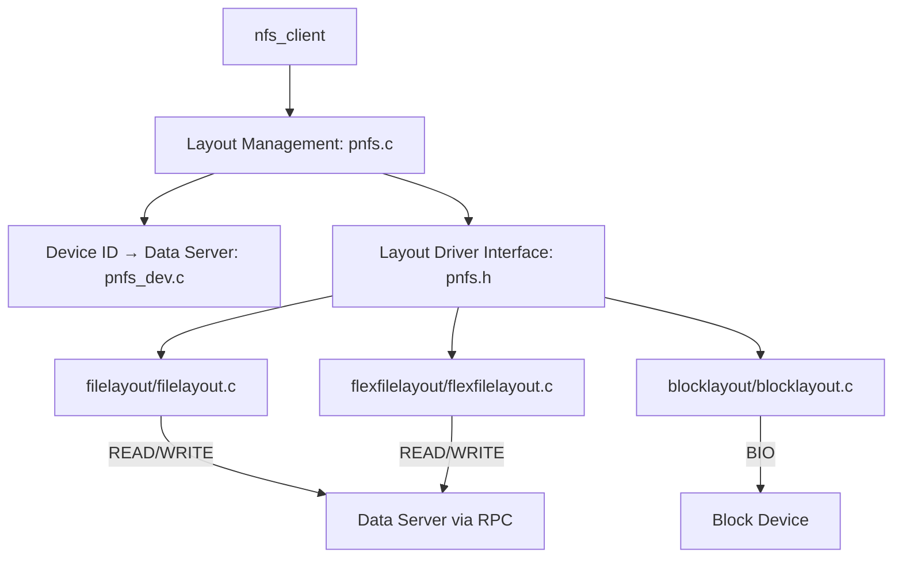
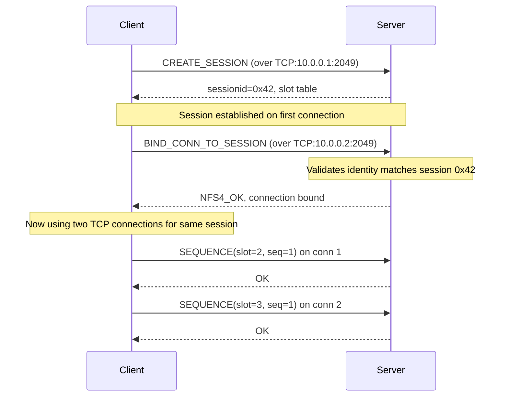

# Chapter 5: NFSv4.1 — Sessions, pNFS, and Trunking

NFSv4 was a successful protocol. By 2005, it was the default filesharing protocol for most enterprise Unix and Linux deployments. But success revealed problems that only production experience could expose.

This chapter tells the story of those problems and the solutions NFSv4.1 brought. The session model, pNFS layouts, and session trunking aren't just features — they're engineering responses to real failures.

## The Three Problems with NFSv4.0

### Problem 1: The Duplicate Request Cache Was Fragile

Every NFS server maintains a duplicate request cache (DRC) to protect against retransmitted operations. If the client sends a RENAME and doesn't receive the reply (packet loss, timeout), it retransmits. Without a DRC, the server would execute the RENAME twice — renaming the file to its new name, then "renaming" it again (which might fail because the source no longer exists).

NFSv4.0's DRC was tied to the TCP connection. When the client disconnected and reconnected (which happens after any network interruption longer than a few seconds), the new connection had an empty DRC. The server couldn't distinguish "this is a retransmission of an already-executed operation" from "this is a new operation with the same content." Non-idempotent operations — RENAME, REMOVE, OPEN — could execute twice.

This was a real problem in practice. Database administrators reported silent data loss when NFS clients reconnected after network hiccups. The operations didn't fail — they just ran twice, with unpredictable results.

### Problem 2: Callbacks Didn't Work Through Firewalls

NFSv4.0's delegation recall depends on the server contacting the client. This requires the client to run a TCP listener on a port the server can reach. In practice:

- Clients behind NAT (Network Address Translation) had unreachable addresses
- Clients behind firewalls that blocked inbound connections couldn't receive callbacks
- Multi-homed clients might be reachable on one interface but not another
- Roaming clients (laptops) had different addresses at different times

The result: deployments couldn't rely on delegations, which meant they couldn't benefit from local caching, which meant NFSv4 was slower than it should have been.

### Problem 3: No Multipath

By 2008, 10-gigabit Ethernet was becoming common. Storage arrays had multiple network ports. NFS clients had multiple NICs. But NFSv4 had no way to use multiple paths to the same storage.

Deployments that wanted multipath had to:

- Mount the same export multiple times on different IP addresses (complex, no failover coordination)
- Use link aggregation at the switch level (LACP, which combines links at layer 2, not layer 4 — doesn't help with multi-server access)
- Implement proprietary vendor solutions (Huawei's eNFS, NetApp's multipath extensions, etc.)

None of these were standard. None were portable. None worked across vendors.

## The Session Model: NFSv4.1's Answer

NFSv4.1 solved all three problems with a single architectural addition: the **session**.

### What a Session Is

Think of a session as a contract between client and server that says: "We agree to process this sequence of operations in order, exactly once, and we'll use this set of connections to do it."

The session is created explicitly (CREATE_SESSION), has a bounded lifetime (implicitly tied to the client ID's lease), and provides three guarantees:

**Ordered execution within each slot.** Every session has a slot table — an array of N slots (negotiated during session creation). Operations are assigned to slots. Within a slot, operations execute in strict sequence order. If the client sends operation #3 and then operation #4 into the same slot, the server will not process #4 until it has completed #3.

**Deterministic duplicate detection.** Because slots are processed in order, the server knows the last sequence number it processed in each slot. When a retransmission arrives, the server recognizes it as a duplicate and returns the cached reply — without executing the operation again.

**A reliable backchannel.** The sessions share their TCP connections with the backchannel — the server-to-client RPC path. No more separate callback listener. The backchannel is just another sequence of operations on the same connection, distinguished by direction.



### How the Slot Table Prevents Duplicate Execution

Imagine a slot table with 8 slots. The client sends RENAME into slot 3 with sequence number 7:

1. Client sends: SEQUENCE(slot=3, seq=7) + RENAME(old, new)
2. Network drops the reply
3. Client retransmits: SEQUENCE(slot=3, seq=7) + RENAME(old, new)
4. Server sees seq=7 in slot 3. It has already executed seq=7. Returns cached reply without executing RENAME again.

This is guaranteed correct because:
- The server knows it has processed up to seq=7 in slot 3
- Any operation with seq≤7 in slot 3 is a duplicate
- Any operation with seq>7 in slot 3 hasn't arrived yet (TCP ordering guarantees within a connection)
- The slot table prevents out-of-order execution within each slot

The elegance of this design is that it moves the duplicate detection problem from the **operation level** (which is hard — how do you know if a RENAME succeeded?) to the **slot level** (which is easy — did we execute this sequence number?). This is why the session model was such an improvement over NFSv4.0's per-connection DRC.

### Session Creation

Establishing a session happens after the client has a client ID:

1. Client sends EXCHANGE_ID to exchange capabilities and identify itself
2. Client sends CREATE_SESSION with desired slot count (typically 8-64)
3. Server responds with session ID, negotiated slot count, and initial sequence numbers
4. Client now has a session and can begin operations

The session persists until:
- The client destroys it (DESTROY_SESSION)
- The client ID expires (lease not renewed)
- The server reboots

## pNFS: Separating Control and Data

Parallel NFS (pNFS) addresses a different problem than session trunking, but it's architecturally related.

### The Metadata Bottleneck

In a traditional NFS setup, every READ and WRITE goes through the same server. The server has two responsibilities:

1. **Control path**: Validate permissions, check locks, manage state, maintain consistency
2. **Data path**: Read and write bytes to storage

The control path is CPU-intensive but low-bandwidth. The data path is bandwidth-intensive but CPU-light. Combining them on the same server means the server's CPU becomes a bottleneck for data throughput, even when the storage itself has much more bandwidth.

### How pNFS Breaks the Bottleneck

pNFS separates the two paths:

- One or more **metadata servers** handle the control path: opens, closes, attribute queries, permission checks
- Multiple **data servers** handle the data path: reads and writes, coordinated through **layouts**

A layout is a description of where a file's data lives on the storage cluster:

```
File "bigdata.db":
  Bytes 0-1G:  Data Server A, offset 0
  Bytes 1G-2G: Data Server B, offset 0
  Bytes 2G-3G: Data Server A, offset 1G
  ...
```

The client obtains a layout through LAYOUTGET, then reads and writes directly to the data servers. The metadata server is involved only when the layout expires or the client needs a new one.



### Layout Types

The NFSv4.1 specification defines three layout types:

**File layout** (RFC 5661 §13): File-level striping across data servers. The simplest layout — data is distributed across servers in stripes of configurable size. Implemented by the Linux kernel in `fs/nfs/filelayout/` and `fs/nfs/flexfilelayout/`.

**Block layout** (RFC 5661 §14): The client accesses storage directly as block devices (iSCSI, Fibre Channel). The layout specifies which blocks belong to the file. The metadata server is only needed for layout management.

**Object layout** (RFC 5661 §15): The client accesses object storage devices through an object protocol. Rarely deployed in practice.

Flexible files layout (RFC 8435) is an extension of the file layout that supports NFSv3 data servers and mirrored layouts. This is important for real-world deployments where the data servers run standard NFSv3 implementations.

### The Linux pNFS Implementation

The Linux kernel implements pNFS through a **layout driver** architecture:



The layout driver interface (`pnfs.h`) defines operations that each layout type must implement:

```c
struct pnfs_layoutdriver_type {
    // Allocate and initialize layout-specific data
    void *(*alloc_layout) (...);
    void (*free_layout) (...) ;
    // Read and write through the layout
    int (*read_pagelist) (...);
    int (*write_pagelist) (...);
    // Device ID management
    struct nfs4_deviceid_node * (*alloc_deviceid_node) (...);
};
```

When the NFS client receives a layout from the metadata server, it passes the layout to the appropriate driver. The driver interprets the layout and issues I/O directly to the data servers. The NFS client's role is reduced to coordinating with the metadata server for layout management.

### What pNFS Means for Multipath

pNFS is a form of multipath — it distributes data across multiple servers. But it's a **server-coordinated** form: the server decides the layout, and the client follows it.

Our project's approach is different: **client-initiated multipath**, where the client decides how to distribute operations across paths without server coordination. The two approaches are complementary:

- pNFS handles **data distribution** — which bytes go to which server
- Client multipath handles **transport distribution** — which TCP connection carries each RPC

A future implementation could combine both: use pNFS to distribute file data across servers and client multipath to distribute each server's traffic across multiple NICs.

## Session Trunking: The Standard's Answer to Multipath

Session trunking is the IETF-sanctioned mechanism for binding multiple TCP connections to a single NFSv4.1 session. It's specified in RFC 5661 §2.10.4.

### How Trunking Works

The protocol is straightforward:

1. Client establishes a session over connection C1
2. Client opens a new connection C2 (to the same server, potentially on a different address)
3. Client sends BIND_CONN_TO_SESSION on C2, referencing the existing session ID
4. The server validates the client's identity on C2 (same authentication credentials)
5. If the identities match, the server binds C2 to the session
6. Now the client can send slot operations over either C1 or C2



### Trunking Discovery

Before a client can trunk a connection, it must know that trunking is possible. The server advertises trunkable addresses through:

**Explicit trunking**: The client sends EXCHANGE_ID (which includes a list of client addresses), and the server responds with a list of server addresses that are trunkable. The client then attempts to connect to each address.

**Implicit trunking**: The client connects to a new address and sends CREATE_SESSION with the same client ID but no session ID. If the server detects that this connection belongs to an existing session (by matching client ID and authentication), it automatically binds the connection.

Implicit trunking is the more robust mechanism because it doesn't require prior discovery. The client can connect to any known server address, and if the server recognizes the client, trunking happens automatically.

### Limitations of Session Trunking

Session trunking is the standards-based approach to multipath. But it has significant limitations in practice:

**Server support is required.** The server must implement BIND_CONN_TO_SESSION and the trunking detection logic. Many enterprise storage arrays don't. Without server support, trunking doesn't work.

**Same server only.** Trunking distributes connections across addresses of the **same server**. It can't distribute across **different servers** that serve the same export. For that, you need a different mechanism.

**Authentication complexity.** With RPCSEC_GSS, each trunked connection needs its own Kerberos authentication context. The server must recognize that contexts A, B, and C belong to the same client. This requires server-side GSS-API state per connection.

**Deployment uncertainty.** Because trunking is optional (MAY implement), servers are not required to support it. Deployments can't rely on it working across different storage vendors.

**No NFSv3 support.** Trunking is an NFSv4.1 feature. NFSv3 has no session model, no slot table, no BIND_CONN_TO_SESSION. If you need multipath with NFSv3 — and many deployments do — session trunking is not an option.

These limitations are why we're building a client-only multipath solution. Session trunking is architecturally beautiful, but it doesn't solve the deployment problems that real-world administrators face.

## From Sessions to Building Our Solution

Sessions give us the vocabulary for understanding multipath: slot tables, connection binding, ordered execution. The Linux kernel's transport switch (`xprtmultipath.c`) gives us the infrastructure. Our task is to bridge the gap between the two — to build a multipath NFS client that works with any server, not just servers that implement session trunking.

Chapter 6 examines the multipath landscape in detail and explains the design choices that lead to our approach.
