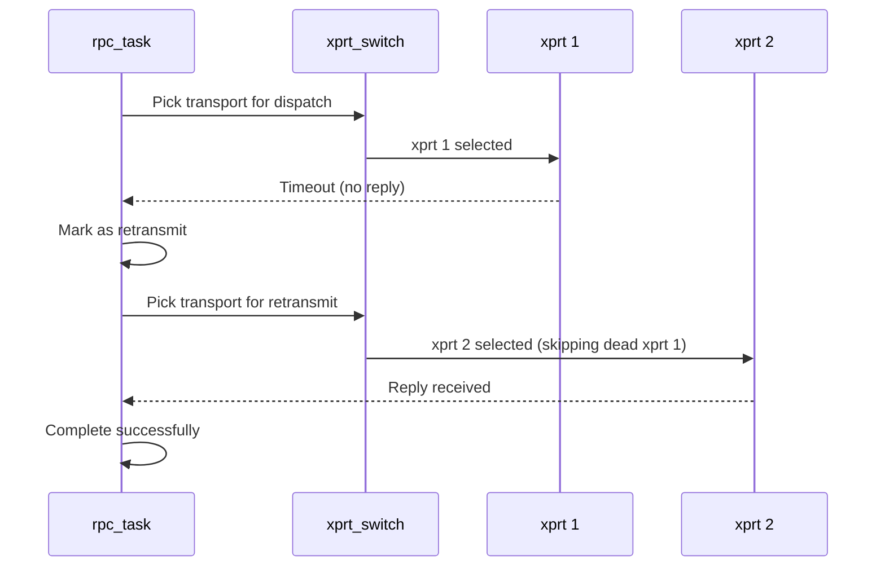

# Chapter 6: The Linux NFS Client Stack — A Journey Through the Code

Every NFS operation — every `read()`, `write()`, `open()`, `stat()` — travels through a stack of kernel subsystems before it reaches the wire. Understanding this stack is essential for anyone who wants to modify the NFS client.

This chapter traces the journey of a single `read()` call from a userspace program to the network interface, explaining what each layer contributes and where our multipath changes fit.

## The Layers

From top to bottom, the NFS client stack has five layers:

```mermaid
flowchart TD
    subgraph Userspace
        APP[Application: read(fd, buf, 4096)]
    end
    subgraph VFS
        V[VFS: generic_file_read]
        V --> VM[Page cache lookup]
        V --> N[Need to read from NFS server]
    end
    subgraph NFS Client (nfs.ko + nfsv4.ko)
        NFS[nfs_file_read]
        NFS --> N4[nfs4_proc_read]
        N4 --> C[Construct COMPOUND RPC]
        C --> X[XDR encode arguments]
    end
    subgraph SunRPC (sunrpc.ko)
        RPC[rpc_run_task]
        RPC --> SCHED[rpc_task scheduler]
        SCHED --> PICK[Which xprt?]
        PICK --> XMIT[xprt_sendmsg]
    end
    subgraph Transport
        XMIT --> TCP[tcp_sendmsg]
        TCP --> NIC[Network Interface]
    end
```

## Step 1: VFS — The Virtual Filesystem Switch

The journey begins when an application calls `read()`. The C library invokes the `sys_read` system call, which enters the kernel and hits the **Virtual Filesystem Switch** (VFS).

The VFS doesn't know about NFS. It doesn't know about EXT4, BTRFS, or XFS either. It has a generic model of what a filesystem is: directories containing files, files containing bytes, each file identified by an inode. Every filesystem — local or network — registers a set of operations that the VFS calls.

For a read operation, the VFS:

1. Looks up the file's inode (which it already has from the `open()` call)
2. Checks that the process has read permission
3. Checks the **page cache** — a kernel-wide cache of recently-read file data
4. If the data is in cache, returns it immediately (no network access at all!)
5. If the data is not in cache (a **page fault**), calls the filesystem's `readpage` operation

This caching is critical for NFS performance. An NFS read that hits the page cache costs microseconds. A read that misses and hits the wire costs milliseconds — 100-1000× more.

Caching is also where NFSv4 delegations matter. A write delegation tells the VFS: "you can cache writes without sending them to the server." A read delegation tells the VFS: "you can cache reads without checking with the server." Without delegations, the VFS must periodically check with the server (attribute cache validation) to ensure cached data hasn't been modified by another client.

## Step 2: NFS Client — Translating VFS Operations to Protocol Operations

When the VFS decides it needs to read from the server, it calls `nfs_file_read()` in `fs/nfs/file.c`. This function:

1. Resolves the file's `nfs_open_context` (which contains the stateid from the OPEN operation)
2. Determines whether the read is buffered (through the page cache) or direct (O_DIRECT)
3. For a buffered read: calls `nfs_pagecache_get_page()` → `nfs_readpage()` → `nfs_readpage_async()`
4. For a direct read: calls `nfs_direct_read()` → `nfs_direct_read_schedule_iovec()` → `nfs_direct_read_schedule_segment()`

The buffered read path (`read.c`) is where most reads land. It works with fixed-size pages (typically 4 KB) and coalesces adjacent pages into larger RPC requests.

The direct read path (`direct.c`) is used by databases and other applications that manage their own caching. It translates the userspace buffer directly into RPC requests, bypassing the page cache entirely.

Both paths eventually call into the protocol-specific read function. For NFSv4, that's `nfs4_proc_read()` in `fs/nfs/nfs4proc.c`. For NFSv3, it's `nfs3_proc_read()` in `fs/nfs/nfs3proc.c`.

The protocol-specific function does two things:

**Construct a COMPOUND RPC.** For NFSv4, the read operation is part of a compound that may include other operations (like GETATTR to refresh file attributes). The compound is built as a `struct nfs_pgio_header` containing all the arguments needed for the RPC.

**Encode the arguments into XDR.** The `nfs4_xdr_enc_read()` function in `nfs4xdr.c` translates the compound into the wire-format XDR byte stream. Every field — operation number, stateid, offset, count — is encoded in big-endian order, padded to 4-byte boundaries.

## Step 3: Sun RPC — Scheduling and Dispatch

The encoded RPC message is handed to the SunRPC layer via `rpc_run_task()`. This creates an `rpc_task` — a kernel structure that represents a single RPC in flight.

The task enters the RPC scheduler. The scheduler's job is to manage concurrency: each transport can have multiple RPCs in flight simultaneously (up to the slot limit), but they must be queued and dequeued in an orderly fashion.

Here's where our multipath changes matter. The scheduler calls `rpc_task_get_next_xprt()` to determine which transport should carry this RPC. In the stock kernel, this function returns the one and only transport. In our modified kernel, it calls the transport switch iterator — which returns the next transport in round-robin order.

```c
// Stock kernel: always returns the same transport
struct rpc_xprt *xprt_iter_default_next(struct rpc_xprt_switch *xps)
{
    // There's only one. Return it.
    return list_first_entry(&xps->xps_xprt_list, struct rpc_xprt, xprt_switch);
}

// Multipath kernel: rotates through all transports
struct rpc_xprt *enfs_xprt_round_robin_next(struct rpc_xprt_switch *xps)
{
    struct rpc_xprt *xprt;
    unsigned int i, start = atomic_inc_return(&rr_count);

    // Scan starting from the rotating counter
    i = 0;
    list_for_each_entry(xprt, &xps->xps_xprt_list, xprt_switch) {
        if (i++ < start % xps->xps_nxprts)
            continue;
        if (xprt_connected(xprt))
            return xprt;
    }
    // Fallback: any live transport
    list_for_each_entry(xprt, &xps->xps_xprt_list, xprt_switch) {
        if (xprt_connected(xprt))
            return xprt;
    }
    return NULL; // All paths dead
}
```

## Step 4: Transport — Sending and Receiving Bytes

The transport (`rpc_xprt`) is the interface between the RPC layer and the network. For TCP mounts (the common case), the transport wraps a kernel socket structure.

When the scheduler selects a transport, it calls `xprt_sendmsg()`:

1. The RPC message is copied into the transport's send buffer
2. The transport calls `tcp_sendmsg()` on its kernel socket
3. The kernel TCP stack fragments the data, adds TCP headers, and queues it for the NIC
4. The NIC DMA's the data from system memory and transmits it on the wire

On the receive side:

1. The NIC receives a packet and DMA's it into a kernel buffer
2. The TCP stack reassembles the byte stream and delivers it to the socket
3. The transport's receive handler is called
4. The transport matches the response to the waiting `rpc_task` via the XID
5. The task is woken and the reply is decoded

### What Happens on Timeout?

If no reply arrives within the timeout interval:

1. The `rpc_task`'s timer fires
2. The scheduler marks the operation as timed out
3. If retransmissions remain, the task is requeued and sent again — potentially on a **different transport**
4. If all retransmissions are exhausted, the task fails with -ETIMEDOUT

In our multipath implementation, step 3 is where failover happens. The transport switch iterator selects the next **live** transport when a retry is scheduled. If all transports have failed, the operation returns an error to the application — just as a single-path NFS mount does when its only path fails.



The key insight: **the application doesn't know that a retransmit happened**. It sees a completed read with correct data. The multipath layer absorbed the transport failure transparently.

## Step 5: Back Up — Decoding the Response

The response follows the reverse path:

1. The transport delivers the reply bytes to the `rpc_task`
2. The task's callback is called — for NFS, this decodes the XDR reply
3. The decoded data is written into the page cache or userspace buffer
4. The VFS completes the read, returning the byte count to the application

From the application's perspective, a `read()` that required an NFS remote operation took slightly longer than a cached read — typically 0.5-5 milliseconds instead of 1-10 microseconds. The application has no idea which transport carried the request, which server IP it went to, or whether there was a retransmission.

This transparency is by design. The whole point of the layered architecture is that each layer can change its internal behavior without requiring changes in the layers above.

## Where Our Changes Land

Our multipath changes touch three areas of this stack:

**Option parsing** (`fs/nfs/fs_context.c`): Add `remoteaddrs=` and `localaddrs=` mount options. This is a pure addition — no existing code is modified.

**Transport instantiation** (new module): After `rpc_clnt` creation, iterate the address list and create additional transports. This is a new code path that runs after the existing `rpc_create()` returns.

**Transport selection** (`net/sunrpc/xprtmultipath.c`): Replace the default `xps_iter_ops` with a multipath-aware iterator. This is a modification to a critical code path, but it's minimal — we change a function pointer and the existing infrastructure handles the rest.

Everything else — the NFS protocol layer, the VFS interface, the TCP transport — stays unchanged. This is the beauty of the layered kernel architecture.

## Summary of the Code Journey

```mermaid
flowchart TD
    APP[Application: read()] --> VFS[VFS: page cache]
    VFS -->|Cache miss| NFS[nfs_file_read]
    NFS --> N4[nfs4_proc_read]
    N4 --> COMP[Build COMPOUND: GETFH + READ]
    COMP --> XDR[XDR encode arguments]
    XDR --> RPC[rpc_run_task]
    RPC --> SCHED[scheduler]
    SCHED -->|Pick transport| SW[xprt_switch iterator]
    SW -->|Round-robin| X[xprt_sendmsg]
    X --> TCP[tcp_sendmsg → NIC]
    TCP -->|Wait| RECV[tcp_recvmsg]
    RECV --> DECODE[XDR decode reply]
    DECODE --> DONE[rpc_task complete]
    DONE --> VFS2[Page cache updated]
    VFS2 --> APP2[Application gets data]
```

**Next**: Chapter 7 dives into the SunRPC layer internals — `rpc_clnt`, `rpc_task`, `xprt_switch` — with enough detail to implement custom transport policies.
