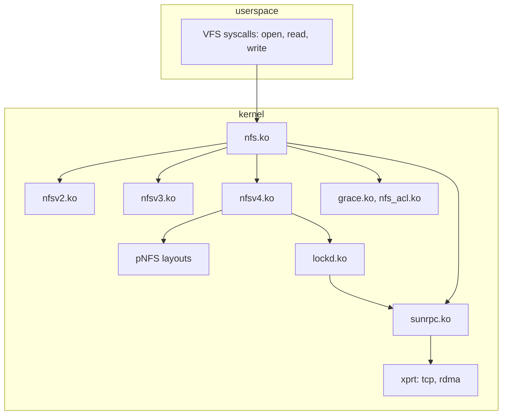
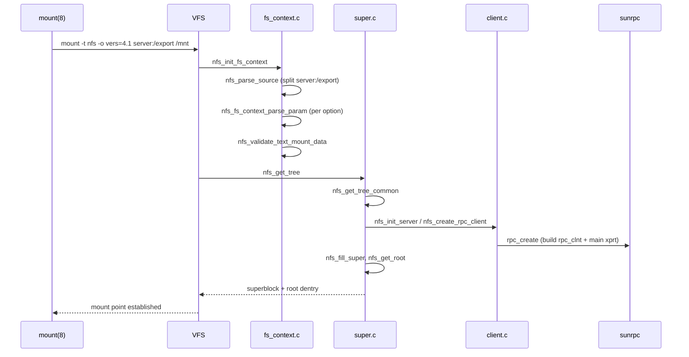
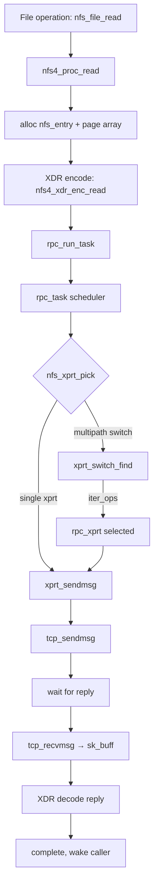
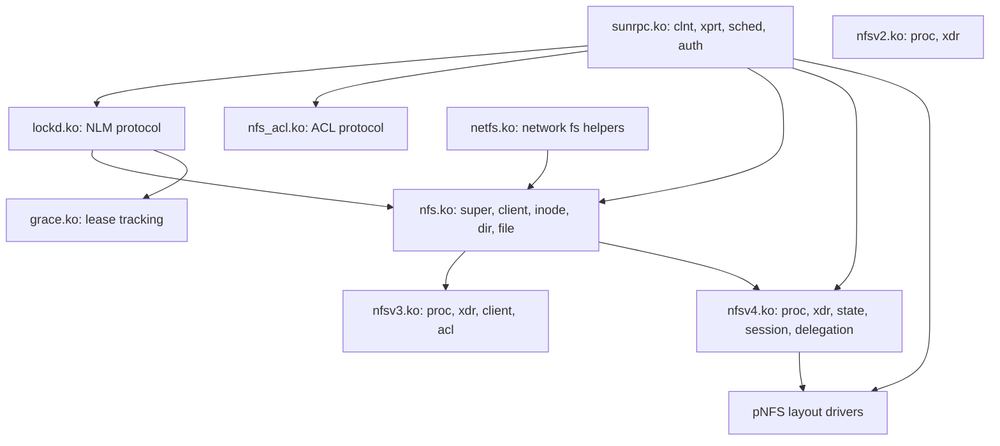

# Chapter 6: The Linux NFS Client Stack

## 6.1 Module Architecture

The Linux NFS client is spread across several kernel modules:



| Module | File | Size (~) | Role |
|--------|------|----------|------|
| `sunrpc.ko` | `net/sunrpc/` | 843 KB | RPC transport, scheduling, auth |
| `nfs.ko` | `fs/nfs/` | 640 KB | NFS core (v2 common, superblock, state) |
| `nfsv2.ko` | `fs/nfs/nfs2super.o` etc | 30 KB | NFSv2 protocol |
| `nfsv3.ko` | `fs/nfs/nfs3*.o` | 60 KB | NFSv3 protocol |
| `nfsv4.ko` | `fs/nfs/nfs4*.o` | 1.2 MB | NFSv4 protocol + state management |
| `lockd.ko` | `fs/lockd/` | 150 KB | NLM lock manager (v3, v4) |
| `nfs_acl.ko` | `fs/nfs_common/` | 12 KB | NFSACL protocol |
| `grace.ko` | `fs/nfs_common/` | 16 KB | Lease grace period management |

## 6.2 Key Source Files

### VFS Interface (`fs/nfs/`)

| File | Purpose |
|------|---------|
| `super.c` | Superblock operations, mount/umount entry |
| `fs_context.c` | Filesystem context, mount option parsing, `-o` parameters |
| `client.c` | `nfs_client` creation, server address management |
| `inode.c` | Inode operations, attribute cache |
| `dir.c` | Directory operations (lookup, readdir, create, unlink) |
| `file.c` | File operations (read, write, mmap, flush) |
| `direct.c` | Direct I/O path (O_DIRECT) |
| `write.c` | Buffered write path, commit coordination |
| `read.c` | Buffered read path, readahead |
| `namespace.c` | NFS namespace operations (cross-mount traversal) |
| `getroot.c` | Root filehandle resolution |
| `internal.h` | Internal data structures shared across NFS files |

### NFSv4 (`fs/nfs/`)

| File | Purpose |
|------|---------|
| `nfs4proc.c` | NFSv4 COMPOUND operation construction and dispatch |
| `nfs4state.c` | State management (client ID, opens, locks, delegations) |
| `nfs4xdr.c` | NFSv4 XDR encoders and decoders |
| `nfs4client.c` | NFSv4 client initialization, session setup |
| `nfs4session.c` | Session slot table management (v4.1) |
| `nfs4renewd.c` | Lease renewal daemon |
| `nfs4namespace.c` | Migration and referral handling |
| `delegation.c` | Delegation management |
| `callback.c` | Callback server (NFSv4.0) |
| `callback_xdr.c`, `callback_proc.c` | Callback XDR and procedure handlers |

### SunRPC (`net/sunrpc/`)

| File | Purpose |
|------|---------|
| `clnt.c` | `rpc_clnt` creation, management, `rpc_run_task` entry |
| `sched.c` | `rpc_task` scheduler, RPC execution pipeline |
| `xprt.c` | Transport creation, connection management |
| `xprtsock.c` | TCP and UDP socket transport implementation |
| `xprtmultipath.c` | Transport switch (multipath foundation) |
| `auth.c` | RPC authentication framework |
| `auth_null.c`, `auth_unix.c`, `auth_tls.c` | Auth flavour implementations |

### Key Headers (`include/linux/`)

| Header | Purpose |
|--------|---------|
| `nfs_fs.h` | NFS filesystem superblock/inode structures |
| `nfs_fs_sb.h` | `nfs_server`, `nfs_client` structures |
| `nfs_xdr.h` | NFS protocol XDR structures |
| `nfs4.h` | NFSv4 protocol constants and types |
| `sunrpc/clnt.h` | `rpc_clnt`, `rpc_create_args` |
| `sunrpc/sched.h` | `rpc_task`, `rpc_task_setup` |
| `sunrpc/xprt.h` | `rpc_xprt`, transport operations |
| `sunrpc/xprtmultipath.h` | `rpc_xprt_switch`, multipath interface |

## 6.3 The Mount Path



## 6.4 The RPC Dispatch Path



## 6.5 The Transport Switch (xprtmultipath)

The `rpc_xprt_switch` is the central data structure for multipath:

```c
struct rpc_xprt_switch {
    spinlock_t                xps_lock;
    struct list_head          xps_xprt_list;     // list of rpc_xprt
    struct rpc_xprt_iter_ops *xps_iter_ops;      // dispatch policy
    unsigned int              xps_nxprts;         // total transports
    unsigned int              xps_nactive;        // active transports
    // ...
};
```

### Adding a Transport

```c
int xprt_switch_add_xprt(struct rpc_xprt_switch *xps, struct rpc_xprt *xprt)
{
    spin_lock(&xps->xps_lock);
    list_add_tail(&xprt->xprt_switch, &xps->xps_xprt_list);
    xps->xps_nxprts++;
    if (xprt_connected(xprt))
        xps->xps_nactive++;
    spin_unlock(&xps->xps_lock);
    return 0;
}
```

### Selecting the Next Transport

The iterator abstracts path selection:

```c
struct rpc_xprt_iter_ops {
    struct rpc_xprt *(*xps_iter_init)(struct rpc_xprt_switch *);
    struct rpc_xprt *(*xps_iter_next)(struct rpc_xprt_switch *);
};
```

The default iterator (`xprt_iter_default`) simply returns the only transport. The multipath iterator (`enfs_xprt_iter_roundrobin`) rotates through live transports.

## 6.6 Module Build Dependencies



## 6.7 Building and Testing

See `AGENTS.md` for the build recipe. Key commands:

```bash
# Prepare source tree
cd ~/kernel-build/linux-source-7.0.0
echo '-14-generic' > localversion-ubuntu
cp /boot/config-$(uname -r) .config
cp /usr/src/linux-headers-$(uname -r)/Module.symvers .
make olddefconfig && make -j$(nproc) scripts prepare

# Build NFS modules only
make M=fs/nfs

# Install to running kernel
sudo cp net/sunrpc/sunrpc.ko fs/nfs/nfs.ko fs/nfs/nfsv3.ko \
        fs/lockd/lockd.ko fs/nfs_common/grace.ko fs/nfs_common/nfs_acl.ko \
        /lib/modules/$(uname -r)/updates/
sudo depmod -a && sudo modprobe nfs
```
