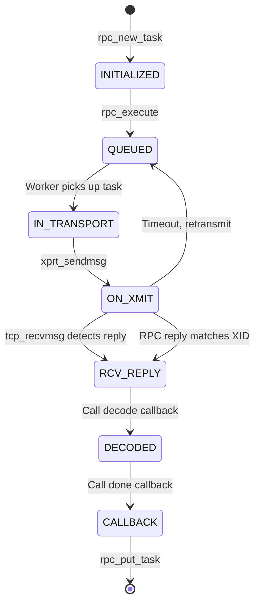

# Chapter 7: How an RPC Actually Gets Sent — Inside sunrpc.ko

The SunRPC layer is the unsung hero of the NFS stack. The NFS protocol gets the attention — COMPOUND operations, delegations, stateids — but the RPC layer is the engine that makes everything move. Every byte that travels between client and server passes through this code.

This chapter is a deep dive into how the Linux kernel's SunRPC implementation works: how tasks are created, scheduled, dispatched, and completed. If you're going to modify the dispatch path (as we are for multipath), you need to understand every step.

## The rpc_clnt: Your Connection to the Server

The `rpc_clnt` is the handle through which all NFS operations flow. It's created once per mount (or, more precisely, once per unique server+authentication combination) and persists until unmount.

```c
struct rpc_clnt {
    const char *cl_nodename;       // Client hostname for debugging
    const char *cl_programname;    // "nfs" or "nfsd"
    struct rpc_xprt  *cl_xprt;     // The "main" transport
    struct rpc_xprt_switch *cl_xprtswitch;  // Transport switch
    struct rpc_auth   *cl_auth;    // Authentication context
    struct cred       *cl_cred;    // Process credentials
    int cl_vers;                   // Protocol version (2, 3, 4, ...)
    unsigned int cl_softrtry : 1;  // Soft (error on timeout) vs hard
    unsigned int cl_nconnect;      // Number of connections to create
    atomic_t cl_count;             // Reference count
};
```

The most important field for our purposes is `cl_xprtswitch`. This points to the transport switch, which manages the list of transports (TCP connections) and the iterator that selects among them.

When the NFS client creates an `rpc_clnt`, it calls:

```c
struct rpc_clnt *rpc_create(struct rpc_create_args *args)
{
    // 1. Allocate the client structure
    clnt = kzalloc(sizeof(*clnt), GFP_KERNEL);
    if (!clnt)
        return ERR_PTR(-ENOMEM);

    // 2. Create the primary transport
    // This opens a TCP connection to the server
    xprt = xprt_create_transport(args);
    if (IS_ERR(xprt)) {
        kfree(clnt);
        return ERR_CAST(xprt);
    }
    clnt->cl_xprt = xprt;

    // 3. Create the transport switch
    // The switch wraps the transport with iteration capability
    xps = xprt_switch_alloc(xprt, GFP_KERNEL);
    clnt->cl_xprtswitch = xps;

    // 4. Set up authentication
    // This creates the credential context
    clnt->cl_auth = auth_create(args->authflavor, args->cred);

    // 5. Note: This is where our multipath hook goes!
    // After rpc_create returns, we add more transports to the switch
    // and install a custom iterator.

    return clnt;
}
```

## The rpc_task: An RPC in Flight

Every individual NFS operation — every READ, WRITE, GETATTR — creates an `rpc_task`. The task tracks the operation from creation through completion.

```c
struct rpc_task {
    struct rpc_clnt         *tk_client;     // The client handle
    const struct rpc_call_ops *tk_ops;      // Callbacks (encode, decode, done)
    struct rpc_rqst         *tk_rqstp;      // The actual request buffer
    int                     tk_status;      // Result status
    unsigned char           tk_flags;       // RPC_TASK_* flags
    unsigned long           tk_timeout;     // Timeout interval
    unsigned long           tk_start;       // When the RPC started
    struct list_head        tk_list;        // For scheduler queues

    // Action function — called to execute the next step
    void (*tk_action)(struct rpc_task *);
};
```

### Task Lifecycle

A task goes through well-defined states:



Each state transition is driven by the `tk_action` function. The scheduler repeatedly calls `tk_action` until the task completes or fails. This is a manual state machine — each invocation of `tk_action` advances the state by one step.

Here's a simplified version of how `tk_action` works for a typical NFS READ:

```c
void nfs_read_rpc_action(struct rpc_task *task)
{
    struct rpc_rqst *req = task->tk_rqstp;
    struct nfs_pgio_header *hdr = req->rq_buffer;

    switch (task->tk_status) {
    case 0:
        // First call: encode the request
        // This calls the NFS XDR encoder to serialize the READ arguments
        rpc_call_start(task);
        req->rq_callinfo = nfs4_enc_read;  // Set up XDR encoder
        // The scheduler will now send this over the transport
        break;

    case -ETIMEDOUT:
        // The request timed out. Should we retry?
        if (task->tk_flags & RPC_TASK_SOFT) {
            // Soft mount: return error to application
            rpc_exit(task, -ETIMEDOUT);
        } else {
            // Hard mount: retry
            // The scheduler will try a different transport if available
            task->tk_status = 0;
        }
        break;
    }
}
```

## The Scheduler: Managing Concurrency

The task scheduler (`sched.c`) manages the queue of tasks waiting to execute. Its job is to match tasks with available transport capacity.

Each transport has a **slot limit** — the maximum number of RPCs that can be in flight simultaneously on that transport. For NFSv3, this defaults to 4. For NFSv4.1 with sessions, it's negotiated with the server and can be 8-64.

When a task is ready to execute:

1. The scheduler checks each transport's available slots
2. If no transport has a free slot, the task goes to sleep
3. When a slot frees up (a reply arrives), the scheduler wakes waiting tasks
4. The awakened task calls `tk_action` to send its request

```c
// Simplified scheduling logic
void rpc_schedule_task(struct rpc_task *task)
{
    struct rpc_xprt_switch *xps = task->tk_client->cl_xprtswitch;
    struct rpc_xprt *xprt;

    // Find a transport with an available slot
    xprt = xps->xps_iter_ops->xps_iter_next(xps);
    while (xprt) {
        if (xprt->xprt_slot_avail > 0)
            break;
        xprt = xps->xps_iter_ops->xps_iter_next(xps);
    }

    if (xprt) {
        // Send the request on this transport
        xprt_sendmsg(xprt, task);
    } else {
        // All transports busy — queue for later
        rpc_sleep_on(task);
    }
}
```

With the stock single-path iterator, this is trivial: there's one transport, and it's either available or not. With our multipath iterator, the scheduler sees multiple transports and can select among them based on availability, health, and policy.

## The xprt_switch: Holding Multiple Transports

The transport switch is the structure that makes multipath possible. It holds an ordered list of transports and the iterator that selects among them.

```c
struct rpc_xprt_switch {
    struct list_head    xps_xprt_list;       // Linked list of rpc_xprt
    unsigned int        xps_nxprts;          // Total number of transports
    unsigned int        xps_nactive;         // Transports in CONNECTED state
    struct kref         xps_kref;            // Reference count

    // The iterator: this is what we replace for multipath
    const struct rpc_xprt_iter_ops *xps_iter_ops;
};
```

### Adding a Transport

When we create an additional transport (for a multipath mount), we call:

```c
int xprt_switch_add_xprt(struct rpc_xprt_switch *xps, struct rpc_xprt *xprt)
{
    spin_lock(&xps->xps_lock);

    // Add the transport to the switch's list
    list_add_tail(&xprt->xprt_switch, &xps->xps_xprt_list);
    xps->xps_nxprts++;

    // Update the active count if the transport is already connected
    if (xprt_connected(xprt))
        xps->xps_nactive++;

    spin_unlock(&xps->xps_lock);
    return 0;
}
```

Once a transport is in the switch, the iterator can see it. Future RPC dispatches will consider it alongside existing transports.

### Removing a Transport

When a transport fails permanently (not just a transient timeout), it should be removed from the switch:

```c
int xprt_switch_remove_xprt(struct rpc_xprt_switch *xps, struct rpc_xprt *xprt)
{
    spin_lock(&xps->xps_lock);

    list_del(&xprt->xprt_switch);
    xps->xps_nxprts--;
    if (xprt_connected(xprt))
        xps->xps_nactive--;

    spin_unlock(&xps->xps_lock);

    // Destroy the transport (close the TCP connection)
    xprt_destroy(xprt);
    return 0;
}
```

### The Iterator Interface

The iterator is a simple structure with two function pointers:

```c
struct rpc_xprt_iter_ops {
    // Initialize iteration (called once per dispatch)
    struct rpc_xprt *(*xps_iter_init)(struct rpc_xprt_switch *);

    // Get the next transport to use (called for each retry)
    struct rpc_xprt *(*xps_iter_next)(struct rpc_xprt_switch *);
};
```

Stock kernel implementations:

```c
// Single transport: always return the only one
static struct rpc_xprt *xprt_iter_default_init(
    struct rpc_xprt_switch *xps)
{
    return list_first_entry(&xps->xps_xprt_list,
        struct rpc_xprt, xprt_switch);
}

// NFSv4.1 trunking: iterate through trunked connections
static struct rpc_xprt *xprt_iter_roundrobin_init(
    struct rpc_xprt_switch *xps)
{
    // Start at the first transport, rotate for each dispatch
    return list_first_entry(&xps->xps_xprt_list,
        struct rpc_xprt, xprt_switch);
}
```

For our multipath implementation, we install a custom iterator that implements the desired dispatch policy (round-robin, weighted, etc.).

## The Auth Layer: Who Are You Really?

Every RPC carries authentication information. The SunRPC auth layer manages this.

For AUTH_SYS (the most common case), the client sends UID, GID, and supplementary groups with each request. The server's NFS daemon translates these into file permission checks.

```c
struct rpc_auth {
    rpc_authflavor_t    au_flavor;     // AUTH_SYS, AUTH_NONE, RPCSEC_GSS
    unsigned int        au_count;      // Reference count

    // Create a credential object
    struct rpc_cred *(*au_create_cred)(struct rpc_auth *, const struct cred *);

    // Destroy a credential
    void (*au_destroy_cred)(struct rpc_cred *);
};
```

The auth layer is important for multipath because **all transports in a switch share the same auth context**. When we add a transport to the switch, we must ensure it authenticates with the same credentials as the existing transports. Otherwise, the server might see different identities on different connections and reject operations.

For AUTH_SYS, this is automatic. For RPCSEC_GSS, each new transport would need to establish its own GSS context — which means separate Kerberos ticket exchanges. This is a real engineering challenge for multipath with Kerberos.

## The Socket Transport: Where It All Hits the Wire

The TCP socket transport (`xprtsock.c`) implements the actual network I/O. It creates a kernel socket, connects to the server, and manages the send/receive buffers.

```c
struct sock_xprt {
    struct rpc_xprt           xprt;         // Base transport structure
    struct socket            *sock;         // The kernel socket
    struct sockaddr_storage   saddr;        // Server address
    struct sockaddr_storage   srcaddr;      // Local address (for binding)
    unsigned long             connect_timeout;
    unsigned long             max_reconnect_timeout;
    struct work_struct        connect_worker;  // Async connect
    struct rpc_buffer        *recv;          // Receive buffer
};
```

### Connection Establishment

The transport establishes a TCP connection (potentially asynchronously):

```c
static void xs_tcp_connect_worker(struct work_struct *work)
{
    struct sock_xprt *transport =
        container_of(work, struct sock_xprt, connect_worker);
    struct socket *sock;
    int err;

    // Create a new socket
    err = sock_create_kern(&init_net, PF_INET, SOCK_STREAM, IPPROTO_TCP, &sock);
    if (err)
        goto out;

    // Bind to a local address if specified
    if (transport->srcaddr.ss_family != AF_UNSPEC)
        err = kernel_bind(sock, (struct sockaddr *)&transport->srcaddr,
                          sizeof(transport->srcaddr));

    // Connect to the server
    err = kernel_connect(sock, (struct sockaddr *)&transport->saddr,
                         sizeof(transport->saddr), 0);
    if (err)
        goto out_close;

    // Connection established
    transport->sock = sock;
    xprt_connected(&transport->xprt);
    return;

out_close:
    sock_release(sock);
out:
    // Schedule a reconnect attempt
    schedule_delayed_work(&transport->xs_reconnect_delay, delay);
}
```

This async connect is important for multipath. If we create a transport to a server that's temporarily unreachable, the connect attempt runs in the background. The transport becomes available as soon as the connection succeeds. Meanwhile, operations can proceed on the existing transports.

### Sending and Receiving

When the scheduler selects a transport to send an RPC:

```c
int xs_tcp_sendmsg(struct rpc_xprt *xprt, struct rpc_rqst *req)
{
    struct socket *sock = container_of(xprt, struct sock_xprt, xprt)->sock;
    struct kvec iov = {
        .iov_base = req->rq_snd_buf,
        .iov_len = req->rq_slen,
    };
    struct msghdr msg = {
        .msg_flags = MSG_DONTWAIT | MSG_NOSIGNAL,
    };
    int err;

    err = kernel_sendmsg(sock, &msg, &iov, 1, iov.iov_len);
    if (err > 0) {
        // Sent successfully
        xprt->xprt_used_bytes += err;
        return 0;
    }

    // Connection error — mark transport as dead
    xprt_disconnect(xprt);
    return err;
}
```

On the receive side:

```c
void xs_tcp_data_ready(struct sock *sk)
{
    struct rpc_xprt *xprt = sk->sk_user_data;
    struct sk_buff *skb;

    // Read all available data from the socket
    while ((skb = skb_dequeue(&sk->sk_receive_queue))) {
        // Copy data into the receive buffer
        skb_copy_datagram_msg(skb, 0, xprt->recv, skb->len);

        // Check if we have a complete RPC reply
        if (rpc_complete_msg(xprt, xprt->recv)) {
            // Find the matching rpc_task by XID
            struct rpc_rqst *req = rpc_find_req(xprt, xprt->recv);
            if (req) {
                // Wake up the waiting task
                rpc_wake_up_task(req->rq_task);
            }
        }
    }
}
```

The receive path is where the XID matching happens. Each `rpc_rqst` has a unique XID. When a reply arrives, the receive handler extracts the XID from the reply and wakes the corresponding task. With multiple transports, each transport has its own receive handler — replies come in on the same connection that carried the request.

## Putting It All Together: A Multipath Dispatch

Here's what a complete multipath NFS READ looks like:

1. **Application** calls `read()` → VFS → NFS → `nfs4_proc_read()`
2. **NFS layer** builds a COMPOUND RPC and encodes it as XDR
3. **RPC task** is created via `rpc_run_task()`
4. **Scheduler** calls `xps_iter_ops->xps_iter_next()` to pick a transport
5. **Our iterator** returns transport #2 (say, because #1 was used last time)
6. **Transport #2** sends the TCP data and waits for a reply
7. **Reply** arrives on transport #2's socket
8. **Receive handler** matches reply to the task by XID
9. **Task** completes, decoded data goes to the application

If transport #2's reply times out:

6a. **Timer fires** on the task
7a. **Scheduler** marks the operation for retransmit
8a. **Scheduler** calls `xps_iter_ops->xps_iter_next()` again — our iterator skips the failed transport
9a. **Transport #1** sends the retransmitted request
10a. **Reply** arrives on transport #1
11a. **Task** completes — the application never knew there was a problem

This is the core of the multipath value proposition. The application sees exactly the same interface as a single-path NFS mount — the same `read()` system call, the same errno values — but with better throughput and automatic failover.

## Chapter Summary

The SunRPC layer provides:

- **rpc_clnt**: The client handle, owns the transport switch and auth context
- **rpc_task**: An individual RPC, tracks state through its lifecycle
- **xprt_switch**: Manages multiple transports, selects via iterator
- **rpc_xprt**: A TCP connection to the server, handles send/receive
- **rpc_auth**: Authentication context, shared across all transports

Our multipath implementation modifies only three things:

1. **Add transports** to the switch after `rpc_clnt` creation
2. **Replace the iterator** with a multipath-aware version
3. **Monitor transport health** to skip dead transports during dispatch

Everything else — the task lifecycle, the XDR encoding, the authentication — stays unchanged. The existing kernel infrastructure handles multipath naturally once the transport switch has multiple transports and the right iterator.

**Next**: Chapter 8 describes the complete dnfs design — patch structure, mount option handling, and the integration points with the existing NFS client.
