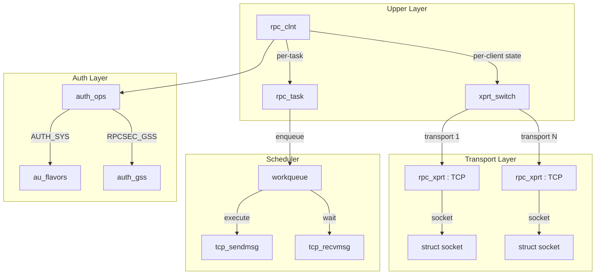
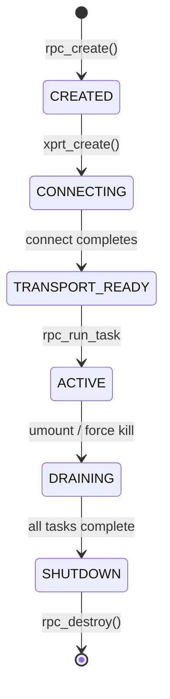
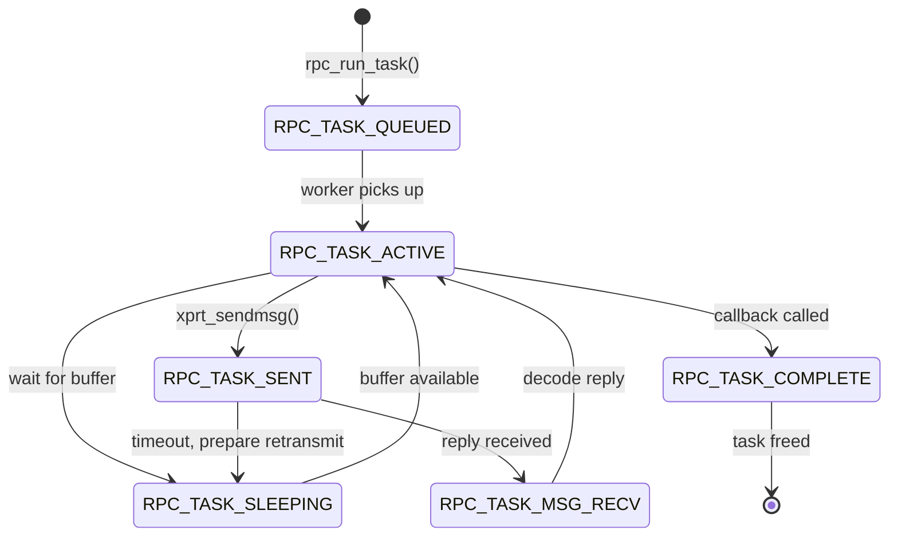
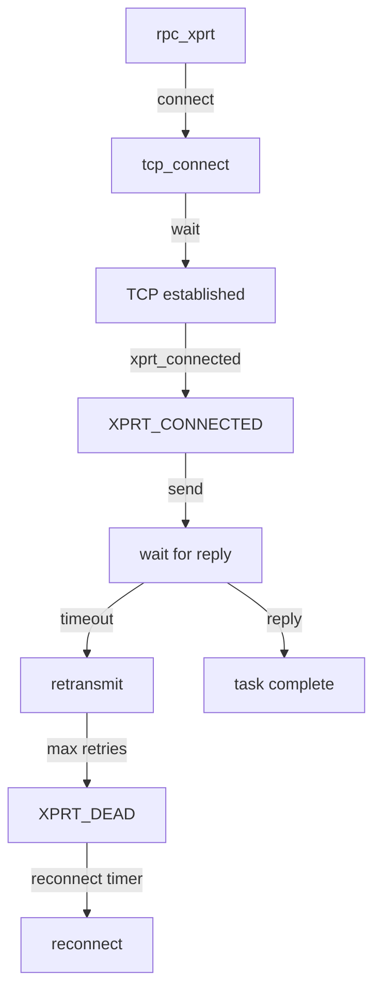

# Chapter 7: The Linux RPC Layer (sunrpc.ko)

## 7.1 Architecture Overview

The `sunrpc.ko` module provides the transport and scheduling infrastructure for all RPC-based filesystems (NFS, NFSd, lockd). Its layering mirrors the protocol itself:



## 7.2 The rpc_clnt Lifecycle



### rpc_create

```c
struct rpc_clnt *rpc_create(struct rpc_create_args *args)
{
    struct rpc_clnt *clnt;

    // Allocate client
    clnt = kzalloc(sizeof(*clnt), GFP_KERNEL);

    // Create initial transport
    clnt->cl_xprt = rpc_xprt_create(args);

    // Create transport switch
    clnt->cl_xprtswitch = rpc_xprt_switch_create(clnt->cl_xprt);

    // Set auth flavour
    clnt->cl_auth = auth_create(args->authflavor);

    return clnt;
}
```

## 7.3 The rpc_task State Machine

Every RPC call flows through a state machine in `sched.c`:



### Task Construction

```c
struct rpc_task *rpc_run_task(const struct rpc_task_setup *setup)
{
    struct rpc_task *task;

    task = rpc_new_task(setup->rpc_clnt, setup->flags, GFP_NOWAIT);
    if (!task)
        return ERR_PTR(-ENOMEM);

    task->tk_action = setup->callback;
    task->tk_ops = setup->ops;

    rpc_execute(task);
    return task;
}
```

## 7.4 Transport Switch Details

The `xprt_switch` is stored in `cl_xprtswitch` on the `rpc_clnt`:

```c
struct rpc_xprt_switch {
    struct kref           xps_kref;
    spinlock_t            xps_lock;

    struct list_head      xps_xprt_list;   // linked list of rpc_xprt

    // Transport counts
    unsigned int          xps_nxprts;
    unsigned int          xps_nactive;
    unsigned int          xps_nunique_destaddr;

    // Policy
    const struct rpc_xprt_iter_ops *xps_iter_ops;

    // Callback for multipath setup
    int (*xps_multipath)(struct rpc_xprt_switch *xps,
                         struct rpc_xprt *xprt);
};
```

### Iteration Ops

```c
static struct rpc_xprt *
xprt_iter_default_next(struct rpc_xprt_switch *xps)
{
    // Single transport: always return the one and only xprt
    return list_first_entry_or_null(&xps->xps_xprt_list,
                                    struct rpc_xprt, xprt_switch);
}

static const struct rpc_xprt_iter_ops xprt_iter_default = {
    .xps_iter_init = xprt_iter_default_next,
    .xps_iter_next = xprt_iter_default_next,
};
```

A multipath implementation replaces `xps_iter_ops` with a custom iterator:

```c
static struct rpc_xprt *
enfs_xprt_iter_roundrobin_next(struct rpc_xprt_switch *xps)
{
    struct rpc_xprt *xprt;
    unsigned int idx = atomic_inc_return(&dispatch_index);

    // Round-robin through live transports
    list_for_each_entry(xprt, &xps->xps_xprt_list, xprt_switch) {
        if (xprt_connected(xprt) && idx-- == 0)
            return xprt;
    }

    return list_first_entry_or_null(&xps->xps_xprt_list,
                                    struct rpc_xprt, xprt_switch);
}
```

## 7.5 Authentication

The auth layer adds RPC-level credentials and verifiers:

```c
struct rpc_auth {
    struct module        *au_owner;
    rpc_authflavor_t      au_flavor;
    unsigned long         au_flags;
    rpc_auth_stat_t     (*au_validate)(struct rpc_task *);
    int                 (*au_wrap)(struct rpc_task *, struct xdr_stream *);
    int                 (*au_unwrap)(struct rpc_task *, struct xdr_stream *);
};
```

| Flavour | Module | Wraps RPC body |
|---------|--------|----------------|
| AUTH_NONE | `auth_null.c` | No |
| AUTH_SYS | `auth_unix.c` | No (credentials in header) |
| RPCSEC_GSS | `auth_gss/auth_gss.c` | Yes (encrypts body) |

## 7.6 Socket Transport (xprtsock.c)

The TCP socket transport implements the connection lifecycle:



Key parameters per transport:

| Parameter | Default | Controls |
|-----------|---------|----------|
| `timeo` | 600 (60s) | Initial timeout for RPC |
| `retrans` | 2 | Max retransmissions before failover |
| `connect_timeout` | 60s | TCP connect timeout |
| `max_slot_table_entries` | 4 (v3) / 64 (v4.1) | Concurrent RPCs per connection |

## 7.7 Building Custom Transport Policies

The transport switch iterator (`xps_iter_ops`) is the extension point for custom dispatch. NFSv4.1 trunking uses it. enfs/dnfs will use it. A custom policy requires:

1. Implement `xps_iter_init` and `xps_iter_next`
2. Install the ops on the switch after building the transport list
3. Optionally override `xps_multipath` for transport-multipath coordination

```c
struct rpc_xprt_iter_ops dnfs_iter_ops = {
    .xps_iter_init = dnfs_iter_init,
    .xps_iter_next = dnfs_iter_next,
};

// Install on an existing switch
void dnfs_install_policy(struct rpc_xprt_switch *xps)
{
    xps->xps_iter_ops = &dnfs_iter_ops;
}
```

Chapter 8 describes how dnfs hooks into this infrastructure.
