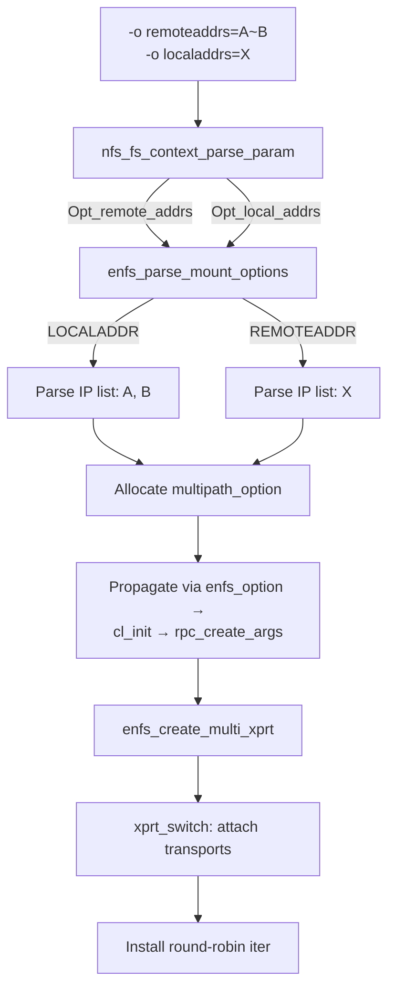
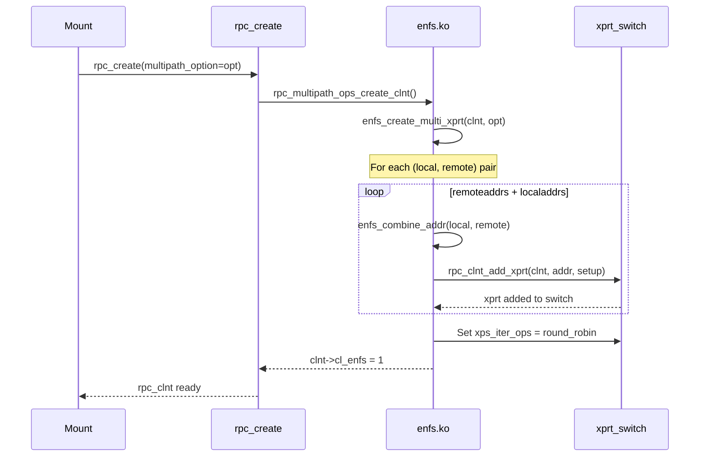
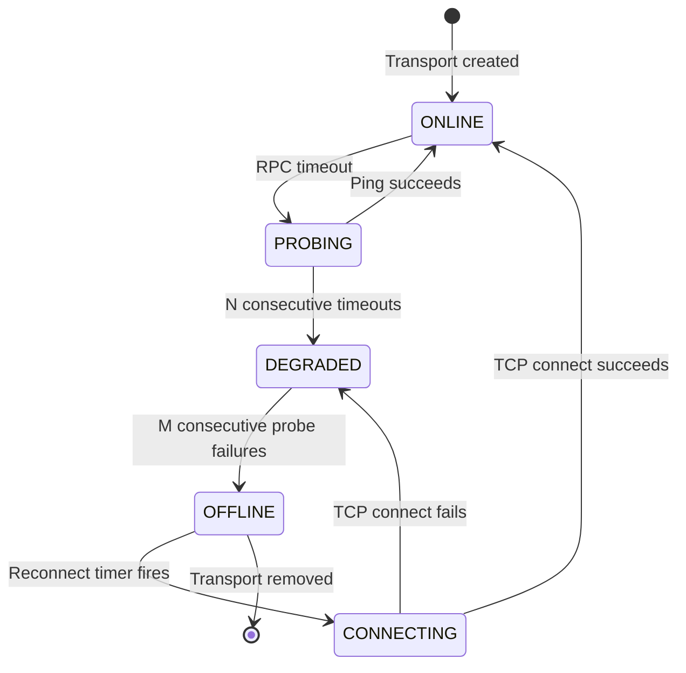

# Chapter 8: dnfs — Distributed NFS Design

## 8.1 Design Goals

dnfs (Distributed NFS) is a clean-room implementation of client-side NFS multipath. Unlike the OpenEuler/Huawei eNFS implementation, dnfs is designed from day one for **upstream kernel acceptance**.

| Goal | Priority | Rationale |
|------|----------|-----------|
| Mainline-ready patches | P0 | Must pass review on linux-nfs@vger.kernel.org |
| No server changes | P0 | Must work with stock NFS servers (v3, v4, v4.1) |
| NFSv3 + NFSv4 + NFSv4.1 | P0 | Cover all deployed NFS versions |
| Configurable path policy | P1 | Round-robin, weighted, failover |
| Runtime path management | P1 | Add/remove paths without unmount |
| Transparent failover | P1 | No application-visible interruption |
| Performance linearity | P1 | N paths → N× throughput (up to fabric limit) |
| Server-side extensions | P2 | OPTIONAL EXTEND op for server capability discovery |

## 8.2 Architectural Decisions

### Why Not Session Trunking?

Session trunking (NFSv4.1 BIND_CONN_TO_SESSION) was rejected as the primary mechanism because:

1. **Server dependency** — requires the server to implement and advertise trunking
2. **NFSv3 excluded** — no trunking mechanism exists for v3
3. **No multi-server** — trunking requires the same server principal on all paths
4. **Implementation variance** — server trunking behaviour is underspecified and untested

### Why the xprt_switch?

The `xprt_switch` iterator is the natural extension point:

```
VFS → NFS → rpc_clnt → xprt_switch → xprt_iter_ops → rpc_xprt
```

It is:
- **Version-independent**: Works for NFSv3, v4, v4.1 (all use `rpc_clnt`)
- **Transport-agnostic**: TCP, RDMA, any xprt type
- **Policy-pluggable**: Simply install new `xps_iter_ops`
- **Already merged**: Stock Linux kernel has the infrastructure

### Clean-Room Approach

dnfs is a clean-room implementation:

- **No code** from the OpenEuler eNFS kernel source
- **No code** from the enfs-dkms Ubuntu port
- **Architecture** derived from the NFS RFCs and Linux kernel best practices
- **Inspiration** from eNFS's approach (multiple xprts per mount) but implemented independently

## 8.3 Kernel Patch Architecture

```mermaid
flowchart TD
    subgraph fs/nfs/ (6 patches)
        MK[Makefile: build dnfs_mod]
        KC[Kconfig: CONFIG_DNFS]
        IH[internal.h: mount option fields]
        SC[super.c: mount/unmount hooks]
        FC[fs_context.c: -o remoteaddrs= parsing]
        CL[client.c: enfs_option propagation]
    end
    subgraph net/sunrpc/ (4 patches)
        SMK[Makefile: build components]
        SKC[Kconfig: CONFIG_SUNRPC_DNFS]
        CLN[clnt.c: rpc_multipath_ops_create_clnt]
        XPR[xprt.c: xprt creation hooks]
        XPM[xprtmultipath.c: export iter helpers]
    end
    subgraph include/linux/ (3 patches)
        CLH[sunrpc/clnt.h: multipath_option field]
        SCH[sunrpc/sched.h: RPC_TASK_DNFS flag]
        XPRH[sunrpc/xprtmultipath.h: iter ops export]
    end
```

### Patch 1 — fs/nfs/Kconfig

```diff
+config DNFS
+    bool "Distributed NFS multipath support"
+    depends on NFS_FS
+    help
+      Enable client-side multipath for NFS mounts. Allows a single
+      mount to use multiple network paths (remoteaddrs= mount option).
+      Works with NFSv3, NFSv4, and NFSv4.1.
```

### Patch 2 — fs/nfs/Makefile

```diff
+nfs-$(CONFIG_DNFS) += dnfs_mod.o
```

### Patch 3 — include/linux/sunrpc/clnt.h

```diff
 struct rpc_create_args {
     ...
+    #if IS_ENABLED(CONFIG_SUNRPC_DNFS)
+    void *multipath_option;
+    #endif
 };
```

### Patch 4 — net/sunrpc/clnt.c

```diff
 int rpc_create(struct rpc_create_args *args, struct rpc_clnt *clnt)
 {
     ...
+    #if IS_ENABLED(CONFIG_SUNRPC_DNFS)
+    if (args->multipath_option)
+        rpc_multipath_ops_create_clnt(args, clnt);
+    #endif
 }
```

## 8.4 Mount Option Syntax

The `-o remoteaddrs=` and `-o localaddrs=` mount options configure multipath:

```bash
# Two storage heads, one client NIC
mount -t nfs -o vers=3,remoteaddrs=10.0.0.1~10.0.0.2 \
    10.0.0.1:/export /mnt

# Two NICs × two storage heads (four transports)
mount -t nfs4 -o vers=4.1,remoteaddrs=10.0.0.1~10.0.0.2,\
    localaddrs=192.168.1.1~192.168.2.1 \
    10.0.0.1:/export /mnt
```

### Option Parsing Flow



## 8.5 Transport Instantiation



## 8.6 The dnfs Module (dnfs.ko)

```c
// Main entry point
void enfs_create_multi_xprt(struct rpc_create_args *args,
                            struct rpc_clnt *clnt)
{
    struct multipath_mount_options *opt = args->multipath_option;
    struct rpc_xprt *main_xprt;

    // Mark this client as dnfs-managed
    clnt->cl_enfs = 1;

    // Build transport list
    for each remote address in opt->remoteaddrs {
        for each local address in opt->localaddrs {
            rpc_clnt_add_xprt(clnt, &addr, setup_callback);
        }
    }

    // Install round-robin dispatch
    clnt->cl_xprtswitch->xps_iter_ops = &enfs_round_robin;
}
```

## 8.7 Dispatch Policy (Round Robin)

```c
static struct rpc_xprt *
enfs_round_robin_next(struct rpc_xprt_switch *xps)
{
    struct rpc_xprt *xprt;
    unsigned int start, i;

    start = atomic_inc_return(&rr_counter) % xps->xps_nxprts;

    // Scan for a live transport starting at counter offset
    i = start;
    list_for_each_entry(xprt, &xps->xps_xprt_list, xprt_switch) {
        if (i-- > 0) continue;
        if (xprt_connected(xprt))
            return xprt;
    }

    // Fallback to any live transport
    list_for_each_entry(xprt, &xps->xps_xprt_list, xprt_switch) {
        if (xprt_connected(xprt))
            return xprt;
    }

    return NULL; // All paths dead
}
```

## 8.8 Failover



## 8.9 /proc Interface

```
/proc/dnfs/
├── mounts
│   └── <mount_id>/
│       ├── paths
│       │   ├── 0: local=192.168.1.1 remote=10.0.0.1 state=ONLINE
│       │   ├── 1: local=192.168.1.1 remote=10.0.0.2 state=ONLINE
│       │   ├── 2: local=192.168.2.1 remote=10.0.0.1 state=DEGRADED
│       │   └── 3: local=192.168.2.1 remote=10.0.0.2 state=ONLINE
│       ├── stats
│       │   ├── rpcs_sent: 1048576
│       │   ├── rpcs_per_path: [262144, 262144, 262144, 262144]
│       │   └── failovers: 3
│       └── config
│           └── policy: round-robin
```

## 8.10 Performance Target

```mermaid
flowchart LR
    subgraph Client 2×100GbE
        C[dnfs client] -->|xprt 1: 100GbE| S1[Server A]
        C -->|xprt 2: 100GbE| S2[Server B]
    end
```

Target: **140 Gb/s** aggregate (70% efficiency of 2 × 100 GbE links, accounting for protocol overhead and NIC/CPU limitations).

## 8.11 Roadmap

| Phase | Milestone | NFS versions |
|-------|-----------|--------------|
| Stage 1 | Minimum viable multipath: `remoteaddrs=` option, round-robin dispatch, basic failover | NFSv3 |
| Stage 2 | NFSv4 + NFSv4.1 support, `localaddrs=` option | NFSv3, v4, v4.1 |
| Stage 3 | `/proc/dnfs/` interface, live path management, weighted policies | All |
| Stage 4 | Performance tuning, IPv6, multi-NIC optimizations | All |
| Stage 5 | Server-side EXTEND capability probe (optional) | NFSv3, v4.1 |
