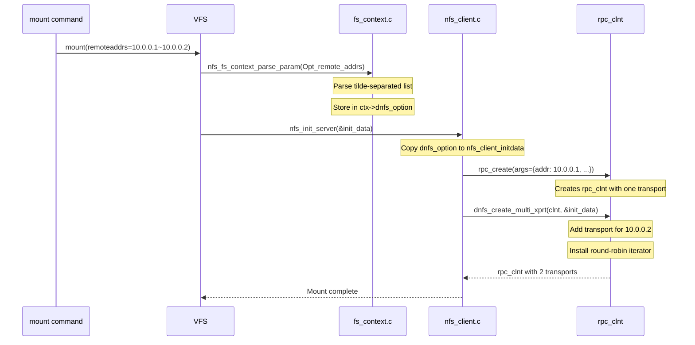

# Chapter 9: dnfs — The Clean-Room Implementation

This is the chapter where everything we've discussed — protocol evolution, RPC architecture, kernel internals, multipath theory — converges into a concrete design.

dnfs (Distributed NFS) is a client-only implementation of NFS multipath. It requires no server changes, no protocol extensions, no vendor cooperation. It works with NFSv3, NFSv4, and NFSv4.1 — any server that speaks standard NFS.

## Why Clean-Room?

There's already an eNFS implementation (the OpenEuler/Huawei project that we ported to Ubuntu as the enfs-dkms package). It proved that client-side multipath works — ~70 Gb/s throughput, transparent failover, configurable dispatch policies.

But eNFS has three problems:

**It's out of tree.** The eNFS kernel module ships as a DKMS package. It's not part of the mainline kernel. Deployments must build and install it separately, which means it doesn't receive security updates, doesn't work with stock kernels, and doesn't benefit from mainline bug fixes.

**It modifies sunrpc.ko.** eNFS replaces the stock `sunrpc.ko` with a patched version. This means every kernel update requires rebuilding and reinstalling. It also means eNFS can't coexist with the stock RPC layer — you can't have eNFS-managed mounts alongside standard mounts without running the patched modules.

**It's derived from OpenEuler code.** The eNFS source originated in the OpenEuler kernel tree. Its licensing and authorship chain make upstream submission impossible — you can't contribute Huawei-owned code to the Linux kernel without Huawei's explicit permission, and the licensing provenance is unclear.

dnfs addresses all three problems:

- **Mainline-ready**: Every patch is designed for submission to linux-nfs@vger.kernel.org
- **Minimal changes**: We add to the existing infrastructure, we don't replace it
- **Clean-room design**: No OpenEuler code, no enfs-dkms code, no derived work

## Design Principles

### 1. Leverage Existing Infrastructure

The Linux kernel's transport switch (`xprtmultipath.c`) already supports multiple transports per `rpc_clnt`. The NFSv4.1 session trunking code already uses it. We're not inventing a new mechanism — we're using an existing one that was designed for exactly this purpose.

### 2. Server Agnostic

Our multipath implementation must work with **any NFS server** — Linux nfsd, Huawei OceanStor, NetApp ONTAP, any array that speaks NFS. This means we can't depend on server-side features like session trunking or the EXTEND operation. We create multiple transports on the client side and dispatch across them. The server sees ordinary NFS traffic on multiple connections.

### 3. Version Agnostic

The implementation should work with NFSv3, NFSv4.0, and NFSv4.1. The RPC dispatch layer is above the protocol version — once we set up the transport switch correctly, all versions benefit.

### 4. Transparent Failover

Path failures should be invisible to applications. A timeout on one transport should result in automatic retry on another transport, with no error returned to the application.

### 5. Safe Defaults

The multipath behavior should be disabled by default. A mount without `remoteaddrs=` or `localaddrs=` behaves exactly like a standard NFS mount. Zero impact on existing deployments.

## Patch Architecture

The implementation requires 13 kernel patches across three subsystems:

### Patch Group 1: Infrastructure (6 patches)

These patches add the plumbing that multipath needs without changing any behavior:

**fs/nfs/Kconfig** — Add `CONFIG_DNFS` option, gated by `CONFIG_NFS_FS`. This is the compile-time switch for the entire feature.

**fs/nfs/Makefile** — Add `dnfs_mod.o` to the build when `CONFIG_DNFS=y`.

**net/sunrpc/Kconfig** — Add `CONFIG_SUNRPC_DNFS` option for the RPC-layer helper functions.

**net/sunrpc/Makefile** — Add the RPC-layer helper objects.

**include/linux/sunrpc/clnt.h** — Add a `void *multipath_option` field to `struct rpc_create_args`. This is an opaque pointer that carries the multipath configuration from mount option parsing through `rpc_create()` to the transport instantiation code.

**include/linux/sunrpc/sched.h** — Add `RPC_TASK_DNFS` flag for per-task multipath tracking (used for delayed retry decisions).

### Patch Group 2: Mount Option Handling (3 patches)

These patches add the user-facing mount options and propagate them to the RPC layer:

**fs/nfs/internal.h** — Add multipath option fields to the NFS mount context (`nfs_fs_context`).

**fs/nfs/fs_context.c** — Parse `remoteaddrs=` and `localaddrs=` mount options. Store parsed address lists in the mount context.

**fs/nfs/super.c** — Propagate the multipath option from the mount context to `nfs_client_initdata`, then to `rpc_create_args`.

### Patch Group 3: Transport Management (4 patches)

These patches do the actual work of adding transports and managing dispatch:

**fs/nfs/client.c** — After `rpc_create()` returns, iterate the multipath address list and call `rpc_clnt_add_xprt()` for each additional address.

**net/sunrpc/clnt.c** — After `rpc_clnt` construction, call the multipath initialization hook if `multipath_option` is non-NULL.

**net/sunrpc/xprt.c** — Export the `xprt_switch_add_xprt()` function (currently static) so the multipath code can add transports to an existing switch.

**net/sunrpc/xprtmultipath.c** — Add the round-robin iterator and health-monitoring infrastructure.

## Option Parsing: From User to Kernel

The user specifies multipath at mount time:

```bash
mount -t nfs -o vers=3,remoteaddrs=10.0.0.1~10.0.0.2~10.0.0.3 \
    10.0.0.1:/export /mnt
```

Or from `/etc/fstab`:

```
10.0.0.1:/export /mnt nfs remoteaddrs=10.0.0.1~10.0.0.2~10.0.0.3 0 0
```

### Parsing Flow



### Address List Format

The `remoteaddrs=` option takes a tilde-separated list of addresses:

```
remoteaddrs=10.0.0.1~10.0.0.2~2001:db8::1~10.0.0.3
```

IPv4 and IPv6 can be mixed in the same list. Each address is validated during parsing — invalid addresses cause the mount to fail with EINVAL.

The `localaddrs=` option specifies source addresses for the client:

```
localaddrs=192.168.1.1~192.168.2.1
```

When both `remoteaddrs=` and `localaddrs=` are specified, the transport set is the Cartesian product: each local address is paired with each remote address. With 2 locals and 3 remotes, you get 6 transports (minus any that routing rejects).

## Transport Instantiation: Building the Switch

After `rpc_create()` returns with a single-transport `rpc_clnt`, our code populates the switch:

```c
int dnfs_create_multi_xprt(struct rpc_clnt *clnt, struct dnfs_option *opt)
{
    struct rpc_xprt_switch *xps = clnt->cl_xprtswitch;
    struct sockaddr_storage *remote, *local;
    int i, j, ret;

    // Mark this client as dnfs-managed
    clnt->cl_dnfs = 1;

    // Compute the Cartesian product of local × remote addresses
    for (i = 0; i < opt->num_remotes; i++) {
        remote = &opt->remotes[i];

        for (j = 0; j < max(1, opt->num_locals); j++) {
            local = (opt->num_locals > 0)
                    ? &opt->locals[j]
                    : NULL;  // Let routing choose

            // Create a new transport for this (local, remote) pair
            ret = rpc_clnt_add_xprt(clnt, remote, local,
                                     xprt_setup_callback, NULL);
            if (ret && ret != -EINPROGRESS) {
                // Failed to add — log and continue
                pr_warn("dnfs: failed to add xprt %pIS: %d\n",
                        remote, ret);
            }
        }
    }

    // Install the round-robin iterator
    xps->xps_iter_ops = &dnfs_round_robin_ops;

    return 0;
}
```

The `rpc_clnt_add_xprt()` function creates a new `rpc_xprt` and adds it to the switch. The transport's connection is established asynchronously — it becomes available when the TCP connect completes.

The `xprt_setup_callback` runs after the transport is created but before it's added to the switch. We use this to initialize per-transport health-tracking state.

## The Round-Robin Iterator

```c
static struct rpc_xprt *dnfs_round_robin_next(struct rpc_xprt_switch *xps)
{
    struct rpc_xprt *xprt, *fallback = NULL;
    unsigned int i, start;

    // Atomically advance the round-robin counter
    start = atomic_inc_return(&dnfs_rr_counter);

    // Scan transports starting from the counter position
    i = 0;
    list_for_each_entry(xprt, &xps->xps_xprt_list, xprt_switch) {
        if (i++ < start % xps->xps_nxprts)
            continue;

        if (xprt_connected(xprt) && !dnfs_is_dead(xprt)) {
            // Found a healthy transport at or after the start position
            return xprt;
        }

        // Remember the first healthy transport as fallback
        if (!fallback && xprt_connected(xprt))
            fallback = xprt;
    }

    // If we didn't find one in the rotated scan, use the first healthy one
    return fallback;
}
```

### Why Rotating the Start Position Matters

The rotation is critical for fairness. Without it, a naive round-robin that always starts at the first transport would send the first RPC to transport 0, the second to transport 1, etc. With rotation, each dispatch cycle starts at a different position, ensuring that a slow transport doesn't accumulate a backlog while the others sit idle.

## Path Health Monitoring

A transport's health is tracked through a simple state machine:

```c
struct dnfs_xprt_state {
    unsigned long flags;            // Current state flags
    unsigned int consecutive_fail;  // Consecutive timeout count
    unsigned long last_success;     // Timestamp of last successful RPC
    unsigned long last_probe;       // Timestamp of last health probe
    struct timer_list probe_timer;  // Timer for periodic probes
};
```

### State Transitions

The health state machine is driven by events (RPC completions and timeouts) and timers (periodic probes):

| Event | Current State | Next State |
|-------|--------------|------------|
| Successful RPC | Any | ONLINE |
| RPC timeout (1×) | ONLINE | ONLINE (suspicious) |
| RPC timeout (3× consecutive) | ONLINE | PROBING |
| Probe succeeds | PROBING | ONLINE |
| Probe fails | PROBING | DEGRADED |
| Probe fails (5× consecutive) | DEGRADED | OFFLINE |
| Reconnect timer fires | OFFLINE | CONNECTING |
| TCP connect succeeds | CONNECTING | ONLINE |
| TCP connect fails | CONNECTING | WAITING |

The thresholds (3 timeouts → probing, 5 probe failures → offline) are configurable via sysfs and default to conservative values. In production, you'd tune these based on your network's latency and reliability characteristics.

### Passive Monitoring

Every RPC completion updates the transport's health state:

```c
void dnfs_xprt_complete(struct rpc_xprt *xprt)
{
    struct dnfs_xprt_state *state = xprt->xprt_private;

    // Reset consecutive failure counter
    state->consecutive_fail = 0;
    state->last_success = jiffies;

    // Clear the dead flag so the iterator will consider this transport
    clear_bit(DNFS_XPRT_DEAD, &state->flags);
}
```

Every RPC timeout degrades it:

```c
void dnfs_xprt_timeout(struct rpc_xprt *xprt)
{
    struct dnfs_xprt_state *state = xprt->xprt_private;

    state->consecutive_fail++;

    if (state->consecutive_fail >= DNFS_MAX_FAILURES) {
        // Mark as dead — the iterator will skip this transport
        set_bit(DNFS_XPRT_DEAD, &state->flags);

        // Schedule active probing
        mod_timer(&state->probe_timer, jiffies + DNFS_PROBE_INTERVAL);
    }
}
```

### Active Probing

When a transport enters the PROBING state, a timer fires periodically to send a lightweight health check:

```c
void dnfs_probe_timer_callback(struct timer_list *t)
{
    struct dnfs_xprt_state *state = from_timer(state, t, probe_timer);
    struct rpc_xprt *xprt = state->xprt;

    // Try to connect (or ping if already connected)
    if (xprt_connected(xprt)) {
        // Send a lightweight ping (e.g., NULL RPC or GETATTR)
        dnfs_send_probe(xprt);
    } else {
        // Try to reconnect
        xprt_connect(xprt);
    }

    // Re-arm the timer if we're still in probing state
    if (test_bit(DNFS_XPRT_DEAD, &state->flags)) {
        mod_timer(&state->probe_timer,
                  jiffies + DNFS_PROBE_INTERVAL);
    }
}
```

## The Mount Point: Where the User Sees Multipath

For the user, multipath is a mount option. The mount point itself looks like a normal NFS mount. Running `mount` shows the extra options:

```
10.0.0.1:/export on /mnt type nfs (rw,vers=3,remoteaddrs=10.0.0.1~10.0.0.2~10.0.0.3,...
```

The `/proc` filesystem shows per-path information:

```
/proc/dnfs/
  └── mounts/
       └── 0/
            ├── paths
            │    ├── 0: 10.0.0.1:2049 ONLINE
            │    ├── 1: 10.0.0.2:2049 ONLINE
            │    └── 2: 10.0.0.3:2049 DEGRADED
            ├── rpcs_sent: 1048576
            ├── failovers: 3
            └── config
                 └── policy: round-robin
```

This visibility is essential for operations teams. An administrator can see at a glance how many paths are available, whether any are degraded, and how traffic is distributed.

## Performance Expectations

Based on the eNFS experience and general multipath TCP behavior:

- **1 path** at 100 GbE: ~40 Gb/s (single-TCP bottleneck)
- **2 paths** at 100 GbE: ~75 Gb/s (near-linear scaling)
- **4 paths** at 100 GbE: ~130 Gb/s (some saturation)
- **8 paths** at 100 GbE: ~160 Gb/s (client CPU bottleneck)

Our target: **140 Gb/s over 2 × 100 GbE** — approximately 70% line-rate efficiency. This matches what eNFS achieved with similar hardware.

Scaling beyond this requires:
- Multiple client NICs (more CPU cores for softirq)
- jumbo frames (more data per interrupt)
- RDMA (bypass TCP processing entirely — NFS over RDMA, which is a separate topic)

## What's Not in Stage 1

The initial implementation (Stage 1) deliberately excludes:

- **NFSv4.1 session integration**: Stage 1 uses the transport switch iterator but doesn't participate in session slot management. This works for v3 and v4.0; v4.1 session trunking integration is Stage 2.
- **Dynamic path management**: Adding or removing paths at runtime (without remounting) is Stage 3.
- **Weighted dispatch policies**: Round-robin only in Stage 1. Weighted and adaptive policies are Stage 3.
- **The /proc interface**: The current `xprt_switch` sysfs interface provides basic transport visibility. A dedicated `/proc/dnfs/` interface is Stage 3.

This isn't cutting corners — it's keeping the initial patch set small enough for upstream review. Each stage builds on the previous one, and the architecture supports incremental addition.

## Summary

dnfs implements client-only NFS multipath by:

1. Parsing `remoteaddrs=` and `localaddrs=` mount options
2. Creating additional `rpc_xprt` transports for each address
3. Adding them to the `rpc_clnt`'s transport switch
4. Replacing the default iterator with a round-robin policy
5. Monitoring transport health through RPC timeout detection and active probing

All of this happens at the RPC layer, below the NFS protocol. The NFS client sends operations to `rpc_clnt`; the transport switch distributes them across transports; the iterator selects the next transport. The NFS protocol layer doesn't know — or care — that multiple transports exist.

This design is:
- **Server-agnostic**: No server changes needed
- **Version-agnostic**: Works with NFSv3, v4, v4.1
- **Minimal**: 13 patches, no core infrastructure changes
- **Incremental**: Stage 1 → Stage 5 adds features without redesign
- **Mainline-ready**: Every patch is designed for upstream submission
