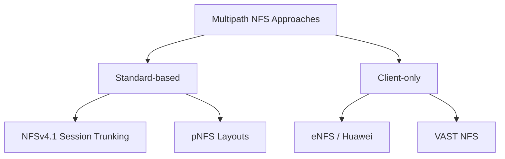
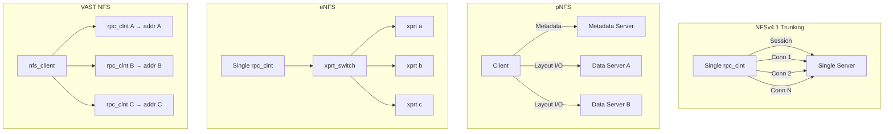
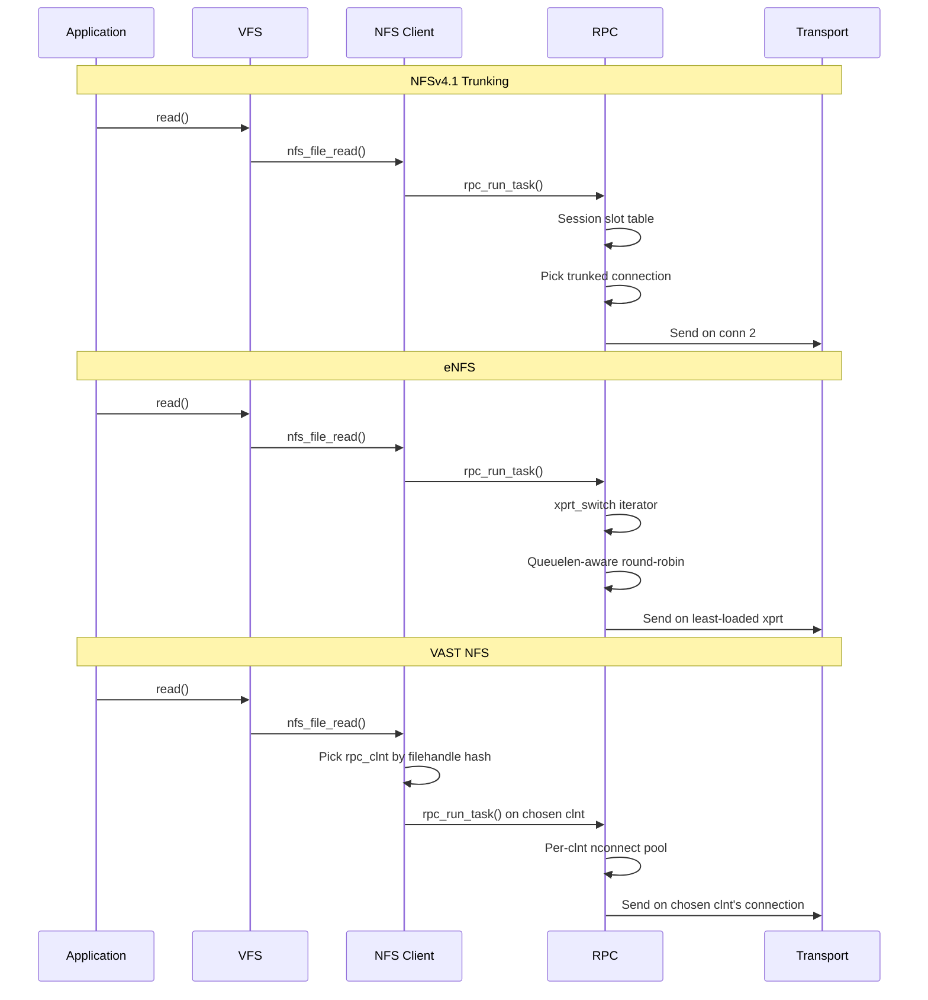
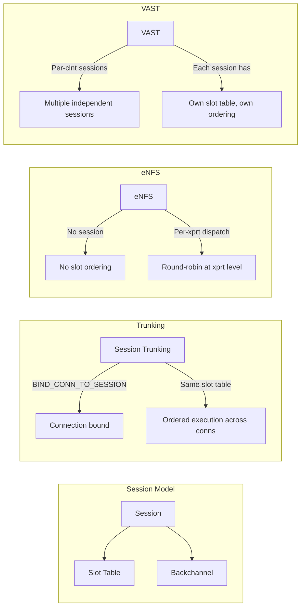
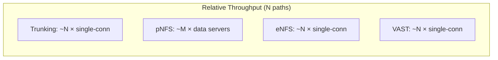
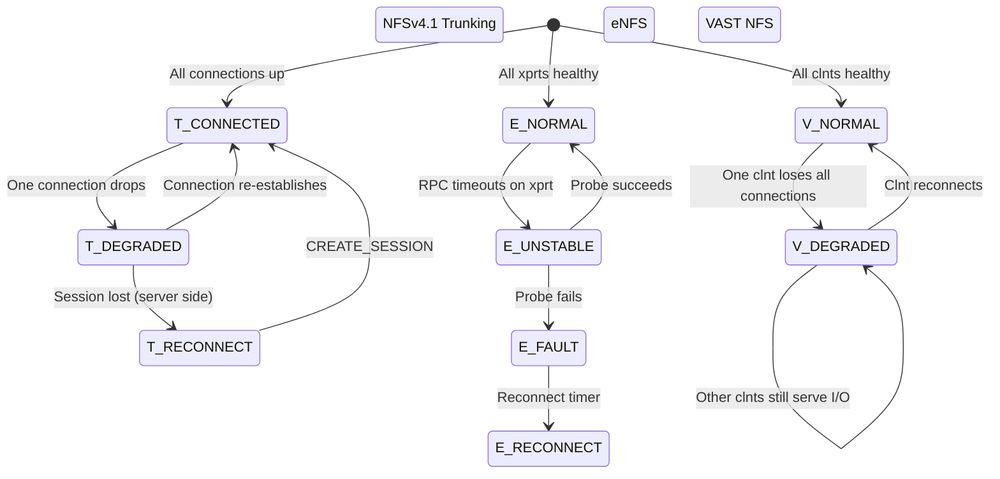
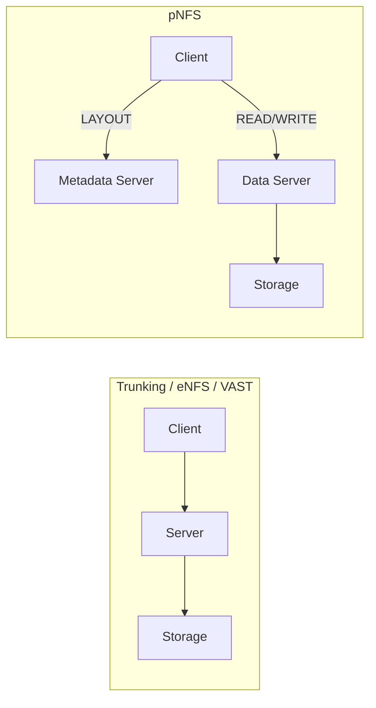
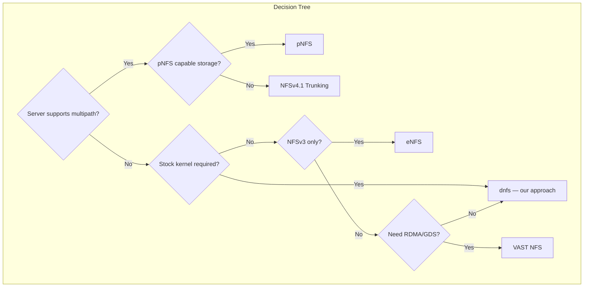

# Chapter 10: Comparing the Multipath NFS Approaches

Four distinct approaches to multipath NFS have emerged in the industry. Each makes different tradeoffs between server requirements, standardization, NFS version support, and deployment flexibility. This chapter compares them head-to-head.

## 10.1 The Four Approaches

### NFSv4.1 Session Trunking (RFC 5661 §2.10.4)

The IETF-sanctioned mechanism: multiple TCP connections bound to a single NFSv4.1 session. Requires server-side support through `BIND_CONN_TO_SESSION`.

### pNFS (RFC 5661 §12-15, RFC 8435)

Parallel NFS separates metadata paths from data paths. Clients obtain layouts from a metadata server and issue I/O directly to data servers. Requires both server support and layout-compatible storage.

### eNFS (Huawei / OpenEuler)

Client-only multipath via hooking into the SunRPC `xprt_switch` iterator. Creates multiple RPC transports and dispatches across them with queue-length-aware round-robin. The EXTEND operation (NFS3PROC_EXTEND = 22) enables Huawei-specific server capability discovery. Works with any NFS server, but advanced features (shard routing, LIF discovery) require Huawei storage.

### VAST NFS (VAST Data)

Client-only multipath via multi-client dispatch. Replaces the entire NFS/RDMA kernel module stack. Creates multiple `rpc_clnt` instances, each assigned a subset of server addresses from `remoteports=`. Backports modern NFS features to older enterprise kernels.

## 10.2 Architectural Comparison

| Dimension | NFSv4.1 Trunking | pNFS | eNFS | VAST NFS |
|-----------|-----------------|------|------|----------|
| **Scope** | Transport-level | Storage-level | Transport-level | Client+NFS-level |
| **Server changes** | Required (BIND_CONN_TO_SESSION) | Required (layouts) | None (basic); Required (EXTEND for advanced) | None |
| **RPC infrastructure** | Single clnt, multi-xprt | Single clnt, layouts or direct I/O | Single clnt, multi-xprt + hooks | Multi-clnt, per-clnt xprt pools |
| **Data path** | Through server | Direct to data servers | Through server | Through server |
| **NFSv3 support** | No | No | Yes | Yes |
| **NFSv4.0 support** | No | No | Yes | Yes |
| **NFSv4.1 support** | Yes | Yes | Yes | Yes |
| **Server vendor lock-in** | No (standard) | No (standard) | No (basic); Yes (advanced) | No |
| **Code status** | In mainline kernel | In mainline kernel | Out-of-tree (OpenEuler) | Out-of-tree (DKMS) |
| **`kupstreamable`** | Yes (merged) | Yes (merged) | No (29 sunrpc hooks) | No (full replacement) |

## 10.3 Multipath Mechanism

### How Each Approach Distributes Operations

### Key Differences in Dispatch

| Aspect | Trunking | pNFS | eNFS | VAST NFS |
|--------|----------|------|------|----------|
| **Dispatch level** | Slot → connection | Layout → data server | Task → xprt | File → clnt → xprt |
| **Path selection** | Server-directed (slot) | Metadata server (layout) | Client (queue-length-aware RR) | Client (hash-based) |
| **Per-file affinity** | No (any slot → any conn) | Yes (layout pins bytes) | No (each RPC on any xprt) | Configurable (spread on/off) |
| **Load awareness** | Implicit (TCP) | Explicit (layout) | Explicit (queuelen) | Implicit (per-clnt pool) |
| **Failover unit** | Connection drop | Layout expiry | xprt state (DEAD) | per-clnt connection loss |

## 10.4 Protocol Interaction

### NFSv4.1 Sessions

| NFSv4.1 Session Feature | Trunking | pNFS | eNFS | VAST NFS |
|-------------------------|----------|------|------|----------|
| Single session ID | Yes | Yes (metadata) | No | No (one per clnt) |
| Shared slot table | Yes | Yes | No | No |
| Ordered execution | Across all conns | Metadata only | Not guaranteed | Per-clnt |
| Backchannel | Shared across conns | Metadata only | Not applicable | Per-clnt |
| Duplicate detection | Per-slot cache | Per-slot (metadata) | Per-connection DRC | Per-clnt |

### The Key Insight: Session Awareness

NFSv4.1 trunking is the only approach that maintains a **single session** across all transports. This means:

- **Ordered execution** is guaranteed across all connections (slot ordering)
- **Duplicate detection** works regardless of which connection carries the retransmission
- **Callback (backchannel)** works on any connection

Both eNFS and VAST NFS fall back to per-connection DRC (NFSv3-style) or per-client session management (VAST's multi-clnt approach). Neither provides session-level guarantees across the entire transport pool.

pNFS doesn't need cross-transport session ordering because the data path bypasses the metadata server entirely — each data server manages its own state independently.

## 10.5 Deployment Requirements

### Server-Side

| Requirement | Trunking | pNFS | eNFS | VAST NFS |
|-------------|----------|------|------|----------|
| Standard NFS server | Yes (v4.1+) | No (needs layouts) | Yes | Yes |
| Additional services | None | Metadata + data servers | None (basic); EXTEND (advanced) | None |
| Port requirements | 2049 | 2049 + data server ports | 2049 | 2049 + RDMA (if used) |
| Multi-server support | No (same server) | Yes (layout distribution) | Yes (same export across servers) | Yes (same export across servers) |

### Client-Side

| Requirement | Trunking | pNFS | eNFS | VAST NFS |
|-------------|----------|------|------|----------|
| Stock kernel | Yes (v4.1+) | Yes (v4.1+) | No (patches needed) | No (DKMS modules) |
| Custom modules | None | None | enfs.ko, patched sunrpc | Entire NFS/RDMA stack |
| Module load order | N/A | N/A | enfs after sunrpc | dkms install replaces stock |
| Kernel upgrade | Automatic (in-tree) | Automatic (in-tree) | Must rebuild enfs | Must rebuild entire stack |

## 10.6 Performance Characteristics

### Throughput Scaling

All four approaches scale throughput with the number of active paths, but the bottleneck differs:

| Approach | Primary Bottleneck | Scaling Factor | Efficiency (lab) |
|----------|-------------------|---------------|------------------|
| Trunking | Session slot processing | N connections | ~70% |
| pNFS | Metadata server layout throughput | M data servers | ~85% (data path bypasses metadata) |
| eNFS | xprt_switch dispatch + TCP softirq | N transports | ~70% (measured) |
| VAST NFS | Per-clnt overhead + TCP softirq | N connections ÷ pconnect | ~65-70% |

### Latency

| Operation | Trunking | pNFS | eNFS | VAST NFS |
|-----------|----------|------|------|----------|
| Baseline (single path) | Equal | Higher (layout fetch) | Equal | Equal |
| With failover | Session reconnect | New layout required | Next xprt (sub-second) | Next connection |
| Worst-case failover | Session timeout (~60s) | Layout expiry + retry | RPC timeout (~60s) | RPC timeout (~60s) |

## 10.7 Failover Behavior

| Failover Event | Trunking | pNFS | eNFS | VAST NFS |
|---------------|----------|------|------|----------|
| Single TCP drop | Transparent (other conns) | Data server unavailable → new layout | Transparent (other xprts) | Transparent (other clnts) |
| Server reboot | Session lost, new CREATE_SESSION | New layout required | All xprts reconnect | All clnts reconnect |
| IP address change | BIND_CONN_TO_SESSION fails | Update data server mapping | xprt destroyed, new one added | New clnt for new address |
| Split-brain detection | Session slot ordering | Layout leasing | Path state machine | Per-clnt connection health |

## 10.8 The pNFS Advantage — Data Path Bypass

pNFS is architecturally different from the other three approaches because it **removes the server from the data path**:

This has profound implications:

| Aspect | pNFS | Trunking / eNFS / VAST |
|--------|------|----------------------|
| **Server CPU usage** | Minimal (data bypass) | Scales with throughput |
| **Total throughput** | Limited by data server fabric | Limited by single server |
| **Latency** | Direct path to storage | Must go through server |
| **Memory pressure** | On data servers | On single NFS server |
| **Metadata operations** | Through metadata server | Through same server as I/O |
| **Consistency model** | Layout-based | Standard NFS |

For workloads where the NFS server becomes the bottleneck (common above ~40 Gb/s on a single server), pNFS is the only approach that doesn't amplify the bottleneck when adding paths.

However, pNFS requires:
- A metadata server that supports pNFS layouts
- Data servers that support the layout type
- Storage that can be split across data servers

The other three approaches work with any NFS server, making them more broadly deployable.

## 10.9 Security and Auth Comparison

| Feature | Trunking | pNFS | eNFS | VAST NFS |
|---------|----------|------|------|----------|
| **AUTH_SYS** | Yes (per-connection) | Yes | Yes | Yes |
| **RPCSEC_GSS** | Yes (single context shared) | Yes (per layout) | Yes (per xprt needs context) | Yes (per clnt has own context) |
| **Kerberos practicality** | Good (single session) | Complex (per data server) | Poor (multiple contexts) | Poor (multiple clnts) |
| **Encryption (NFSv4.1)** | Single session key | Per-data-server keys | Not supported (NFSv3) | Per-clnt keys |

The single-session model of NFSv4.1 trunking is significantly simpler for Kerberos deployments. With trunking, the client establishes one GSS context per session. All trunked connections share it. With eNFS or VAST NFS, each transport or client needs its own context, multiplying the Kerberos overhead.

## 10.10 When to Use Which

### Choose NFSv4.1 Session Trunking If:

- You have NFSv4.1 servers that support trunking (Linux nfsd, NetApp ONTAP)
- You need ordered execution with deterministic duplicate detection
- Kerberos security is required (single GSS context is simpler)
- You can't install kernel modules (stock kernel required)

### Choose pNFS If:

- Your storage supports it (requires metadata server + data server architecture)
- You need to scale beyond single-server throughput limits
- Your data format is layout-friendly (file, block, or object)
- You can tolerate layout acquisition latency

### Choose eNFS If:

- You need multipath without server support
- You're targeting NFSv3 (where trunking isn't available)
- You're on a supported kernel (OpenEuler or patched Ubuntu)
- You need the EXTEND protocol for Huawei storage capabilities

### Choose VAST NFS If:

- You need NFS/RDMA with GPU Direct Storage
- You're on an older kernel that needs modern NFS features backported
- You need metadata-dedicated connections (mdconnect)
- You can deploy DKMS modules

### Choose Our dnfs Approach If:

- You need mainline upstream acceptance
- You don't want to maintain out-of-tree patches
- You need to work across NFSv3, v4, and v4.1
- You want minimal footprint (single iterator replacement + mount option parsing)

## 10.11 Summary Matrix

| Criterion | v4.1 Trunking | pNFS | eNFS | VAST NFS | dnfs |
|-----------|--------------|------|------|----------|------|
| In mainline | Yes | Yes | No | No | Goal |
| Server changes | Required | Required | Optional | None | None |
| NFSv3 | No | No | Yes | Yes | Yes |
| Single session | Yes | Yes (metadata) | No | No | No |
| RDMA | Optional | Optional | No | Yes | Future |
| Kerberos simplicity | High | Medium | Low | Low | Medium |
| Per-file spread | N/A | Layout-controlled | Round-robin | Configurable | Configurable |
| Metadata separation | No | Yes (by design) | No | Yes (mdconnect) | Future |
| For old kernels | Yes (backport) | No | Yes | Yes (target) | Yes (backport) |
| Upstream path | N/A | N/A | Blocked | Blocked | Primary goal |
