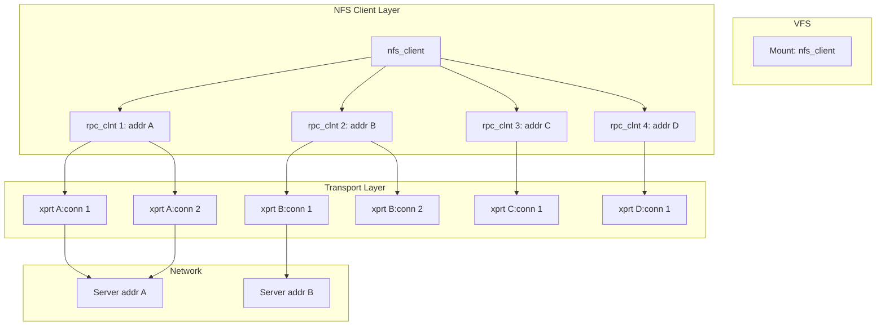
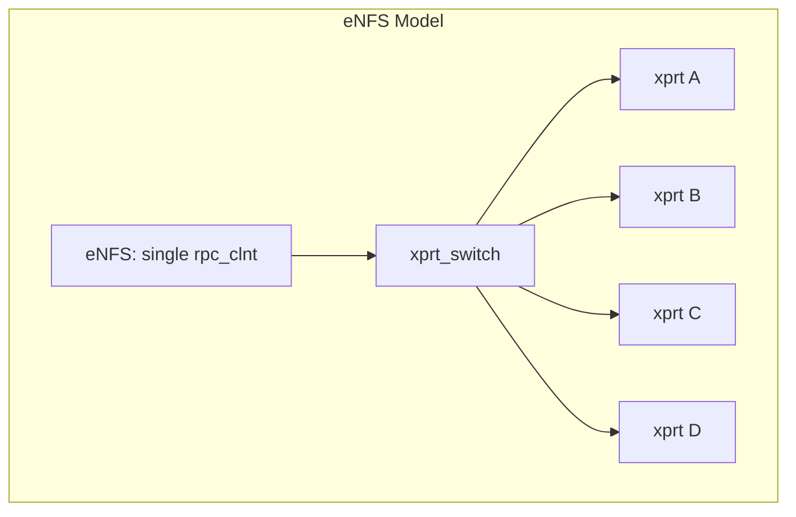
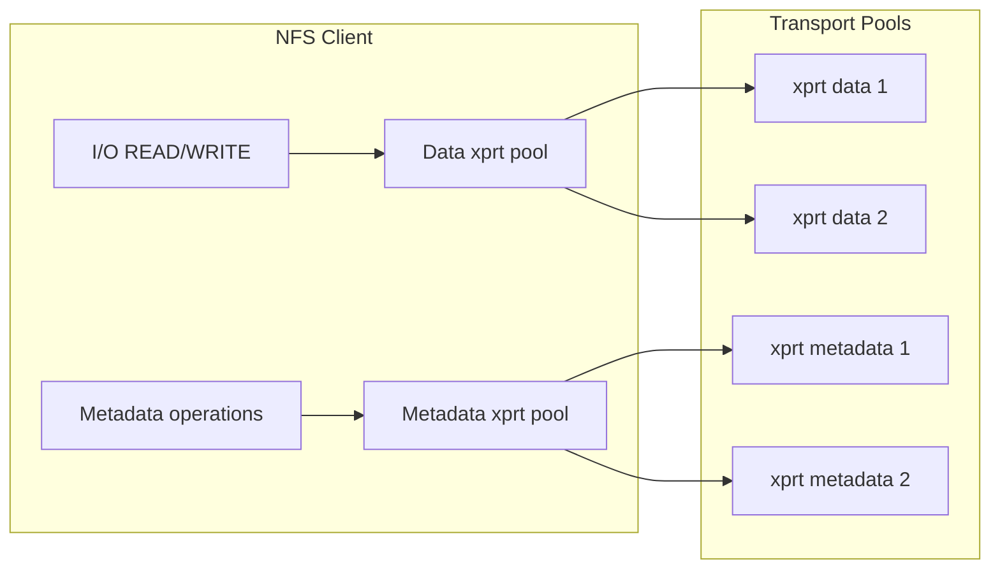
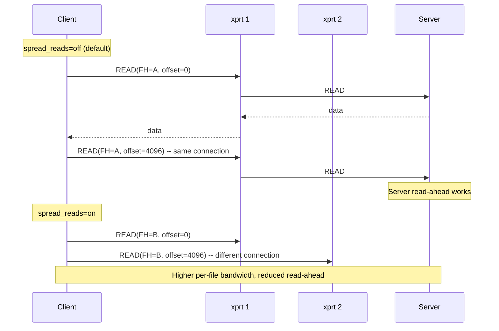

# Annex D: VAST NFS — Architecture and Deviations from Mainline

## D.1 What Is VAST NFS?

VAST NFS is an out-of-tree replacement for the entire Linux NFS/RDMA stack. Unlike eNFS (which adds hooks to the stock `sunrpc.ko`), VAST **replaces** `sunrpc.ko`, `nfs.ko`, `nfsv3.ko`, `nfsv4.ko`, `nfsd.ko`, `lockd.ko`, and all RDMA transport modules with a bundled, backported version based on Linux 6.6.x LTS.

The package (version 4.5.6) supports kernels from CentOS 7's 3.10.0 through modern 6.x, making it appealing for enterprise environments stuck on older distributions.

### Architecture Overview

```mermaid
flowchart TD
    subgraph Stock Kernel (replaced)
        STOCK[S: sunrpc.ko]
        STOCKN[S: nfs.ko]
        STOCKL[S: lockd.ko]
        STOCKR[S: rpcrdma.ko]
    end
    subgraph VAST NFS Modules
        VSN[vastnfs-sunrpc.ko]
        VSNF[vastnfs-nfs.ko]
        VSL[vastnfs-lockd.ko]
        VSR[vastnfs-rpcrdma.ko]
    end
    subgraph Install
        INSTALL[dkms install] -->|replaces| STOCK
        INSTALL -->|replaces| STOCKN
        INSTALL -->|replaces| STOCKL
        INSTALL -->|replaces| STOCKR
    end
```

**Key distinction from eNFS**: VAST does not patch the running kernel's modules. It provides complete replacement modules built from source shipped with the package. This gives them freedom to modify any part of the NFS/RDMA stack without `#ifdef` hooks or `__GENKSYMS__` tricks.

## D.2 Supported Kernels

VAST targets enterprise kernels that are stuck on older versions but need modern NFS features:

| Kernel Version | Distribution | Build Tag |
|---------------|--------------|-----------|
| 3.10.0-693.el7 | CentOS 7.4 | v3.9.30 |
| 3.10.0-862.el7 | CentOS 7.5 | v3.9.30 |
| 3.10.0-957.el7 | CentOS 7.6 | v3.9.30 |
| 3.10.0-1062.el7 | CentOS 7.7 | v3.9.30 |
| 3.10.0-1127.el7 | CentOS 7.8 | v3.9.30 |
| 3.10.0-1160.el7 | CentOS 7.9 | v3.9.30 |
| 4.4.140-96.80 | SLES 12 SP4 | v3.9.30 |
| 4.12.14-122 | SLES 12 SP5 | v3.9.30 |
| 4.18.0-\*.el8 | RHEL 8 / Rocky 8 | v4.0.39 |
| 5.14.0-\*.el9 | RHEL 9 / Rocky 9 | v4.0.39 / HEAD |
| 5.x / 6.x | Modern upstream | HEAD |

The distinction between "legacy" (v3.9.30, v4.0.39) and "modern" (HEAD) code paths affects which features are available:

| Feature | Legacy Kernels | Modern Kernels |
|---------|---------------|----------------|
| NFSv3 multipath | Yes | Yes |
| NFSv4.1 multipath | No | Yes |
| NFSv4.1 session trunking | No | Backported |
| pNFS | No | Backported |
| RDMA (NFSoRDMA) | Yes | Yes |
| GPU Direct Storage (GDS) | No | Yes |

## D.3 Multipath Architecture

VAST NFS implements client-based multipath through a **per-client connection group** model. Instead of adding transports to a single `rpc_clnt`'s transport switch (eNFS's approach), VAST creates multiple `rpc_clnt` instances, each assigned to a subset of the available server addresses.

### Three-Layer Connection Model



Contrast with eNFS (single `rpc_clnt`, multiple transports in the switch):



### Why Multiple rpc_clnt Instances?

The multiple-client approach has tradeoffs compared to eNFS's single-client approach:

| Aspect | VAST (multi-clnt) | eNFS (single-clnt) |
|--------|-------------------|-------------------|
| Transport switch | One per clnt (1-8 xprts each) | One switch, all xprts |
| Dispatch policy | Per-clnt round-robin, then per-clnt connection pool | Single round-robin across all xprts |
| NFSv4.1 session | Each clnt has its own session | Single session shared across xprts |
| Complexity | Higher (NFS-layer orchestration) | Lower (RPC-layer dispatch) |
| Server compatibility | Works with any server | Works with any server |
| RDMA integration | Per-clnt QP pairs | Shared QP management |

## D.4 Mount Option System

The `rpc_portgroup` structure is the core data type for address management:

```c
struct rpc_portgroup {
    unsigned int    nr;        // Number of ports
    size_t          *addrsz;   // Per-address size (for sockaddr_storage)
    struct sockaddr_storage *addrs;  // Variable-length address array
};
```

Key mount options:

| Option | Example | Purpose |
|--------|---------|---------|
| `remoteports=` | `remoteports=172.25.1.1-172.25.1.32` | List of server addresses (range notation) |
| `localports=` | `localports=eth0~eth1` | Client source interfaces (name or IP) |
| `nconnect=` | `nconnect=8` | Total TCP connections per mount |
| `pconnect=` | `pconnect=4` | Connections per target address |
| `spread_reads` | — | Spread file reads across connections |
| `spread_writes` | — | Spread file writes across connections |
| `mdconnect=8` | `mdconnect=8` | Dedicated metadata connections (v3 only) |
| `remoteports=dns` | — | DNS-based server address discovery |
| `remoteports_offset=` | — | Starting offset into the ports list |
| `localports_failover` | — | Failover between local interfaces (RDMA) |
| `nosharetransport` | — | Each mount gets private connections |
| `sharetransport=N` | — | Mounts with same N share connections |
| `noidlexprt` | — | Don't disconnect idle connections |

### Address Specification Syntax

Both IP addresses and interface names are supported:

```bash
# IP range: 8 addresses
mount -o remoteports=10.0.0.1-10.0.0.8

# Individual addresses (tilde separator)
mount -o remoteports=10.0.0.1~10.0.0.3~10.0.0.7

# Mixed: range + individual
mount -o remoteports=10.0.0.1-10.0.0.4~10.0.0.9

# Interface names
mount -o localports=eth0~eth1~eth2

# DNS mode
mount -o remoteports=dns
```

### Connection Distribution Logic

The `pconnect` parameter controls how connections are distributed:

```bash
# nconnect=8, remoteports=172.25.1.1-172.25.1.32
# 8 connections to a pseudo-random sub-range of the 32 addresses
mount -o nconnect=8,remoteports=172.25.1.1-172.25.1.32

# nconnect=12, pconnect=3, remoteports=172.25.1.1-172.25.1.8
# 4 clients × 3 connections = 12 total
mount -o nconnect=12,pconnect=3,remoteports=172.25.1.1-172.25.1.8
```

Each combination of (local port × remote port) becomes a potential `rpc_xprt` destination. The actual assignment is computed at mount time based on:

```c
uint32_t rpc_calc_portgroup_offset(struct net *net,
                                   uint32_t localport_addr,
                                   const struct rpc_portgroup *ports,
                                   bool remoteports_offset_provided,
                                   uint32_t remoteports_offset)
{
    // If a user-specified offset is given, use it directly
    if (remoteports_offset_provided)
        hash = remoteports_offset;
    else
        // Otherwise, hash the local source IP to pick a starting offset
        hash = hash_32(localport_addr, 16);

    remoteport_idx = hash % ports->nr;
    return remoteport_idx;
}
```

This hashing approach ensures that different local addresses (from `localports=`) naturally select different remote addresses, spreading the load across all available server endpoints.

## D.5 Metadata-Dedicated Connections

VAST NFSv3 supports **metadata-dedicated connections** via the `mdconnect` mount option:

```bash
# 16 data connections + 8 metadata connections
mount -o vers=3,nconnect=16,mdconnect=8,remoteports=...
```

When `mdconnect` is enabled:

1. The transport pool is split into two groups: **data transports** and **metadata transports**
2. READ and WRITE operations use the data transport pool
3. All other NFS operations (GETATTR, LOOKUP, ACCESS, FSINFO, etc.) use the metadata transport pool
4. This prevents heavy I/O from starving metadata operations



This is unique to VAST — neither stock Linux nor eNFS has this feature. It's particularly useful for workloads where a single file's I/O can saturate the transport and cause metadata timeouts (e.g., large sequential reads with concurrent directory listings).

## D.6 Read/Write Spreading Control

VAST provides per-file I/O spreading through `spread_reads` and `spread_writes`:

```bash
# Spread reads across connections (default: per-file pinned to one connection)
mount -o vers=3,nconnect=16,spread_reads

# Spread both reads and writes
mount -o vers=3,nconnect=16,spread_reads,spread_writes
```

When spreading is **off** (default), all I/O for a single file (identified by filehandle) uses the same transport. This allows the server to optimize sequential read-ahead and write-behind caching.

When spreading is **on**, consecutive I/O operations for the same file may use different transports. This increases per-file bandwidth at the cost of losing server-side caching optimizations.



## D.7 Transport Sharing Between Mounts

VAST supports sharing transport connections across multiple mounts to the same server:

```bash
# Both mounts share transport connections
mount -o vers=3,nosharetransport=off server:/export1 /mnt/1
mount -o vers=3 server:/export2 /mnt/2  # shares with /mnt/1

# Each mount gets private connections
mount -o vers=3,nosharetransport server:/export3 /mnt/3
```

The `sharetransport=N` option (NFSv4.x only) allows fine-grained sharing groups:

```bash
# Mounts A and B share (group 1), mount C is separate (group 2)
mount -o sharetransport=1 server:/a /mnt/a
mount -o sharetransport=1 server:/b /mnt/b
mount -o sharetransport=2 server:/c /mnt/c
```

This is useful when multiple exports from the same server need different QoS policies — sharing transport pools reduces aggregate connection count, while isolating them prevents I/O interference.

## D.8 Deviations from Mainline SunRPC

Unlike eNFS (which uses `#ifdef` hooks at specific call sites), VAST ships complete replacement source for every module. The deviations are embedded in the source rather than patched in.

### Data Structures Added

| Structure | Purpose |
|-----------|---------|
| `struct rpc_portgroup` | Address group for multipath (remoteports/localports) |
| `struct xprt_portusage` | Port cluster usage tracking for connection distribution |
| `struct nfs_client_portgroup` | Per-client port group state |

### Modified Structures

| Structure | Added Fields | Purpose |
|-----------|-------------|---------|
| `nfs_client` | `cl_localports`, `cl_remoteports`, `cl_localports_failover`, `cl_remoteports_offset` | Per-client multipath state |
| `rpc_clnt` | `cl_localports_usage`, `cl_remoteports_usage`, `cl_remoteports_offset` | Connection usage tracking |
| `rpc_xprt_switch` | `xps_localports_usage`, `xps_remoteports_usage` | Per-switch port usage |

### New Exported Symbols

| Symbol | Purpose |
|--------|---------|
| `rpc_portgroup_eq()` | Compare two port groups for equality |
| `rpc_calc_portgroup_offset()` | Compute starting offset into a port group |
| `xprt_portusage_get()` | Acquire port usage tracking reference |
| `xprt_portusage_put()` | Release port usage tracking reference |

## D.9 RDMA Integration

VAST NFS includes full support for NFS over RDMA (NFSoRDMA) with NVIDIA GPU Direct Storage (GDS):

- **RDMA transport**: Modified `xprtrdma` module with VAST-specific optimizations
- **GPU Direct Storage**: Allows GPU memory to be used directly for NFS read/write buffers, bypassing CPU and system memory
- **Local port failover**: When using RDMA, `localports_failover` allows transports to temporarily migrate between local addresses if the preferred interface fails

RDMA is configured through:

```bash
# RDMA mount with multipath
mount -o proto=rdma,port=20049,vers=3,nconnect=8,remoteports=10.0.0.1-10.0.0.8
```

## D.10 Comparison: VAST vs eNFS vs dnfs Design

| Feature | VAST NFS | Huawei eNFS | dnfs (planned) |
|---------|----------|-------------|----------------|
| **Architecture** | Replace entire NFS/RDMA stack | Hook into existing sunrpc | Add to existing NFS via xprt_switch |
| **Sunrpc changes** | Full replacement | 29 hooks + exports + new file | Minimal (iterator replacement) |
| **NFS layer changes** | Full replacement | ~15 patches, new enfs.ko | New lightweight module |
| **Module type** | DKMS (replacement) | DKMS (hooks) | In-tree |
| **Multipath model** | Multi-client (N clients) | Single-client, multi-xprt | Single-client, multi-xprt |
| **Address syntax** | `remoteports=` with ranges | `remoteaddrs=` with tilde | `remoteaddrs=` with tilde |
| **Per-file spread** | Configurable (off by default) | Round-robin across all xprts | Round-robin across all xprts |
| **Metadata separation** | Yes (`mdconnect`) | No | No |
| **Transport sharing** | Yes (`sharetransport`) | No | No |
| **RDMA support** | Full (with GDS) | TCP only | TCP initially |
| **Server requirements** | None | None | None |
| **Upstreamable** | No (full replacement) | No (29 hooks) | Yes (minimal changes) |

## D.11 Key Takeaways for Our Design

VAST NFS demonstrates a fundamentally different approach from eNFS:

1. **Full replacement is powerful but not upstreamable.** VAST ships entire kernel subsystems as DKMS modules. This gives them unlimited modification freedom but locks them out of mainline.

2. **Multi-client vs. single-client dispatch.** VAST's approach of using multiple `rpc_clnt` instances has advantages (each client manages its own session for NFSv4.1) but adds complexity (operations must be distributed across clients at the NFS layer, not the RPC layer).

3. **Range-based address specification.** VAST's IP range syntax (`-` for inclusive ranges) is more user-friendly than eNFS's tilde-only approach.

4. **Metadata-dedicated connections** are a useful innovation that our design could adopt in a future stage — the concept of separating data and control paths is not new (pNFS does this architecturally), but applying it at the connection level within a single server mount is valuable.

5. **VAST's approach is market-driven** — they target enterprise customers stuck on old kernels who need modern NFS features. Our clean-room implementation targets mainline acceptance, which means we need a smaller, more focused patch set.
