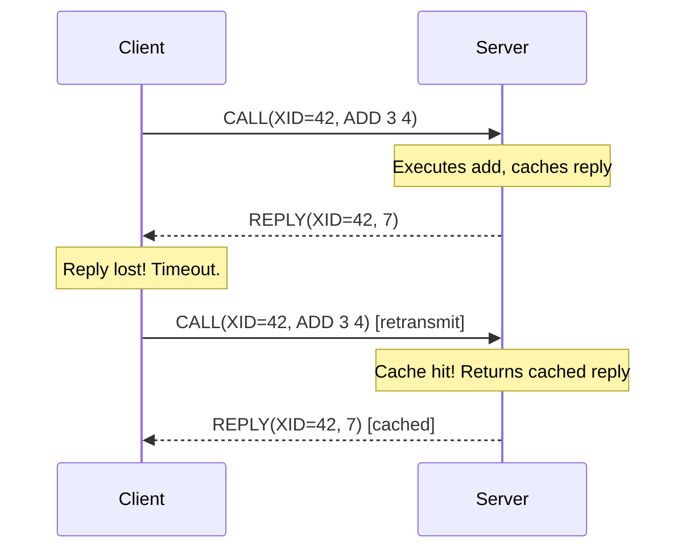
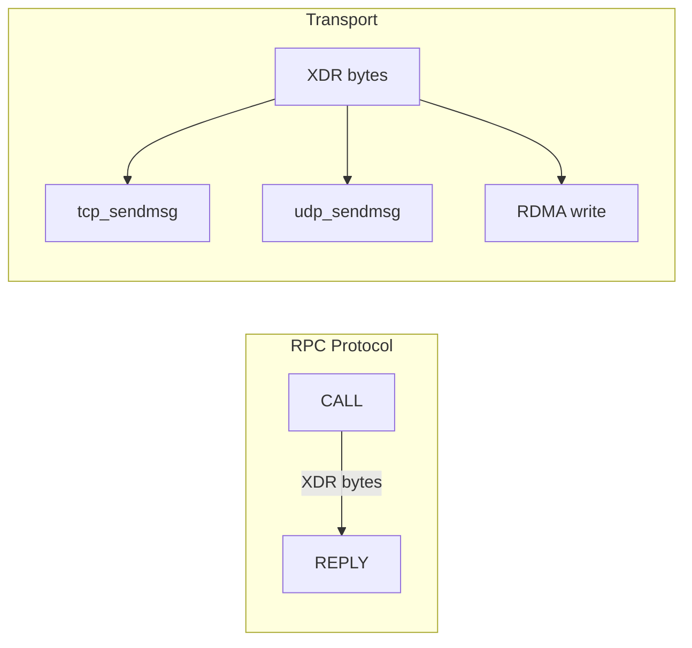

# Chapter 1: What Is Remote Procedure Call?

## The Core Idea in One Sentence

Remote Procedure Call is exactly what it sounds like: you call a function, but the function executes on a different machine.

That's the whole idea. Everything else — the protocol, the serialization, the authentication, the transport management — exists to make this one sentence true in practice. If you understand nothing else, understand this: **RPC is about making a function call across a network feel like a local function call.**

## "This Is Like REST"

If you've worked with REST APIs (and who hasn't), you already know 80% of the mental model.

```mermaid
flowchart LR
    subgraph REST
        C1[Client] -->|HTTP POST /add| S1[Server]
        C1 -->|Body: {a:3, b:4}| S1
        S1 -->|Response: {result:7}| C1
    end
    subgraph RPC
        C2[Client] -->|RPC CALL| S2[Server]
        C2 -->|XDR: [program=100, version=1, proc=ADD, a=3, b=4]| S2
        S2 -->|XDR: [result=7]| C2
    end
```

In REST, a client sends an HTTP request to a URL, the server processes it, and sends back an HTTP response. The request has a method (GET, POST, etc.), a path (/add), a body ({"a": 3, "b": 4}), and some metadata.

In RPC, a client sends a CALL message to a server, the server processes it, and sends back a REPLY. The call has a **program number** (which service?), a **version number** (which version of the service?), a **procedure number** (which operation?), and arguments encoded as XDR bytes.

The REST analogy maps like this:

| REST Concept | RPC Equivalent |
|-------------|----------------|
| HTTP method + URL path | Program number + version + procedure number |
| Request body (JSON) | Arguments encoded in XDR |
| Response body (JSON) | Results encoded in XDR |
| HTTP status code | RPC accept/deny + auth status |
| Content-Type negotiation | Auth flavour negotiation |
| Request ID in header | XID (transaction ID) |

The big difference: REST is built on HTTP, which is a text protocol. RPC is built on XDR, which is a binary protocol. **RPC is like REST, but without the HTTP verbosity.** No headers, no content-type negotiation, no connection management — just function arguments and function results, packed into bytes.

## The Three Numbers

Every RPC service is identified by three numbers:

**Program number.** A 32-bit integer assigned by the IANA. The NFS protocol is program 100003. The portmapper (rpcbind) is program 100000. Your custom service needs a number in the "unregistered" range (0x40000000 and above), or you can register with IANA if you're building something for the world.

Think of this as the hostname in a URL. It identifies which service you're talking to.

**Version number.** A 32-bit integer that lets you evolve the service without breaking old clients. NFS has versions 2, 3, and 4 — each is a different protocol sharing the same program number. When you call `rpc_create()` with version 3, you talk to the NFSv3 server; with version 4, you talk to NFSv4.

Think of this as the v1/v2/v3 in an API path.

**Procedure number.** A 32-bit integer that identifies the operation within the service. In NFSv3, procedure 0 is NULL (a no-op, used for health checks), procedure 1 is GETATTR, procedure 6 is READ, procedure 7 is WRITE. Your calculator service might have procedure 1 for ADD, 2 for SUB, 3 for MUL, 4 for DIV.

Think of this as the HTTP method + path combined into a single number.

### Why Three Numbers?

The three-number scheme exists so that a single kernel RPC layer can serve multiple protocol implementations simultaneously. The same `sunrpc.ko` module handles NFS, NLM, lockd, and your custom service — all at the same time. The program number dispatches to the right handler, the version number selects the right protocol version, and the procedure number selects the right operation within that version.

If you were building this with REST, you'd have:

```
POST /api/v1/nfs/read
POST /api/v1/nfs/write
POST /api/v2/lock/lockfile
POST /api/v1/calculator/add
```

In RPC, the same dispatch is expressed as:

```
program 100003, version 3, procedure 6  (NFSv3 READ)
program 100003, version 4, procedure 24 (NFSv4 READ — different number!)
program 100021, version 1, procedure 1  (NLM LOCK)
program 400001, version 1, procedure 1  (Calculator ADD)
```

## XID: The Transaction ID

Every RPC has a **transaction ID** (XID) — a 32-bit number that the client generates and puts in the CALL header. The server copies it verbatim into the REPLY. The client uses the XID to match responses with requests.

This is like the `X-Request-ID` header in REST, except it's mandatory and it's used for duplicate detection. If the client sends a CALL and doesn't receive a REPLY within the timeout, it sends the same CALL with the **same XID**. The server sees the duplicate XID (it maintains a cache) and returns the cached REPLY without re-executing the operation.



This is the RPC contract for reliability: **the caller retries until it gets an answer, and the callee deduplicates using the XID.** This is different from TCP (which handles reliability at the transport layer) but complementary to it — TCP makes sure bytes arrive in order; RPC makes sure operations don't execute twice.

## CALL and REPLY: The Two Messages

An RPC is exactly two messages: a CALL and a REPLY. Nothing else. No handshake, no keepalive, no negotiation.

### The CALL Message

```xdr
CALL {
    XID           (4 bytes)   — Transaction ID
    RPC version   (4 bytes)   — Always 2 (the ONC RPC version, not the NFS version)
    Program       (4 bytes)   — 100003 for NFS
    Version       (4 bytes)   — 2, 3, or 4 for NFS
    Procedure     (4 bytes)   — 6 for NFSv3 READ
    Credential    (variable)  — "Who am I?" (AUTH_SYS, RPCSEC_GSS, etc.)
    Verifier      (variable)  — "Prove it" (often empty)
    Arguments     (variable)  — XDR-encoded procedure arguments
}
```

The structure is fixed. Every CALL looks exactly like this, regardless of which protocol uses it. The RPC layer dispatches based on (program, version, procedure) and passes the argument bytes to the appropriate handler.

### The REPLY Message

```xdr
REPLY {
    XID           (4 bytes)   — Same as the CALL
    Reply status  (4 bytes)   — ACCEPTED (0) or DENIED (1)

    [If ACCEPTED:]
    Auth verifier (variable)  — Server's proof of identity (often empty)
    Accept status (4 bytes)   — SUCCESS (0), PROG_UNAVAIL (1), etc.
    Results       (variable)  — XDR-encoded procedure results

    [If DENIED:]
    Reject status (4 bytes)   — RPC_MISMATCH (0), AUTH_ERROR (1)
    [If RPC_MISMATCH:] low/high version numbers
    [If AUTH_ERROR:] auth status code
}
```

The important thing to notice: **the server can't change the structure.** If the server doesn't recognize the program number, it doesn't send "sorry, I don't know that program" — it sends a standard REPLY with `PROG_UNAVAIL` status. The RPC layer handles this the same way for every program.

This is different from REST, where each endpoint returns a different-shaped error. In RPC, the error always fits in the same envelope.

## Transport Independence

RPC doesn't care what transport carries the messages. TCP, UDP, RDMA — they all work. The RPC layer serializes the CALL and REPLY into bytes, hands them to the transport, and lets the transport worry about getting them there.



For kernel development, you'll almost always use TCP. NFSv4 mandates TCP. NFSv3 can use UDP but nobody does anymore. Your custom service should use TCP unless you have a specific reason not to.

The transport is abstracted behind `rpc_xprt` — a kernel structure that represents "a way to send RPC bytes to a server." The RPC layer doesn't know whether `rpc_xprt` wraps a TCP socket or an RDMA connection. This is important because it means our multipath code works the same way regardless of transport type.

## What You Actually Do as a Kernel Developer

When you add a new RPC service to the kernel, you:

1. **Define your protocol** — a `.x` file (optional but recommended for documentation) that lists your procedures and their argument/result types
2. **Write XDR encoders/decoders** — functions that serialize your types into XDR bytes and deserialize them back
3. **Create an `rpc_clnt`** — the client handle that represents your connection to the server
4. **Call `rpc_run_task()`** — create a task and pass it encoded arguments; the task sends the CALL and waits for the REPLY
5. **Decode the response** — extract your results from the XDR reply

That's it. Everything else — TCP connection management, retransmission, authentication, XID matching — is handled by the SunRPC layer. You don't need to think about it.

The rest of this book walks through each of these steps in detail. Chapter 2 shows you where everything lives in the kernel source tree.
