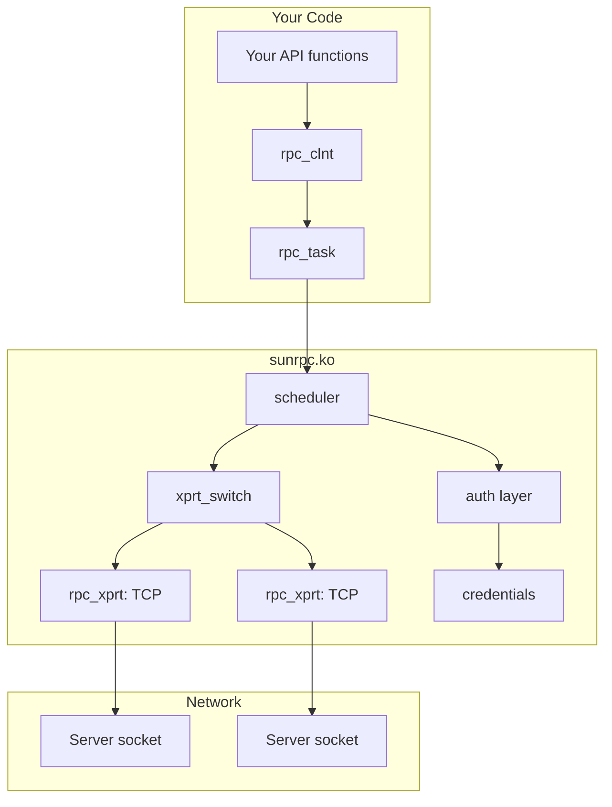

# Chapter 2: Where SunRPC Lives in the Kernel

## The Module

SunRPC in the Linux kernel lives in a single module: `sunrpc.ko`. It's at `net/sunrpc/` in the kernel tree.

Unlike most kernel subsystems, SunRPC is a **module**, not a built-in. It loads automatically when something needs it — when you mount NFS, when you start an NFS server, or when a lockd process starts. This means it can be updated independently of the kernel image. It also means you can build it separately without building the whole kernel:

```bash
make M=net/sunrpc
```

This is the same build pattern you use for any kernel module, and it's the fastest way to iterate on SunRPC changes.

## The Directory Layout

```text
net/sunrpc/
├── clnt.c              — RPC client core (create client, run tasks)
├── sched.c             — Task scheduler (manage concurrent RPCs)
├── xprt.c              — Transport core (create, connect, send, receive)
├── xprtsock.c          — TCP/UDP socket transport implementation
├── xprtmultipath.c     — Transport switch (multiple transports per client)
├── auth.c              — Authentication framework
├── auth_null.c         — AUTH_NONE flavour
├── auth_unix.c         — AUTH_SYS flavour (UID/GID based)
├── auth_tls.c          — AUTH_TLS flavour
├── auth_gss/           — RPCSEC_GSS flavour (Kerberos)
├── svc.c               — Server core (receive, dispatch, reply)
├── svcsock.c           — Server TCP socket transport
├── svcauth.c           — Server authentication dispatch
├── svcauth_unix.c      — Server AUTH_SYS handler
├── xdr.c               — XDR encoding/decoding primitives
├── addr.c              — Address resolution helpers
├── rpcb_clnt.c         — rpcbind client (portmapper)
├── timer.c             — RPC timer management
├── sysfs.c             — Transport visibility in sysfs
├── debugfs.c           — RPC debugging interface
├── stats.c             — RPC statistics
└── sunrpc_syms.c       — Exported symbol registration
```

You don't need to be familiar with all of these files. The ones you need for client-side development are:

- `clnt.c` — You'll call into this to create clients and run tasks
- `xdr.c` — You'll use its helpers to encode and decode your protocol
- `sched.c` — You'll configure scheduling but rarely modify it
- `auth.c` / `auth_null.c` / `auth_unix.c` — You'll pick an auth flavour

## The Three Main Structures

SunRPC has three data structures you need to understand. Everything else is detail.

### struct rpc_clnt (net/sunrpc/clnt.c + include/linux/sunrpc/clnt.h)

The **RPC client handle**. Created by `rpc_create()`, destroyed by `rpc_destroy()`. One handle per remote service you're talking to.

```
rpc_clnt holds:
  - Server address (IP + port)
  - Authentication context
  - Transport (TCP connection)
  - Program number, version number
  - Timeout and retry settings
  - Reference count (nobody destroys it while someone's using it)
```

Think of `rpc_clnt` as an **HTTP client** — you create one, configure it, and use it for many requests. You don't create a new one for each operation.

### struct rpc_task (include/linux/sunrpc/sched.h)

A **single RPC in flight**. Created by `rpc_run_task()`, destroyed automatically on completion.

```
rpc_task holds:
  - Pointer to the rpc_clnt
  - Encoded request buffer
  - Decoded response buffer
  - Timeout state (when to retry)
  - Completion callback
```

Think of `rpc_task` as an **HTTP request** — you create one for each operation you want to perform. It exists from the moment you call `rpc_run_task()` until the reply is decoded and your callback fires.

### struct rpc_xprt (include/linux/sunrpc/xprt.h)

A **transport connection** — almost always a TCP socket. Created when the client is created, managed by the transport switch.

```
rpc_xprt holds:
  - The kernel socket
  - Server address
  - Send and receive buffers
  - Connection state (connected, connecting, dead)
  - Congestion management
```

Think of `rpc_xprt` as a **TCP connection**. You don't create these directly — `rpc_create()` creates the first one, and the transport switch manages any additional ones.

## How They Fit Together



You create a client, then create tasks against that client. Each task goes through the scheduler, picks a transport, gets authenticated, and goes on the wire. The reply comes back through the same transport, gets decoded, and your callback fires.

## The Lifecycle Pattern

Every RPC-based kernel module follows the same lifecycle:

```c
// 1. Compile-time: include headers
#include <linux/sunrpc/clnt.h>
#include <linux/sunrpc/sched.h>
#include <linux/sunrpc/xprt.h>

// 2. Create client
clnt = rpc_create(&args);
if (IS_ERR(clnt))
    return PTR_ERR(clnt);

// 3. Run tasks
for (each operation) {
    task = rpc_run_task(clnt, ...);
    // task runs asynchronously
    // callback fires when reply arrives
}

// 4. Destroy client
rpc_destroy(clnt);
```

This pattern is the same for NFS, for lockd, for rpcbind, and for your custom calculator service. The details change (what arguments you encode, what results you decode, what auth you use), but the lifecycle is identical.

## Key Headers

| Header | What It Exports |
|--------|----------------|
| `include/linux/sunrpc/clnt.h` | `rpc_create`, `rpc_destroy`, `rpc_clnt` structure |
| `include/linux/sunrpc/sched.h` | `rpc_run_task`, `rpc_call_ops`, `rpc_task` structure |
| `include/linux/sunrpc/xprt.h` | `rpc_xprt` structure |
| `include/linux/sunrpc/xdr.h` | XDR stream, encode/decode helpers |
| `include/linux/sunrpc/auth.h` | auth flavours, credential management |

## What You Don't Need to Know

You don't need to understand how the scheduler works internally. You don't need to know how transports are created or destroyed. You don't need to know how the XID matching works or how the auth layer verifies credentials.

The SunRPC layer is designed to be **used**, not modified. Most developers will never touch a line of SunRPC code — they'll just call `rpc_create()` and `rpc_run_task()` and push encoded bytes in one end and receive decoded results from the other. That's enough to build a working RPC service.

When you do need to modify the SunRPC layer (as we do for multipath), you need to understand the transport switch and the task scheduler. Those are covered in later chapters. For now, just know where the files are and what the three structures do.

## Quick Lab: Find Your SunRPC

```bash
# Is the module loaded?
lsmod | grep sunrpc

# Where is it on disk?
modinfo sunrpc | grep filename

# What version?
modinfo sunrpc | grep vermagic

# What symbols does it export?
grep -r EXPORT_SYMBOL net/sunrpc/ | wc -l
```

On our test VM, the module lives at `/lib/modules/7.0.0-14-generic/kernel/net/sunrpc/sunrpc.ko.zst` and exports approximately 180 symbols. Most of those are for NFS; a handful are for custom services like yours.
