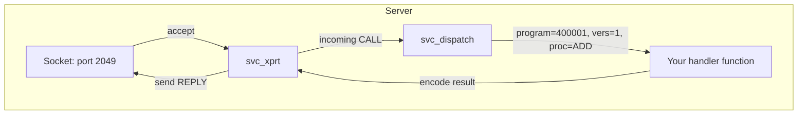
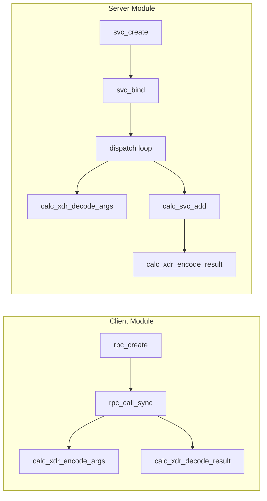

# Chapter 9: The Kernel RPC Server

## The Server Side

So far we've been writing the client — the module that connects to a remote service and makes RPC calls. But someone has to *serve* those calls. That's the RPC server.

The kernel's RPC server infrastructure is in `svc.c`, `svcsock.c`, and related files. It provides:

- **Socket listening**: Accept incoming TCP connections on a specified port
- **Request dispatch**: Parse incoming CALLs, extract program/version/procedure, call the right handler
- **Reply marshalling**: Take the handler's results, encode them as XDR, send the REPLY
- **Concurrency**: Manage multiple threads to handle concurrent requests

## The Server Components

Like the client, the server is organized around a few key structures:



### svc_xprt

The server-side transport. One per TCP connection. Receives bytes from the socket, assembles them into RPC messages, and queues them for dispatch.

You don't create these directly. The server infrastructure creates them when a client connects.

### svc_program

Your program registration structure. Shared with the client side, but used differently:

```c
static struct svc_program calc_svc_program = {
    .pg_prog       = CALC_PROG,         // 400001
    .pg_name       = "calculator",
    .pg_class      = "calc",
    .pg_vers       = calc_svc_versions,
    .pg_nvers      = 1,
    .pg_stats      = NULL,             // Optional stats
};
```

### svc_version

```c
static struct svc_version calc_svc_version = {
    .vs_vers       = 1,
    .vs_nproc      = 5,
    .vs_proc       = calc_svc_procedures,
    .vs_dispatch   = calc_dispatch,
};
```

### svc_procedure

```c
static struct svc_procedure calc_svc_procedures[] = {
    [ADD] = {
        .pc_func     = calc_svc_add,       // Your handler
        .pc_encode   = (kxdrproc_t)calc_xdr_encode_result,
        .pc_decode   = (kxdrproc_t)calc_xdr_decode_args,
        .pc_argsize  = sizeof(struct calc_args),
        .pc_ressize  = sizeof(struct calc_result),
        .pc_name     = "ADD",
    },
    // ... SUB, MUL, DIV
};
```

## The Handler Function

Your handler receives decoded arguments and a place to put results:

```c
int calc_svc_add(struct svc_rqst *rqstp)
{
    struct calc_args *args = rqstp->rq_argp;     // Decoded arguments
    struct calc_result *res = rqstp->rq_resp;     // Result buffer

    res->result = args->a + args->b;
    res->error  = 0;

    return 0;  // Return non-zero for system error
}
```

That's it. The RPC server layer:
1. Receives the CALL bytes
2. Parses the RPC header (XID, program, version, procedure)
3. Looks up your handler by (program, version, procedure)
4. Calls your decoder to unpack the arguments
5. Calls your handler
6. Calls your encoder to pack the results
7. Sends the REPLY

## Starting the Server

```c
static struct svc_serv *calc_server;

int calc_start_server(void)
{
    calc_server = svc_create(&calc_svc_program,  // Which program to serve
                             CALC_MAX_THREADS,   // Max concurrent handlers
                             NULL);              // Stats (optional)
    if (IS_ERR(calc_server))
        return PTR_ERR(calc_server);

    // Bind to a port and start listening
    int ret = svc_bind(calc_server, htons(2049));
    if (ret < 0) {
        svc_destroy(calc_server);
        return ret;
    }

    // Start the thread pool
    ret = svc_start(calc_server);
    if (ret < 0) {
        svc_destroy(calc_server);
        return ret;
    }

    pr_info("Calculator server listening on port 2049\n");
    return 0;
}

void calc_stop_server(void)
{
    svc_stop(calc_server);
    svc_destroy(calc_server);
}
```

## Thread Pool

The kernel RPC server uses a thread pool to handle requests. Each thread picks up the next incoming CALL, dispatches it, and sends the reply. The number of threads determines concurrency.

For a calculator service (where each operation is fast), one or two threads is enough. For NFS (where each READ might take milliseconds to fetch from disk), you might need dozens.

```c
#define CALC_MAX_THREADS 2
```

## Server Versus Client



The XDR encoding/decoding functions are shared between client and server. The client calls them in one order (encode args, decode result), the server calls them in the opposite order (decode args, encode result). The same .c file serves both.

## Putting It Together

A kernel module that provides the calculator service:

```c
// calc_server.c
#include <linux/module.h>
#include <linux/sunrpc/svc.h>
#include "calc_prot.h"

static struct svc_serv *calc_svc_serv;
static struct svc_program calc_svc_program;
static struct svc_version calc_svc_ver;
static struct svc_procedure calc_svc_procs[];

int calc_svc_add(struct svc_rqst *rqstp)
{
    struct calc_args *a = rqstp->rq_argp;
    struct calc_result *r = rqstp->rq_resp;
    r->result = a->a + a->b;
    r->error = 0;
    return 0;
}

int calc_svc_sub(struct svc_rqst *rqstp) { ... }
int calc_svc_mul(struct svc_rqst *rqstp) { ... }
int calc_svc_div(struct svc_rqst *rqstp) { ... }

static int __init calc_init(void)
{
    calc_svc_serv = svc_create(&calc_svc_program, 2, NULL);
    if (IS_ERR(calc_svc_serv))
        return PTR_ERR(calc_svc_serv);

    svc_bind(calc_svc_serv, htons(2049));
    svc_start(calc_svc_serv);
    pr_info("Calculator server loaded\n");
    return 0;
}

static void __exit calc_exit(void)
{
    svc_stop(calc_svc_serv);
    svc_destroy(calc_svc_serv);
    pr_info("Calculator server unloaded\n");
}

module_init(calc_init);
module_exit(calc_exit);
MODULE_LICENSE("GPL");
```

The client and server are separate modules. The client runs on one machine, the server on another. They each include `calc_prot.h` for the shared type definitions and procedure numbers.
