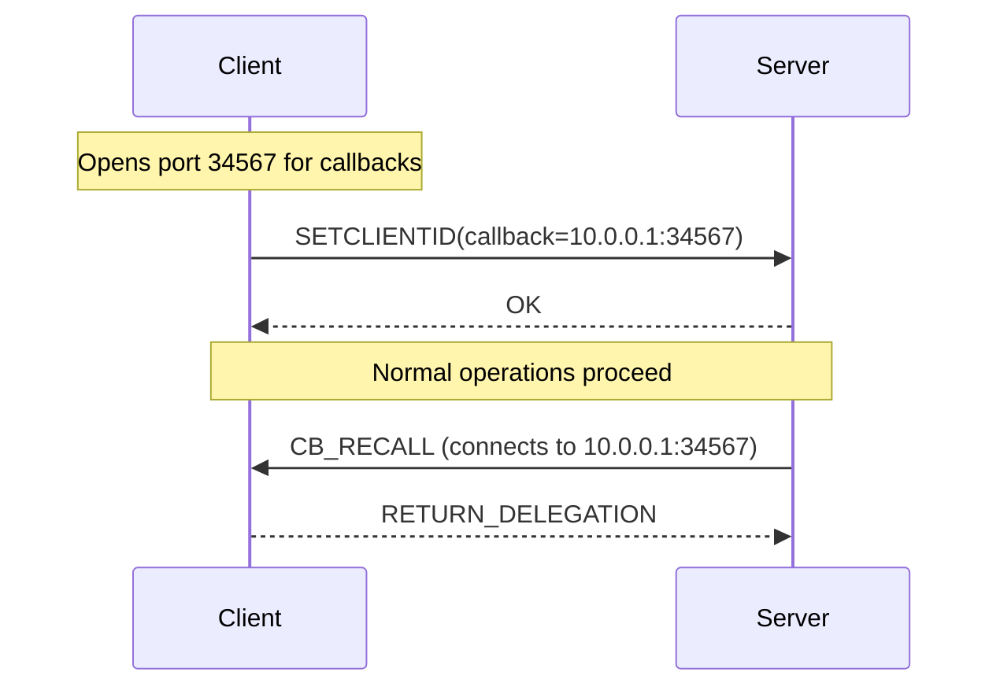
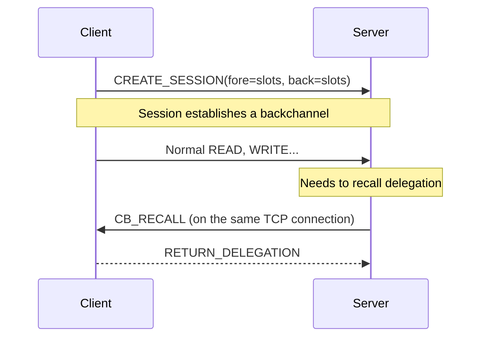

# Chapter 10: Backchannel — When the Server Calls You Back

## Why a Backchannel?

In the standard RPC model, the client calls and the server responds. The server never initiates a call. This is like HTTP — the browser requests, the server responds, end of story.

But NFSv4 needs the server to occasionally contact the client. Specifically:

- **Delegation recall**: The server granted a client a write delegation on a file. Now another client wants to write to the same file. The server must tell the first client: "give back the delegation."

- **Layout recall**: The server granted a client a pNFS layout. Now the layout is stale. The server must tell the client: "your layout is invalid, get a new one."

- **State notification**: The server wants to notify the client about an event (file changed, attributes updated, etc.).

These server-to-client messages are called **callbacks**.

## How Callbacks Work in NFSv4.0 (The Fragile Way)

In NFSv4.0, the client opens a separate TCP listener port for callbacks:



Problems:
- Client must be reachable on that port (NAT breaks this, firewalls break this)
- The callback connection is separate from the main RPC connection
- If the callback listener fails, the server can't recall delegations

## How Callbacks Work in NFSv4.1 (The Backchannel)

In NFSv4.1, the callback uses the **same TCP connection** as the client's outgoing RPCs. The connection carries traffic in both directions — client-to-server RPCs and server-to-client callbacks.



This is called a **backchannel** because it's a channel for traffic in the reverse direction. The client doesn't need a separate listener. The firewall doesn't need to allow inbound connections. The callback is just an RPC that happens to go from server to client.

## The SunRPC Backchannel

In the kernel's SunRPC layer, the backchannel is implemented as part of the session transport. When the client creates a session, it allocates a portion of the slot table for backchannel operations.

```c
// Creating a session with backchannel support (simplified)
struct rpc_clnt *clnt = rpc_create(&args);

// Allocate backchannel slots
int ret = svc_create_backchannel(clnt, &back_program, 4);
```

The `back_program` defines the procedures the server can call:

```c
static struct svc_program back_program = {
    .pg_prog = CALC_BACK_PROG,     // Your backchannel program number
    .pg_vers = calc_back_versions,
    .pg_nvers = 1,
};
```

The client registers a handler for each backchannel procedure:

```c
// This function is called when the server sends a backchannel RPC
static int calc_back_notify(struct svc_rqst *rqstp)
{
    // Server is telling us something
    // Our chance to respond
    return 0;
}
```

## When You Need a Backchannel

For most custom RPC services, you don't need a backchannel. The standard client-calls-server model is sufficient. You need a backchannel when:

- **The server needs to initiate communication** (delegation recall, event notification)
- **Polling is unacceptable** (the client can't keep asking "anything new?" every N seconds)
- **You need bidirectional RPC** (both sides can initiate)

Our calculator doesn't need a backchannel. The client sends arguments, the server returns results, and that's the entire conversation.

## Backchannel vs. Webhooks

If you're familiar with webhooks, this is the same concept. A webhook is an HTTP callback — instead of the client polling the server, the server POSTs to the client when something happens.

```mermaid
flowchart LR
    subgraph Webhook Pattern
        W1[Client] -->|Register URL| W2[Server]
        Note over W2: Event happens
        W2 -->|POST /callback| W1
    end
    subgraph Backchannel Pattern
        B1[Client] -->|Register via session| B2[Server]
        Note over B2: Event happens
        B2 -->|CB_RPC on TCP connection| B1
    end
```

The backchannel is the RPC equivalent of webhooks. Same idea, different transport.
