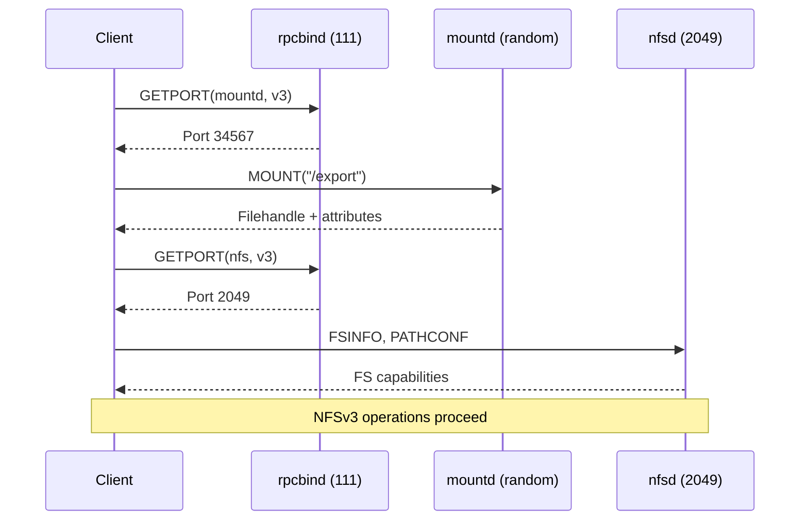

# Chapter 12: How NFS Actually Uses SunRPC

## The Real-World Example

The calculator in Chapter 11 is a toy. NFS is the real thing — the largest, most complex RPC service in the Linux kernel. Understanding how NFS uses SunRPC is like understanding how a production web application uses HTTP: it shows you patterns you'll want to replicate in your own services.

## The Program Registration

NFS doesn't register one program. It registers several:

| Program | Number | Versions | Module |
|---------|--------|----------|--------|
| NFS | 100003 | 2, 3, 4 | nfs.ko / nfsv4.ko |
| NFS (server) | 100003 | 2, 3, 4 | nfsd.ko |
| NLM (lock manager) | 100021 | 1, 3, 4 | lockd.ko |
| NSM (status monitor) | 100024 | 1 | lockd.ko |
| rpcbind | 100000 | 2, 3, 4 | sunrpc.ko |

Each program has its own rpc_program structure, its own version tables, and its own procedure arrays. They all share the same SunRPC infrastructure.

Here's how the NFS client registers its program:

```c
// From fs/nfs/client.c (simplified)
static struct rpc_program nfs_program = {
    .name       = "nfs",
    .number     = NFS_PROGRAM,          // 100003
    .nrvers     = 3,                    // v2, v3, v4
    .version    = nfs_versions,         // Array of 3 version structs
};
```

Each version has its own procedure table:

```c
// NFSv3 has 19 procedures (fs/nfs/nfs3proc.c)
static struct rpc_procinfo nfs3_procedures[] = {
    [3] = { .p_proc = NFSPROC3_GETATTR, .p_name = "GETATTR", ... },
    [6] = { .p_proc = NFSPROC3_READ,    .p_name = "READ",    ... },
    [7] = { .p_proc = NFSPROC3_WRITE,   .p_name = "WRITE",   ... },
    // ... 16 more
};

// NFSv4 has 56+ procedures (fs/nfs/nfs4proc.c)
static struct rpc_procinfo nfs4_procedures[] = {
    [9]  = { .p_proc = NFSPROC4_CLNT_READ,    .p_name = "READ",    ... },
    [18] = { .p_proc = NFSPROC4_CLNT_OPEN,    .p_name = "OPEN",    ... },
    [24] = { .p_proc = NFSPROC4_CLNT_WRITE,   .p_name = "WRITE",   ... },
    // ... 53 more
};
```

The procedure numbers don't have to be consecutive or start from 0. Each version defines its own mapping.

## The COMPOUND Pattern

NFSv4 doesn't send individual operations. It sends COMPOUND procedures that contain multiple operations:

```c
// An NFSv4 READ isn't just a READ operation
// It's a COMPOUND containing SEQUENCE + PUTFH + READ + GETATTR

struct rpc_message msg = {
    .rpc_proc = &nfs4_procedures[NFSPROC4_CLNT_COMPOUND],
    .rpc_argp = &compound_args,   // Contains SEQUENCE, PUTFH, READ, GETATTR
    .rpc_resp = &compound_res,
};
```

The procedure number is always `NFSPROC4_CLNT_COMPOUND` (which is 1 — the one and only NFSv4 client procedure). The actual operations are embedded in the compound arguments. This is like having a web API with a single endpoint that takes a list of sub-operations.

This pattern is unique to NFSv4. NFSv3 and NFSv2 use individual procedures for each operation (procedure 6 = READ, procedure 7 = WRITE, etc.).

## The Mount Path (NFSv3)

The NFSv3 mount sequence shows the full RPC lifecycle:



Each arrow is a separate RPC client, separate rpc_clnt, separate TCP connection:

```c
// 1. Create rpcbind client
rpcb_clnt = rpc_create(&(struct rpc_create_args){
    .address = &rpcbind_addr,     // Server:111
    .program = &rpcb_program,
});

// 2. Ask rpcbind for mountd port
rpc_call_sync(rpcb_clnt, &msg, 0);
// msg contains: program=100005, version=3, procedure=3 (GETPORT)
// Reply: port 34567

// 3. Create mountd client
mnt_clnt = rpc_create(&(struct rpc_create_args){
    .address = &mountd_addr,      // Server:34567
    .program = &mnt_program,
});

// 4. Call MOUNT
rpc_call_sync(mnt_clnt, &mount_msg, 0);

// 5. Create NFS client
nfs_clnt = rpc_create(&(struct rpc_create_args){
    .address = &nfs_addr,         // Server:2049
    .program = &nfs_program,
    .version = nfs3_version,
});

// 6. Call READ, WRITE, etc.
rpc_call_sync(nfs_clnt, &read_msg, 0);
```

This multi-client, multi-connection pattern is a real-world example of something you might need to replicate: a service that depends on other services to bootstrap.

NFSv4 simplifies this. Everything goes through one port (2049) and one program (100003):

```c
// NFSv4: one client, one port, everything goes through it
nfs_clnt = rpc_create(&(struct rpc_create_args){
    .address = &nfs_addr,        // Server:2049
    .program = &nfs_program,
    .version = nfs4_version,
});

// All operations — mount, read, write, lock — use the same client
rpc_call_sync(nfs_clnt, &compound_msg, 0);
```

This is the "RESTful" comparison again. NFSv3 is like having separate API servers for authentication, file operations, and locking. NFSv4 is like consolidating everything behind a single API gateway.

## The Transport Switch in NFSv4.1

NFSv4.1 uses the transport switch (`xprtmultipath.c`) for session trunking. When the client detects multiple paths to the server:

```c
// After the first rpc_clnt is created:
// The NFSv4.1 client calls nfs4_xprt_switch_connect()
// which tries additional server addresses

// For each discovered address:
struct rpc_xprt *new_xprt = xprt_create_transport(&addr);
xprt_switch_add_xprt(clnt->cl_xprtswitch, new_xprt);
```

The transport switch now has multiple transports. The RPC scheduler iterates through them, dispatching operations across all available paths.

This is where our dnfs project hooks in. Instead of relying on server-discovered addresses (NFSv4.1 trunking), we add transports based on the `remoteaddrs=` mount option. The transport switch doesn't care how the transports got there — it just dispatches across whatever it has.

## Concurrency: How NFS Fills the Pipe

NFS achieves high throughput by maintaining multiple in-flight RPCs simultaneously. For NFSv3, each transport can have up to 4 concurrent RPCs (the `slot_table_entries` parameter). For NFSv4.1, it's negotiated with the server and can be 8-64.

```c
// NFSv3: up to 4 concurrent RPCs per connection
.rpc_task_setup.flags = 0;  // Synchronous rpc_call_sync doesn't help here

// Instead, NFS uses async tasks:
for (int i = 0; i < 4; i++) {
    rpc_run_task(&task_setup);
    // Tasks run in parallel, callbacks fire independently
}
```

With 4 transports and 4 concurrent RPCs each, a single NFS mount can have 16 RPCs in flight simultaneously. This is how NFS saturates a 40 GbE link — not through large individual operations, but through many concurrent operations.

## The Auth Setup

NFS supports multiple auth flavours at the same time:

```c
// The NFS client tries different auth flavours until one succeeds
// (This is the SECINFO negotiation)

// First try: AUTH_SYS
clnt->cl_auth = auth_create(RPC_AUTH_UNIX, current_cred());

// If server requires Kerberos, switch to RPCSEC_GSS
if (server->auth_flavor == RPC_AUTH_GSS) {
    auth_destroy(clnt->cl_auth);
    clnt->cl_auth = gss_auth_create(server->principal);
}
```

This multi-flavour negotiation is unique to NFS. Most RPC services use a single auth flavour and stick with it.

## What NFS Does Differently

Compared to our calculator, NFS:

| Aspect | Calculator | NFS |
|--------|-----------|-----|
| Program versions | 1 | 3 (v2, v3, v4 in one module) |
| Procedures per version | 5 | 19 (v3), 56+ (v4) |
| Concurrent RPCs | 1 (sync) | 4-64 (async) |
| Auth flavours | AUTH_NULL | AUTH_SYS, RPCSEC_GSS |
| Transport switch | 1 transport | Multiple (v4.1 trunking) |
| XDR complexity | 2 structs, 10 lines each | Hundreds of types, thousands of lines |

The patterns are the same — rpc_create, rpc_call_sync/rpc_run_task, XDR encode/decode — but NFS is an order of magnitude larger in every dimension.

## The Kernel Source as a Reference

When you're building your own RPC service, the NFS code is the best reference:

| What you need | Where to look |
|--------------|---------------|
| Creating a client | `fs/nfs/client.c: nfs_create_rpc_client()` |
| Making async calls | `fs/nfs/nfs4proc.c: nfs4_proc_read_setup()` |
| Encoders/decoders | `fs/nfs/nfs4xdr.c: nfs4_xdr_enc_read()` |
| Server dispatch | `fs/nfsd/nfs4proc.c: nfsd4_proc_compound()` |
| Procedure tables | `fs/nfs/nfs3proc.c: nfs3_procedures[]` |

The NFS client and server are the largest, most-tested users of the kernel's SunRPC layer. If you're unsure how a piece of the RPC infrastructure works, see how NFS uses it. The patterns are universal.
